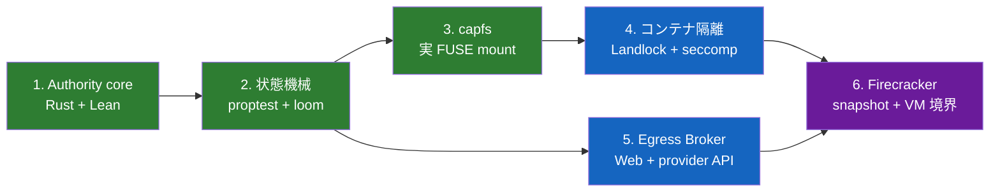
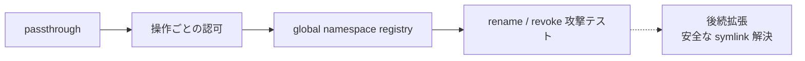

# 実装順序

[設計書一覧](README.md) / 実装順序

最初から microVM を起動しても、設計の難しい部分はほとんど検証できない。まず Authority と `capfs` をホスト上で動かし、あとから隔離層へ載せる。

## 全体の依存関係

## 1. Authority core

Rust で typed Capability、正規化型、`Matches`、`PathBelow`、`WeakerThan` を作る。同じ型を Lean にも置き、共通 corpus で結果を突き合わせる。

**完了条件:** repository、host、path、time、response size の境界値まで Rust と Lean が一致する。

repository、path、file effect、time、typed Capability、`Matches`、`WeakerThan` の Rust/Lean 実装は完了している。さらに public HTTP fetch（canonical host、GET/HEAD、URL path、response size）と閉じた GitHub operation（installation、repository、operation、base/head branch）を tagged authority として追加し、Lean の matching / containment proof、147件の共通 corpus、state lifecycle test まで接続した。Host Egress Broker で URL parser・DNS・redirect・実 response streaming と GitHub API request を強制する部分は phase 5 の対象である。

## 2. 状態機械

subject tree、held、revoke、open handle、attempt、effect、authorization guard を実装する。正常操作だけでなく leak、forge、stale ID、期限切れ、revoke race を proptest と loom に流す。

現在は逐次部分として、subject tree、静的 envelope、server-side ID、root 発行、held、Derive、revoke、祖先失効、`auth_epoch`、subject lifecycle、open-handle registry まで実装している。公開 API の契約 test に加え、1〜63操作の Derive/revoke 列を1,000 case 生成し、独立した参照モデルと毎 transition 比較する property test がある。

並行境界では、最終認可から executor の線形化点と audit outcome 確定まで shared guard を保持し、revoke、subject shutdown、発行 transition を exclusive guard に置いた。全 attempt と commit 済み effect は caller、Capability、typed request、epoch とともに in-memory journal へ記録する。

Loom は direct / ancestor revokeに対する単一・compound effectの全 interleavingと、preemption bound 2 の 2 effects / 1 revokeを検査する。compound modelはexecutorが全段階まで進むか、全く入らないか、また1件のauditがrequest set全体を持つかも確認する。guard を認可直後に外す negative control も反例を出す。これにより次の完了条件は現在の Authority core model について満たした。

状態機械 phase に残るのは、durable audit backend、supervisor / filesystem / Broker adapter、および open handle・rename・unlink・複数 revoke を含む競合 model である。global namespace registry は capfs crate へ移り、path/object 対応と mutation lock を実装済みである。詳細は[Capability の発行と逐次状態機械](../authority-core/capability-state.md)、[Authorization guard](../authority-core/authorization-guard.md)、[Subject lifecycle と open handle](../authority-core/subject-lifecycle-and-handles.md)、[Attempt / effect audit](../authority-core/audit-records.md)、[共有 namespace registry](../capfs/namespace-registry.md)を参照する。

**完了条件:** negative control では race の反例が出て、本番 lock では同じ bounded model の反例が消える。

## 3. capfs

最初は direct I/O の passthrough FUSE を作る。次に global namespace registry、操作 allowlist、毎操作の Capability 判定、no-replace rename、open handle 排他を足す。

**完了条件:** 実 mount 上で read-after-revoke と rename/write 競合を再現しても、権限外アクセスが成立しない。

初期完了時点では symlink と hard link を含む repository を拒否し、`SYMLINK` と `LINK` も `EPERM` にする。これにより、namespace と revoke の基本 invariant を link 解決から独立して検証する。

現在はVM共通のlink-free namespace registry、repository preflight、`RepoId`とbacking root / namespaceのbinding、manifestの原子的なstartup import、subject-local node tableに加え、Direct-I/O FUSE adapterまで実装している。`ImportedRepository`をcloneした複数mountは同じbacking rootとnamespaceを共有し、node / local handle / authorityだけを分離する。`LOOKUP` / `GETATTR` / `FORGET` / `OPEN` / `READ` / `WRITE` / `SETATTR` / `CREATE` / `MKDIR` / `UNLINK` / `RMDIR` / `RENAME` / `RELEASE` / `OPENDIR` / `READDIR` / `RELEASEDIR`をroot fd、node table、namespace registry、Authority kernelへ接続し、zero TTLとdirect I/Oを使う。`OPEN`は`O_RDONLY`、`O_WRONLY`、`O_RDWR`を対応する`ReadData` / `WriteData`の単一または複合認可へ変換し、writableな`O_TRUNC`には`Truncate`も同じ複合認可へ加える。`SETATTR`のsizeは`Truncate`、ordinary modeまたはatime/mtimeは`SetMetadata`を要求する。`CREATE`は`CreateFile`と返却handleのaccess effectを同じ複合認可で確認し、`MKDIR`、`UNLINK`、`RMDIR`、`RENAME`も対応effectを現在pathで確認する。変更はwriter lock内の現在parent pathへroot fd相対のbacking syscallが成功した後だけnamespaceへpublishする。`READDIR`は`ListDirectory`を通常のpath patternで確認したうえで、同一namespace guard内のdirect childだけをvisibility filterへ通す。directory handleはopen時のgenerationを保持し、途中でcreate / remove / renameが成功したstreamを`EAGAIN`でrestartさせる。実mount上で権限外siblingが`ENOENT`になり、open済みfile descriptorのread / write / size変更 / mode変更と既存directory streamの次のlisting、既存parent directory fdに対する`mkdirat`がrevoke後は`EACCES`になることを確認した。詳しい境界は[Backing repository の事前検証](../capfs/backing-preflight.md)、[共有 namespace registry](../capfs/namespace-registry.md)、[mount ごとの node table](../capfs/node-tables.md)、[Direct-I/O FUSE adapter](../capfs/read-only-fuse.md)を参照する。

その後、repository 内で完結する symlink を[後続機能](capfs.md#symlink-は後続機能として追加する)として追加する。hard link は同じ inode に複数 path を与えるため、symlink と同時には有効化せず、import 時の分離または alias-aware な認可モデルを設計してから扱う。

## 4. コンテナ隔離

namespace、cgroup v2、read-only rootfs、tmpfs、Landlock、capability drop、`no_new_privs`、seccomp を順に組み込む。

**完了条件:** workload から見える書き込み先が `capfs` と制限付き tmpfs だけで、backing、network、device、余計な `/proc` へ出られない。

## 5. Host Egress Broker

vsock framing と session envelope を先に作り、その上に公開 HTTPS fetch、最後に GitHub の `PublishBranch` と `CreatePullRequest` を載せる。

**完了条件:** redirect、DNS rebinding、private IP の test が通り、guest に credential がなく、任意の認証付き HTTP 転送口も存在しない。

## 6. Firecracker

pinned guest kernel、dm-verity rootfs、専用 workspace、vsock、jailer を構成する。最後に session 初期化前 snapshot と restore 後の ID 再生成を入れる。

**完了条件:** 同じ snapshot から起動した VM が別々の ID と workspace を持ち、guest から Broker を迂回できない。

## なぜこの順番か

設計の本体は `Authority core -> state machine -> capfs` にある。ここまでは通常のホスト上で速く回せる。Firecracker を先に完成させても、Capability の意味論や rename race は解決しない。

## 関連文書

- [検証戦略](verification.md)
- [capfs](capfs.md)
- [隔離基盤](runtime-isolation.md)
