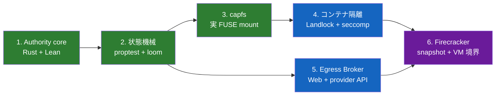
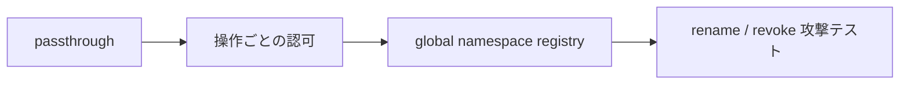

# 実装順序

[設計書一覧](README.md) / 実装順序

最初から microVM を起動しても、設計の難しい部分はほとんど検証できない。まず Authority と `capfs` をホスト上で動かし、あとから隔離層へ載せる。

## 全体の依存関係

## 1. Authority core

Rust で typed Capability、正規化型、`Matches`、`PathBelow`、`WeakerThan` を作る。同じ型を Lean にも置き、共通 corpus で結果を突き合わせる。

**完了条件:** repository、host、path、time、response size の境界値まで Rust と Lean が一致する。

## 2. 状態機械

subject tree、held、revoke、open handle、attempt、effect、authorization guard を実装する。正常操作だけでなく leak、forge、stale ID、期限切れ、revoke race を proptest と loom に流す。

**完了条件:** negative control では race の反例が出て、本番 lock では同じ bounded model の反例が消える。

## 3. capfs

最初は direct I/O の passthrough FUSE を作る。次に global namespace registry、操作 allowlist、毎操作の Capability 判定、no-replace rename、open handle 排他を足す。

**完了条件:** 実 mount 上で read-after-revoke と rename/write 競合を再現しても、権限外アクセスが成立しない。

## 4. コンテナ隔離

namespace、cgroup v2、read-only rootfs、tmpfs、Landlock、capability drop、`no_new_privs`、seccomp を順に組み込む。

**完了条件:** workload から見える書き込み先が `capfs` と制限付き tmpfs だけで、backing、network、device、余計な `/proc` へ出られない。

## 5. Host Egress Broker

vsock framing と session envelope を先に作り、その上に公開 HTTPS fetch、最後に GitHub の `PublishBranch` と `CreatePullRequest` を載せる。

**完了条件:** redirect、DNS rebinding、private IP の test が通り、guest に credential がなく、任意の認証付き HTTP 転送口も存在しない。

## 6. Firecracker

pinned guest kernel、dm-verity rootfs、専用 workspace、vsock、jailer を構成する。最後に session 初期化前 snapshot と restore 後の ID 再生成を入れる。

**完了条件:** 同じ snapshot から起動した VM が別々の ID と workspace を持ち、guest から Broker を迂回できない。

## なぜこの順番か

設計の本体は `Authority core -> state machine -> capfs` にある。ここまでは通常のホスト上で速く回せる。Firecracker を先に完成させても、Capability の意味論や rename race は解決しない。

## 関連文書

- [検証戦略](verification.md)
- [capfs](capfs.md)
- [隔離基盤](runtime-isolation.md)
