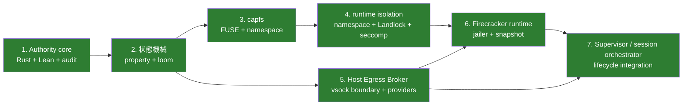

<!-- doc-type: exempt -->

# 実装順序

[設計書一覧](README.md) / 実装順序

> **対象読者:** 実装順序を決める人、進捗と未着手範囲を確認する人

最初から microVM を起動しても、設計の難しい部分はほとんど検証できない。まず Authority、状態機械、`capfs` をホスト上で確定し、その後に runtime isolation、Broker、Firecracker、統合 adapter を接続する。

このページは実装順序の記録と、現在の残存境界をまとめる。次の三つを混同しない。

- **実装済み:** 型、API、production adapter のコードが repository にある。
- **mock/contract 検証済み:** fake、mock、module test、local contract test で境界を確認した。
- **実機／外部境界:** 特権kernel、実jailer、snapshot restore、DNS/HTTPS、guest supervisorからの全13 CapFS effectとclosed Broker dispatchまではrequired gateで確認する。外部live provider、VM escape耐性、全syscall／全interleavingはblockedまたはTCBとして別に記録する。

## 全体の依存関係



## 1. Authority core

typed Capability、正規化型、`Matches`、`PathBelow`、`WeakerThan`、HTTP/GitHub の tagged authority、Rust/Lean の共通 corpus は実装済みである。Rust と Lean の production 判定を versioned TSV 150 件へ流し、repository、path、method、host、time、response size、GitHub operation の境界を突き合わせる。

状態遷移では subject tree、static envelope、server-side ID、root issuance、held、Derive、revoke、祖先失効、`auth_epoch`、subject lifecycle、open-handle registry を実装済みである。attempt/effect についても in-memory journal と `DurableAuditLog` の write-ahead journal、reopen、Started crash window、commit receipt、checksum/replay validation が実装されている。

durable journal の cross-process writer coordination は実装済みで、identity ledger・session recovery journal・authority audit WAL のいずれも、別 process を実際に起動して二重 writer が拒否されることを確認している。既存 audit journal の recovery も実装済みである。crash 後に `Started` のまま残った attempt は、新しい capability state を attach する前に `CommitUnknown` として durable に閉じ、以後の attempt は別の capability-state instance として記録する。残る実機課題は、外部 provider が保持する receipt と `CommitUnknown` を突き合わせる照合だけである。詳細は [Attempt / effect audit](../authority-core/audit-records.md) と [検証戦略](verification.md) を参照する。

## 2. 状態機械と revoke

逐次 state では、1〜63 操作の Derive/revoke 列を 1,000 case 生成し、独立した参照モデルと各 transition 後に比較する。並行境界では、最終認可から executor の線形化点と audit outcome 確定まで shared guard を保持し、revoke、subject shutdown、発行 transition を exclusive guard に置く。

loom は direct/ancestor revoke、単一/compound effect、2 effects/1 revoke を bounded model で確認する。negative control は認可直後に guard を解放した場合の反例を確認する。これにより Authority core の bounded model に対する完了条件は満たしているが、open handle、rename、unlink、複数 revoke、実 syscall adapter の全 interleaving を証明したものではない。

## 3. capfs

repository preflight、`RepoId` と backing root/namespace の binding、manifest の原子的 import、共有 namespace registry、subject-local node table、cache-aware FUSE adapter は実装済みである。`LOOKUP`、`GETATTR`、`FORGET`、`OPEN`、`READ`、`WRITE`、`SETATTR`、`CREATE`、`MKDIR`、`UNLINK`、`RMDIR`、`RENAME`、`RELEASE`、`OPENDIR`、`READDIR`、`RELEASEDIR` を root fd、node table、namespace registry、Authority kernel へ接続する。

mock/contract 検証に加え、実mount 22件で権限外siblingの不可視化、open handleのrevoke後再認可、全13 effect、link、backing差し替え、nested mount、bounded mutation/revoke raceを確認する。KVM SessionOwner gateは隔離層内の同じ全effectをproduction経路で実行する。全thread scheduleとkernelのFORGET lifecycle全体は有限テストによる完全証明ではない。symlinkとhard linkの認可モデルも実装・実測済みである（[ADR 0017](../decisions/0017-authorize-an-aliased-inode-on-every-name.md)）。

## 4. runtime isolation

`runtime-isolation` crate は policy validation、host capability detection、`LinuxBackend`、次の 13 段階の ordered apply を実装済みである。

```text
Namespaces -> IdentityMap -> CgroupV2 -> ReadOnlyRootfs
  -> Workspace -> LimitedTmpfs -> MaskProc -> MaskDevices
  -> CloseInheritedFileDescriptors -> Landlock -> DropCapabilities
  -> NoNewPrivs -> Seccomp
```

policy は absolute clean path、tmpfs 1 byte〜1 GiB、positive cgroup memory/process limit、Landlock ABI 3 以上、forbidden syscall を含まない explicit seccomp allowlist を検査する。failure 時は backend が報告した completed step を逆順に rollback するが、root pivot、namespace、Landlock、capability drop、`no_new_privs`、seccomp の kernel state は同一 process 内で安全に戻せないため、child termination が必要になる。

mock backendの成功／失敗順序、capability不足の事前拒否、Landlock ABI不足、path／limit validation、forbidden syscallに加え、特権hostでdirect apply、production launcherの`execve`後、実escape試行、rollbackを確認する。KVM guestではreadonly rootの`/` branch、cgroup、隔離後のCapFS／Broker経路を確認する。Linux全syscall／引数空間やVM escape耐性の完全証明ではない。

## 5. Host Egress Broker

`egress-protocol` と `egress-broker` の bounded frame、session ID、strict sequence、128-bit request ID、canonical payload hash、bounded replay、session budget、closed operation union、canonical CBOR decoder、typed dispatch、public HTTPS、GitHub provider adapter は実装済みである。

`egress-broker` は frame、canonical CBOR、session/replay、budget、最終 `CapabilityKernel` 認可、typed adapter の順で要求を処理する。公開 HTTPS は `GET`/`HEAD`、HTTPS port 443、DNS 応答全体の public-only、redirect ごとの再検査、32 MiB host cap、5 hop、10 秒接続 timeout、60 秒 total timeout を適用する。GitHub は `PublishBranch` と `CreatePullRequest` のみを受け、前者には host-side expected-old/new plan と `force: false` を要求する。

mock/contract検証に加え、実system DNS、TLS/SNI、address pin、redirect後の再解決／rebindingをprivileged HTTPS gateで確認する。KVM gateはguest supervisorから全13 CapFS effectを通り、Firecracker per-port Unix socket上のcanonical request、host Brokerの`NotAuthorized` response、adapter非実行まで確認する。実GitHub APIと`EGRESS_GITHUB_TOKEN`を使うproviderだけはoperator credential不在でblockedである。詳細は [Host Egress Broker](../egress-broker/README.md) を参照する。

## 6. Firecracker runtime

`firecracker-runtime` は pinned artifact digest、mutable `latest` path の拒否、dm-verity read-only mapping、clone-specific workspace、jailer 起動、private namespace/cgroup/seccomp profile、virtio-vsock、network device 拒否、Firecracker API の順序、snapshot/restore、restore 後の 5 identity 再生成、guest control API の identity injection/workload gate を実装済みである。

launch は `RuntimeState::WorkloadStopped` で戻り、restore は `IdentityRegenerated` で止まる。`inject_identity` が成功して初めて `IdentityInjected`、`start_workload` が成功して `Running` へ進む。artifact、workspace、verity、jailer、API failure には rollback がある。

fake command/filesystem/API/identity sourceによるcontract testとlocal Unix socket HTTP exchangeに加え、[`verify-real-guest-control.sh`](../../scripts/ci/verify-real-guest-control.sh)は実Firecracker process、実dm-verity device、guest kernel、v2 policy-digest-bound guest `AF_VSOCK` control channel、guest supervisor/isolation launcher、guest-to-host Broker portを通す。実lifecycle／SessionOwner gateは`Runtime::launch`のjailer namespace／cgroup、clean snapshot capture／restore、全13 CapFS effect、停止cleanupまで確認する。VM escape耐性そのものはFirecracker／KVM／host kernelのTCBであり、repository testによる完全証明ではない。

## 7. Supervisor / session orchestrator

`supervisor` は authenticated connection identity から subject を解決し、最大 4 KiB の versioned closed wire protocol、subject setup、Authority Core transition、runtime handle registry、ordered shutdown を実装済みである。実際の namespace、cgroup、mount、descriptor syscall は `RuntimeResources` adapter の責務である。production の caller resolver も実装済みで、subject ごとの `SOCK_SEQPACKET` listener が `SO_PEERCRED` から connection identity を作り、request を decode する前に subject を確定させる。

`session-orchestrator` は durable 128-bit no-reuse ledger、snapshot identity rejection、workspace/Broker/VM/capability/workload lease binding、startup commit 順、failure rollback、stop retry を実装済みである。Authority Core、Broker listener、Firecracker runtime、workspace の production adapter と、それらを同じ startup/stop 経路へ接続する composition test も実装している。

両crateのmock/contract testは正常順序、spoof/foreign lease、partial failure、cleanup failure、stale handle、identity reuse、二重起動を検証する。加えて実host resource gateとKVM SessionOwner gateが、実Linux resource、vsock転送、CapFS mount、Firecracker、Broker durable evidence、stop／cleanupをproduction compositionで統合確認する。

## なぜこの順番か

設計の中心は `Authority core -> state machine -> capfs` にある。ここを通常の host test で速く回せる状態にしてから、runtime isolation と Broker を別の trust boundary として追加する。Firecracker はその両方を載せる境界であり、最後に supervisor と session orchestrator で resource identity と cleanup の順序を結ぶ。Firecracker を先に実機起動しても、Capability の意味論、rename race、revoke/commit の線形化は解決しない。

## 現在の残存境界

実装順序の全段階は repository の code と production adapter まで到達している。ただし、段階が完了したことは system 全体の保証を意味しない。現在の claim と残存理由は [検証ステータス manifest](../verification-status.md) と [完了台帳](../hardening/2026-08-18-completion-ledger.md) を正とする。

| 境界 | 現在の扱い |
|---|---|
| live GitHub provider | disposable repository と operator credential が必要なため `external` scope で blocked |
| privileged aarch64 | 実 runner が必要。cross-target check は runtime evidence ではない |
| independent review | repository 外の reviewer と revision-bound report が必要。自己レビューで代替しない |
| VM escape、host kernel、全 syscall／scheduler interleaving | upstream/physical TCB または有限 model の範囲外 |
| 多 host の distributed revoke、replicated Broker state | single-host state machine の外。未実装の枝として扱わず、trust model が変わる設計課題として残す |

## 現在の検証コマンド

各 standalone 境界を個別に検証する場合は、対象 crate の manifest を指定する。

```bash
cargo fmt --manifest-path crates/egress-broker/Cargo.toml -- --check
cargo test --manifest-path crates/egress-broker/Cargo.toml --locked
cargo clippy --manifest-path crates/egress-broker/Cargo.toml --all-targets --locked -- -D warnings

cargo fmt --manifest-path crates/firecracker-runtime/Cargo.toml -- --check
cargo test --manifest-path crates/firecracker-runtime/Cargo.toml --locked
cargo clippy --manifest-path crates/firecracker-runtime/Cargo.toml --all-targets --locked -- -D warnings

cargo fmt --manifest-path crates/supervisor/Cargo.toml -- --check
cargo test --manifest-path crates/supervisor/Cargo.toml --locked
cargo clippy --manifest-path crates/supervisor/Cargo.toml --all-targets --locked -- -D warnings

cargo fmt --manifest-path crates/session-orchestrator/Cargo.toml -- --check
cargo test --manifest-path crates/session-orchestrator/Cargo.toml --locked
cargo clippy --manifest-path crates/session-orchestrator/Cargo.toml --all-targets --locked -- -D warnings
```

## 関連

- [検証戦略](verification.md)
- [capfs](capfs.md)
- [隔離基盤](runtime-isolation.md)
- [Host Egress Broker](../egress-broker/README.md)
- [Firecracker runtime](../firecracker-runtime/README.md)
- [Supervisor adapter](../supervisor/README.md)
- [Session orchestrator](../session-orchestrator/README.md)
- [検証ステータス manifest](../verification-status.md)
- [完了台帳](../hardening/2026-08-18-completion-ledger.md)
