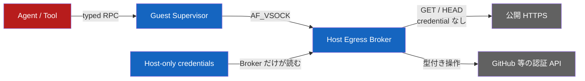
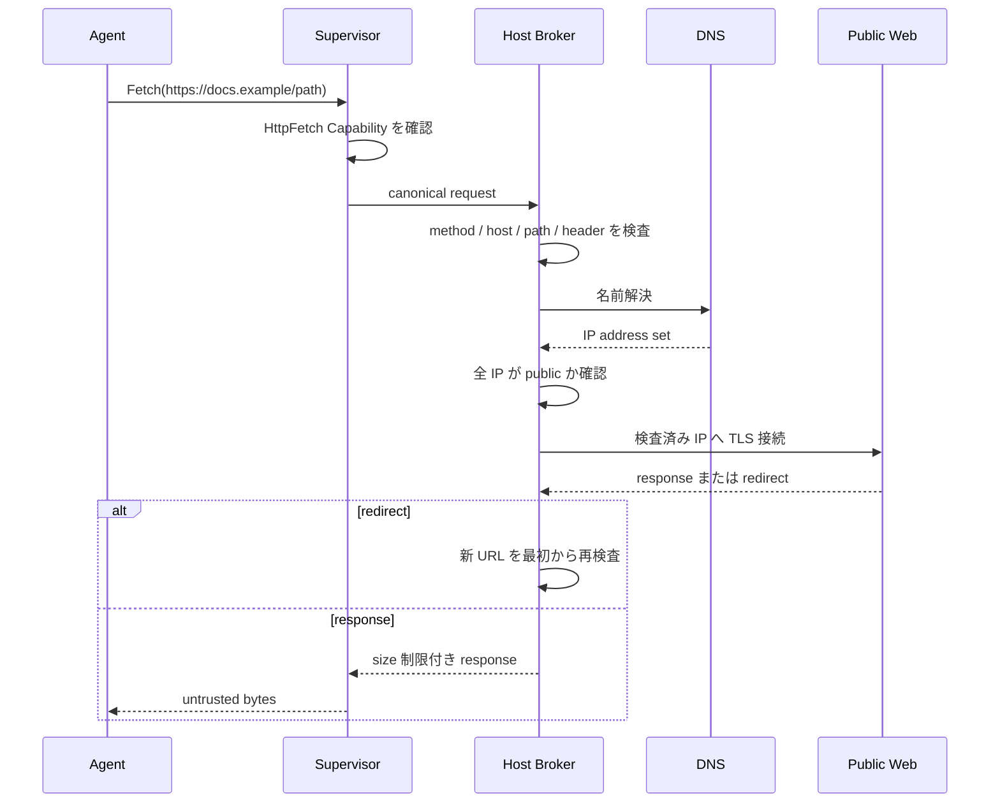
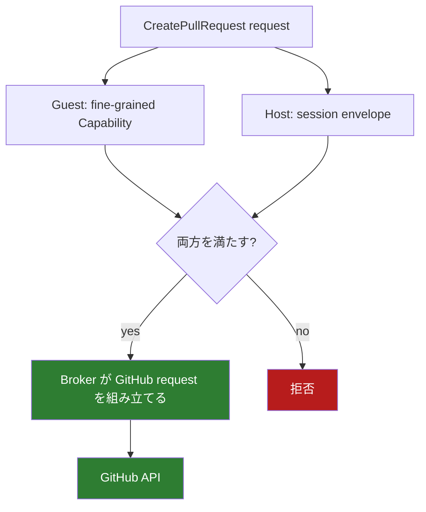

# ネットワークと外部副作用

[設計書一覧](README.md) / ネットワークと外部副作用

「GitHub だけに通信できれば安全」という設計にはしない。Agent が調査や依存取得で公開 Web を読む場面は普通にある。一方で、生のネットワークを渡すと Capability Kernel を通らない副作用経路ができる。

そこで、公開 Web の取得と、認証情報を使う操作を分ける。

標準 profile の guest には `virtio-net` を付けない。公開 Internet に出られるのは Host Broker だけである。Firecracker 自体には traffic filter がないため、将来 network 付き profile を作る場合も host firewall を別途置く。[Firecracker host guidance](https://github.com/firecracker-microvm/firecracker/blob/main/docs/prod-host-setup.md)

## 公開 HTTPS を取得する流れ

`HttpFetch` Capability が指定するのは method、完全一致 host、path prefix、1 response の最大 byte 数。複数 host が必要なら複数枚を渡す。

Broker 側のルールは次の通り。

- `https`、port 443、`GET` / `HEAD` だけ。
- userinfo、request body、`Authorization`、`Cookie`、proxy credential を拒否。
- redirect は最大5回。毎回 URL、Capability、DNS、接続先を再検査。
- loopback、private、link-local、metadata、multicast、CGNAT、host 管理 deny range を拒否。
- public / private が混ざる DNS answer は丸ごと拒否。
- 検査済み IP へ接続し、canonical host で TLS certificate と SNI を検証。
- connect timeout 10秒、全体60秒、展開後 response 上限32 MiB。

最初の host 名だけ確認しても、redirect や DNS rebinding で内部 IP へ移れる。接続のたびに確認し直すのはそのためである。[OWASP SSRF guidance](https://owasp.org/www-community/pages/controls/SSRF_Prevention_in_Nodejs.html)

## 認証付き API は型を固定する

guest に token は渡さない。Broker が受け付けるのは、たとえば次のような操作だけである。

最初の GitHub adapter は `PublishBranch` と `CreatePullRequest` を扱う。`PublishBranch` は expected old OID を要求し、競合した remote ref を上書きしない。任意 URL、method、header、JSON body を token 付きで転送する API は作らない。

## vsock protocol

guest と Broker の間は length-prefixed canonical CBOR とする。control frame は最大1 MiB。session ID、単調増加 sequence、128-bit request ID、payload hash を持たせ、同じ ID で違う内容が来たら拒否する。snapshot restore 後は接続と sequence を作り直す。

このうち session ID、sequence、request ID、SHA-256 payload hash、bounded deduplication table は [`egress-protocol`](../../crates/egress-protocol/src/session.rs) に実装済みである。新しい envelope は一度だけ dispatch でき、完全に同じ retry は `Duplicate` として保存済み outcome を返す。session 不一致、順序違反、同じ request ID の別 payload、capacity / sequence exhaustion は dispatch 前に拒否する。canonical CBOR framing、vsock I/O、response cache は次の実装段階である。

request 回数、累積 byte、同時 fetch 数は Capability ではなく session budget から配る。子 Capability を何枚作っても予算は増えない。

## 関連文書

- [Capability モデル](capability-model.md)
- [状態機械と revoke](state-and-revocation.md)
- [隔離基盤](runtime-isolation.md)
