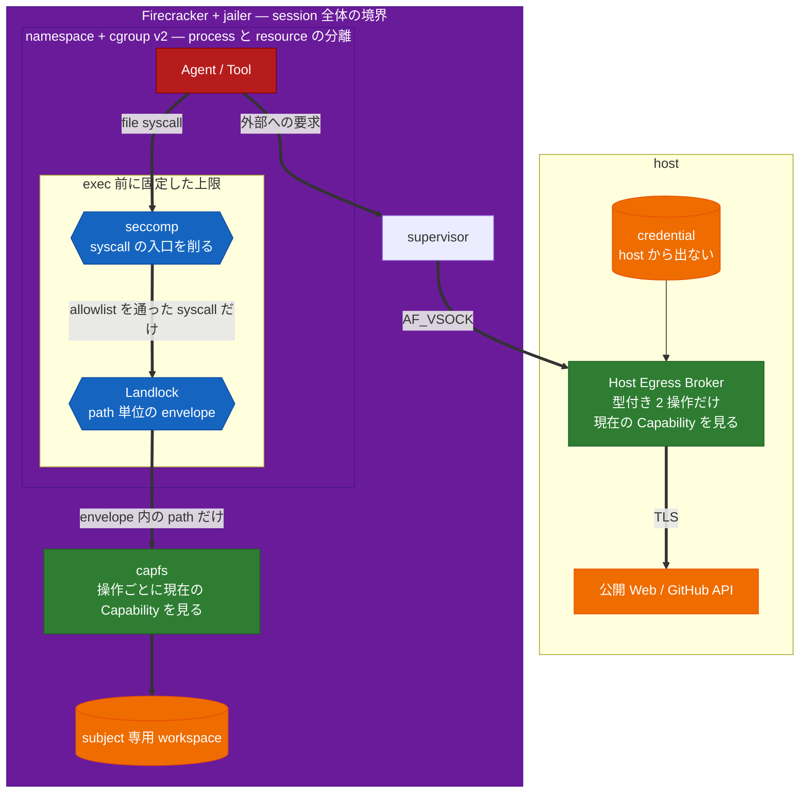
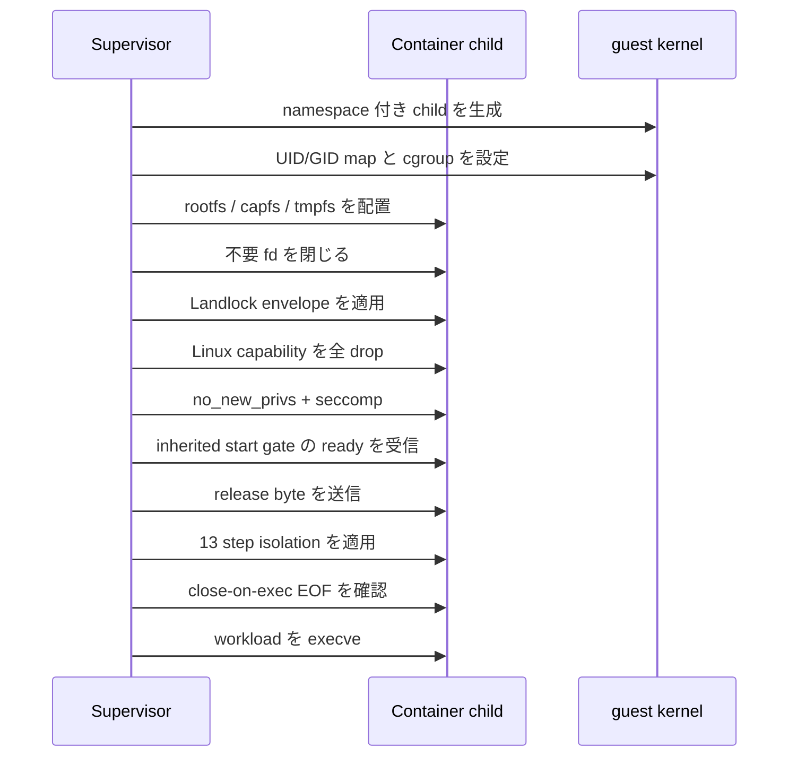
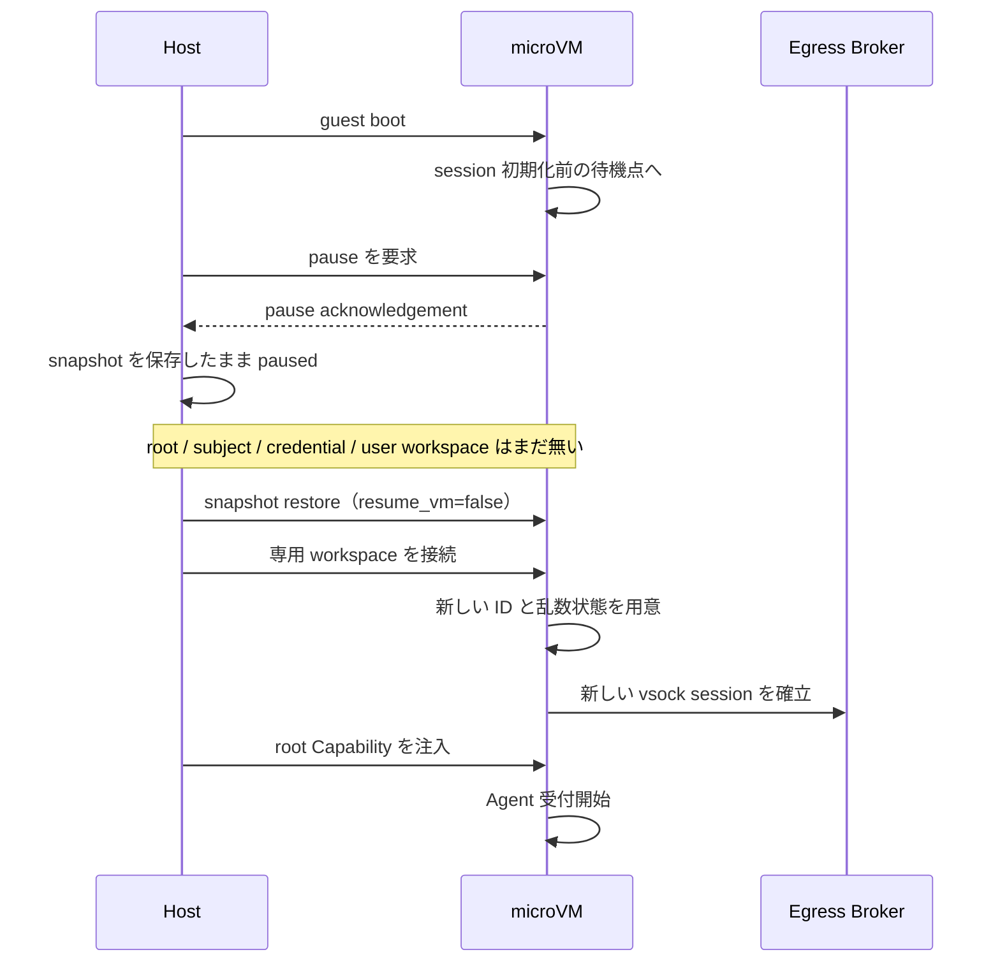

<!-- doc-type: design -->

# 隔離基盤

[設計書一覧](README.md) / 隔離基盤

> **対象読者:** 隔離境界の設計者、runtime-isolation と Firecracker の実装者

ここでは「同じ安全機構を何枚も重ねる」のではなく、各レイヤに違う仕事を持たせる。上のレイヤほど細かく判断し、下のレイヤほど大きな被害を止める。

## 6つの防御レイヤ

レイヤは 1 列に並んでいない。**閉じ込め**は入れ子で、**判定**は経路の上に乗る。workload が起こせることは 2 種類しかなく、file 操作と外部副作用で通る門が違う。

図の読み方は 3 つ。

**枠は閉じ込め、矢印は判定。** `Firecracker` と `namespace + cgroup v2` は経路上の 1 段ではなく、内側で起きたことの被害範囲を決める入れ子の枠である。破られたときに何が漏れるかは、その枠が何を囲っているかで決まる。

**file syscall と外部要求は別の門を通る。** file 操作は seccomp → Landlock → capfs の順に 3 回判定される。順序は kernel が決めるもので、seccomp が「その syscall を呼べるか」、Landlock が「その path に触れてよいか」、capfs が「今この Capability で許されるか」を見る。一方、外部への要求は file syscall を 1 度も通らない。supervisor 経由で vsock に出て、host 側の Broker が型付き操作として判定する。**Broker に file 操作は届かないし、capfs に外部要求は届かない。**

**緑と青で判定の性質が違う。** 緑（`capfs` と Broker）は現在の Capability を毎回見るので、revoke がその場で効く。青（seccomp と Landlock）は exec 前に固定した上限で、後から広げられない。狭い方に倒すのが青、追随するのが緑という分担になっている。

credential が host 側の枠から出ていないことも図に含めてある。guest はどの経路でも token に触れない。

## guest composition と workload gate

guest の composition は [`guest-supervisor-init`](../../crates/supervisor/src/bin/guest-supervisor-init.rs) が所有する。PID 1 の [`guest-control-init`](../../crates/firecracker-runtime/src/bin/guest-control-init.rs) は host CID 2 から identity bundle を一度受け取り、image に固定された guest supervisor を起動する。supervisor は固定された repository / file effect / path policy から guest `CapabilityKernel` と CapFS runtime を作り、control listener と Broker channel を準備してから `guest-supervisor-ready/v1` を返す。readiness を返す前に workspace mount、CapFS、subject bootstrap、isolation control listener、workload 側接続を全て成立させる。

workload の起動は supervisor が任意の command を受け取る API ではない。`LinuxHostResources` は image-configured `workload-isolation-launcher` を unnamed socketpair の stdin/stdout だけで起動し、launcher が正確な `ready` を返すまで release byte を送らない。launcher は `RuntimeIsolation::spawn_isolated` の child startup に加えて、CLOEXEC の exec-status writer を workload child に渡す。exec 成功時は fd が閉じて EOF になり、exec 失敗・不正 marker・timeout は `isolated` を返さず fail closed にする。supervisor/launcher の両方が ambient environment を clear し、必要な identity / channel fd だけを明示する。

これは実装されたguest pathである。runtime-isolationのprivileged probeはproduction launcherと`execve`後のworkloadを直接通し、post-execのkernel enforcementを確認する。mutableなhost rootを試験都合でremountしないため、`rootfs.source == "/"` はreadonly SquashFS rootを使うKVM SessionOwner gateで確認する。

## コンテナを起動する順番

順番を崩すと、制限前に開いた fd や余分な権限が残る。workload は、すべての制限が有効になるまで1命令も実行させない。

起動後に見えるものは次に限る。

- read-only rootfs。
- subject 専用の `/workspace` (`capfs`)。
- size 制限付き tmpfs。
- 最小限の `/proc` と `/dev`。
- 自分専用の control socket。

block device、backing mount、`/dev/fuse`、host TTY、外部 network interface は見せない。PID namespace の PID 1 は子プロセスを reap する。

## Landlock と seccomp の分担

Landlock には、subject 生成時に決めた file envelope を入れる。現在保持している Capability ではない。後から追加できる file Capability はこの envelope の内側だけなので、Landlock を緩める必要がない。

guest kernel の ABI を固定し、read、write、truncate、create、remove、refer を別々に扱う。必要な ABI がなければ起動を止める。Landlock が扱えない metadata 操作は `capfs` で拒否する。[Linux Landlock documentation](https://docs.kernel.org/userspace-api/landlock.html)

seccomp は default deny とし、少なくとも mount、追加 namespace、kernel module、`ptrace`、`process_vm_*`、`bpf`、`perf_event_open`、外部 network socket、`MAP_SHARED` を禁止する。

## Firecracker の役割

Firecracker は subject 間の細かい権限を知らない。guest 全体が壊れたときに、被害をそのセッションへ閉じるのが役目である。

- 1 VM に 1 つの相互信頼グループ。
- rootfs は read-only virtio-blk + dm-verity。
- workspace は VM ごとの read-write virtio-blk。
- host との通信は virtio-vsock。
- 標準 profile では virtio-net を付けない。
- Firecracker 自身も jailer、host namespace、cgroup、標準 seccomp filter で囲う。

## snapshot は「セッション開始前」で止める

同じ snapshot から複数 VM を起動すると、乱数や ID まで複製され得る。そこで snapshot にセッション固有状態を入れず、restore 後に VM / session / subject / Capability / request ID を作り直す。workspace block image も clone ごとに分ける。[Firecracker snapshot security](https://github.com/firecracker-microvm/firecracker/blob/main/docs/snapshotting/snapshot-support.md?plain=1)

実装上は `WorkloadStopped` から Firecracker の pause acknowledgement を受けて `SnapshotPaused` に遷移してから snapshot files を書く。pause 自体の応答が失われた場合は `SnapshotPauseUnknown`、write/hash が失敗した場合も paused state を再利用せず shutdown に進む。fake/runtime testでfail-closed状態機械を、production SessionOwner KVM gateでclean snapshot capture／restore、rebind、resumeを確認済みである。

## 関連

- [脅威モデル](threat-model.md)
- [capfs](capfs.md)
- [ネットワークと外部副作用](network-egress.md)
