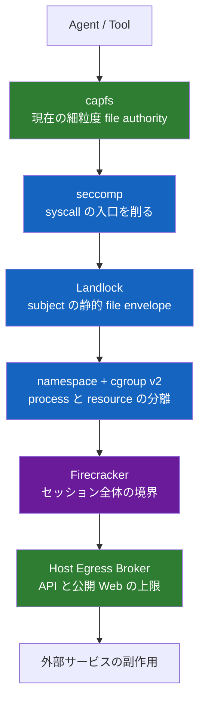
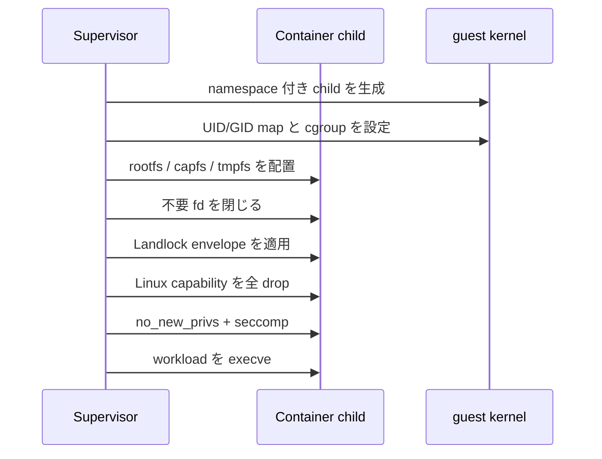
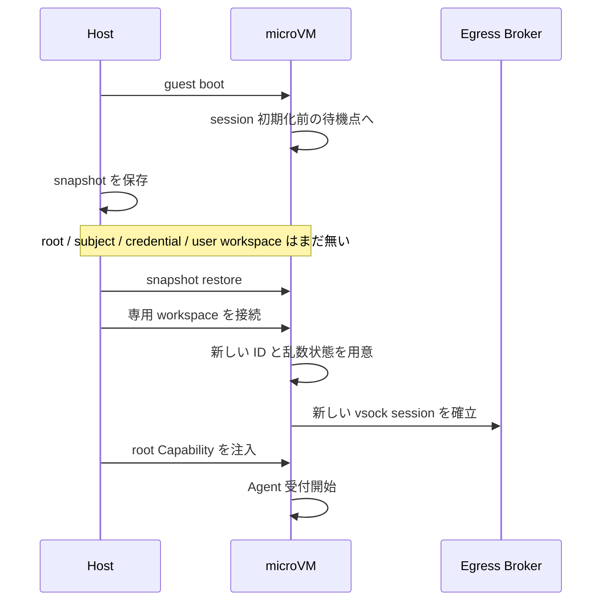

# 隔離基盤

[設計書一覧](README.md) / 隔離基盤

ここでは「同じ安全機構を何枚も重ねる」のではなく、各レイヤに違う仕事を持たせる。上のレイヤほど細かく判断し、下のレイヤほど大きな被害を止める。

## 6つの防御レイヤ

`capfs` と Broker は現在の Capability を見る。Landlock 以下は、起動時に決めた上限を後から広げない。

## コンテナを起動する順番

順番を崩すと、制限前に開いた fd や余分な権限が残る。workload は、すべての制限が有効になるまで1命令も実行させない。

起動後に見えるものは次に限る。

- read-only rootfs。
- subject 専用の `/workspace` (`capfs`)。
- size 制限付き tmpfs。
- 最小限の `/proc` と `/dev`。
- 自分専用の control socket。

block device、backing mount、`/dev/fuse`、host TTY、外部 network interface は見せない。PID namespace の PID 1 は子プロセスを reap する。

## Landlock と seccomp の分担

Landlock には、subject 生成時に決めた file envelope を入れる。現在保持している Capability ではない。後から追加できる file Capability はこの envelope の内側だけなので、Landlock を緩める必要がない。

guest kernel の ABI を固定し、read、write、truncate、create、remove、refer を別々に扱う。必要な ABI がなければ起動を止める。Landlock が扱えない metadata 操作は `capfs` で拒否する。[Linux Landlock documentation](https://docs.kernel.org/userspace-api/landlock.html)

seccomp は default deny とし、少なくとも mount、追加 namespace、kernel module、`ptrace`、`process_vm_*`、`bpf`、`perf_event_open`、外部 network socket、`MAP_SHARED` を禁止する。

## Firecracker の役割

Firecracker は subject 間の細かい権限を知らない。guest 全体が壊れたときに、被害をそのセッションへ閉じるのが役目である。

- 1 VM に 1 つの相互信頼グループ。
- rootfs は read-only virtio-blk + dm-verity。
- workspace は VM ごとの read-write virtio-blk。
- host との通信は virtio-vsock。
- 標準 profile では virtio-net を付けない。
- Firecracker 自身も jailer、host namespace、cgroup、標準 seccomp filter で囲う。

## snapshot は「セッション開始前」で止める

同じ snapshot から複数 VM を起動すると、乱数や ID まで複製され得る。そこで snapshot にセッション固有状態を入れず、restore 後に VM / session / subject / Capability / request ID を作り直す。workspace block image も clone ごとに分ける。[Firecracker snapshot security](https://github.com/firecracker-microvm/firecracker/blob/main/docs/snapshotting/snapshot-support.md?plain=1)

## 関連文書

- [脅威モデル](threat-model.md)
- [capfs](capfs.md)
- [ネットワークと外部副作用](network-egress.md)
