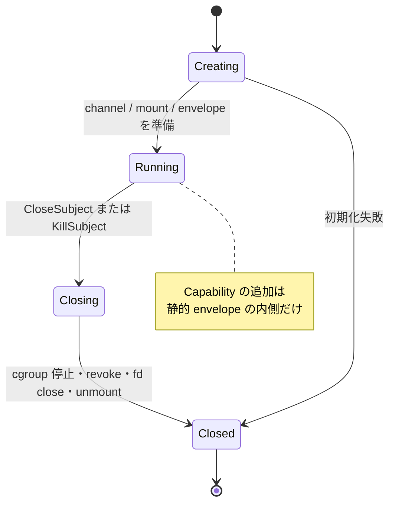
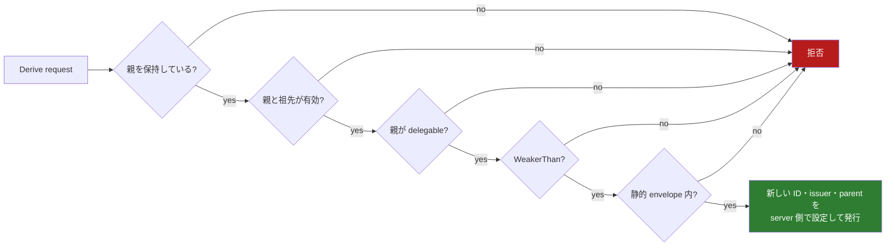
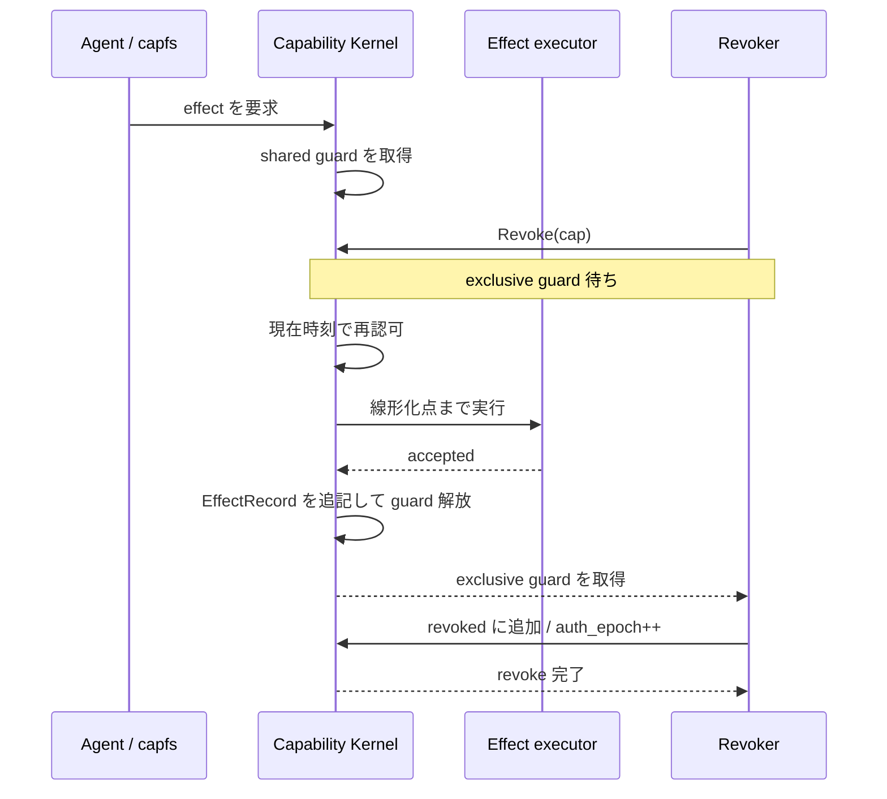

# 状態機械と revoke

[設計書一覧](README.md) / 状態機械と revoke

revoke で難しいのは、「止めると決めた瞬間」と「副作用が実際に起きた瞬間」が別々に存在することだ。この設計では、両者を同じ lock の上に置いて順番を一意に決める。

## 持つ状態

```text
State {
    capabilities : Map<CapId, Capability>
    held         : Map<SubjectId, Set<CapId>>
    revoked      : Set<CapId>
    issued_ids   : Set<CapId>
    subjects     : Map<SubjectId, Subject>
    open_handles : Map<HandleId, OpenHandle>
    attempts     : AppendOnlySeq<AttemptRecord>
    effects      : AppendOnlySeq<EffectRecord>
    auth_epoch   : UInt64
}
```

subject は専用の `SOCK_SEQPACKET`、専用の `capfs` mount、親 subject を持つ。request に書かれた ID は信用せず、supervisor が受信した socket fd から caller を決める。

open handle は「一度だけ使える lease」ではない。同じ fd で何度でも read / write できる代わりに、実際の操作ごとに認可をやり直す。

## subject の一生



範囲外の file Capability を既存 subject に後付けしない。必要なら、新しい subject とコンテナを作り直す。Landlock の上限を後から広げられないためである。

## 委譲

`Derive` は親を持っているだけでは通らない。親と全祖先が有効で、親が委譲可能で、子が `WeakerThan` を満たし、さらに child subject の静的 envelope 内に収まっている必要がある。



## 現在の実装位置

[`crates/authority-core/src/state.rs`](../../crates/authority-core/src/state.rs) には、並行処理を入れる前の逐次状態機械がある。現在は次の境界まで実装している。

| 実装済み | 次に実装する |
|---|---|
| subject と静的 envelope の登録 | shared/exclusive authorization guard |
| server-side ID による root 発行 | attempt/effect log と線形化点 |
| held、caller binding、parent link、`delegable` を検査する Derive | open handle と subject lifecycle |
| `WeakerThan` と target envelope による権限縮小 | revoke / commit の loom model と negative control |
| 逐次 revoke と祖先 chain の無効化 | supervisor channel から caller を決める adapter |

詳細は[Capability の発行と逐次状態機械](../authority-core/capability-state.md)を参照する。逐次モデルで revoke 後の認可は止まるが、すでに進行している副作用と revoke の順序を確定するのは次節の guard の責務である。

## commit と revoke の競合

effect は shared authorization guard、revoke は exclusive guard を取る。



この順なら effect が先に成立する。逆に revoke が exclusive guard を先に取れば、その後の effect は再認可で落ちる。どちらに転んでも順序は曖昧にならない。

```text
CommitEffect(subject, effect):
    attempts += Started
    shared_guard.lock()
    cap := Authorize(subject, effect, monotonic_now())
    if cap is None:
        attempts += Denied
        return NotAuthorized
    result := ExecuteToLinearizationPoint(effect)
    if result.accepted:
        effects += EffectRecord(effect, cap, result)
        attempts += Accepted
    else:
        attempts += FailedBeforeCommit
```

拒否した試行は `attempts` に残すが、`effects` には入れない。`NoUnauthorizedCommit` は、実際に成立した `effects` だけを対象に検査する。

## 線形化点

| 操作 | ここを越えたら commit 済みとする |
|---|---|
| file read / write | `capfs` が backing read / write を発行した瞬間 |
| create / remove / rename / truncate | 対応する backing syscall を発行した瞬間 |
| 公開 Web 取得 | Host Broker が検証済み outbound request を受理した瞬間 |
| 認証 API | Host Broker が idempotency key 付き request を永続的に受理した瞬間 |

revoke は、これより前の操作を巻き戻すものではない。

## KillSubject

`KillSubject` は subject を `Closing` にして新規操作を止め、コンテナの cgroup 全体を停止する。その後、held Capability の revoke、control fd と open handle の close、`capfs` の unmount を行って `Closed` にする。

すでに Host Broker が受理した外部操作だけは続行し得る。

## 設計の背景

派生元を明示した tree と祖先 revoke は、seL4 の capability derivation tree と descendant revocation の考え方を参考にしている。[seL4 Reference Manual](https://sel4.systems/Info/Docs/seL4-manual-latest.pdf)

また「既存 authority から作る authority は縮小だけ」という方向は、FreeBSD Capsicum の `cap_rights_limit` が rights を追加できず削減だけを許す性質とも一致する。[FreeBSD `cap_rights_limit(2)`](https://man.freebsd.org/cgi/man.cgi?query=cap_rights_limit&sektion=2)

どちらもこの実装の正しさを自動的に証明するものではない。ここでは、派生 link を保存する理由と、権限変更を単調な縮小に限定する設計上の先例として参照している。

## 関連文書

- [Capability モデル](capability-model.md)
- [Capability の発行と逐次状態機械](../authority-core/capability-state.md)
- [capfs](capfs.md)
- [ネットワークと外部副作用](network-egress.md)
