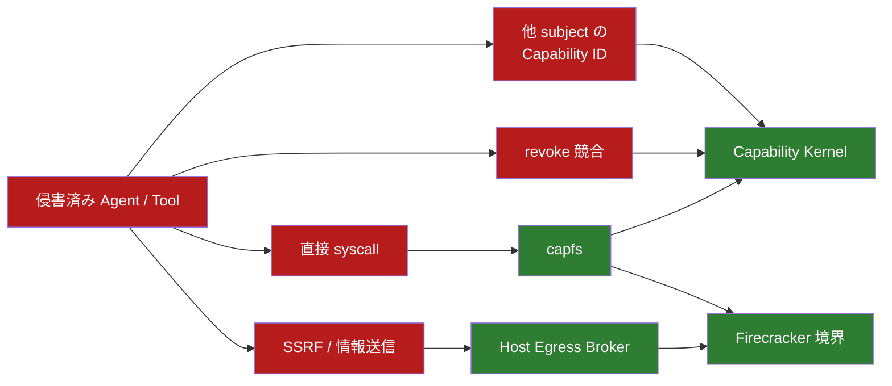
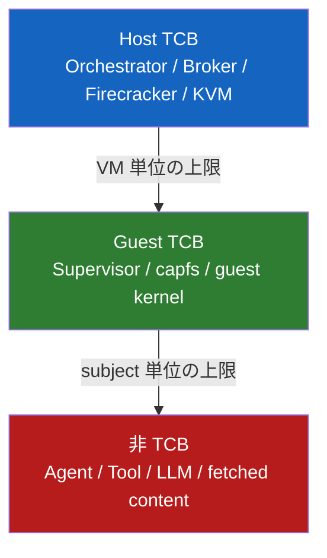

<!-- doc-type: design -->

# 脅威モデル

[設計書一覧](README.md) / 脅威モデル

> **対象読者:** 設計者、セキュリティレビュー担当者

## 一番大事な前提

Agent と Tool は信用しない。プロンプトインジェクションを受けた結果、任意コード実行まで到達しているものとして考える。

SDK を素直に使うことも、渡した Capability ID を秘密にすることも期待しない。直接 syscall を呼び、別 subject の ID を試し、revoke と write を競合させるところまでが通常の攻撃モデルである。

リポジトリ内のコード、LLM、Web から取得した内容も同じく信頼しない。

## どこが破られたら、何が残るか

細粒度の制御と、VM 全体の上限は別の保証として扱う。

| 侵害された場所 | その後も守れるもの |
|---|---|
| Agent / Tool | subject ごとの Capability 制約 |
| guest supervisor / guest kernel | その VM の workspace と Host Broker の session envelope まで |
| Firecracker / KVM / host kernel / Host Broker | 保証対象外 |

supervisor は TCB なので、侵害後も細粒度 Capability が守られるとは言わない。その代わり、guest に認証情報を置かず、VM には専用 workspace しか接続しない。ここで被害の上限をもう一段作る。

## VM の切り方

1 VM は、互いを信頼してよい 1 セッションのまとまりとする。別テナント、別セッション、相互不信の Agent は同居させない。

コンテナ境界は普段の分離には使うが、guest kernel breakout に対する最後の壁とは数えない。

## 保証対象外と初期実装の制限

次はシステム全体として保証対象に含めない。

- VM escape、ホスト侵害、物理攻撃、サイドチャネル。
- commit 済み外部操作の巻き戻し。
- VM を跨ぐ Capability 委譲。
- supervisor 再起動後の Capability 復元。
- Agent / Tool からの raw TCP / UDP。

次は拒否を維持する。

- device、FIFO、socket、`MKNOD`、`O_TMPFILE`、共有書き込み `mmap`。
- repository の外へ解決される symlink target。絶対 path と、root より上へ climb する相対 path の両方。
- inode の名前が repository の外にもある hard link。その名前は `capfs` が認可を検査できない。
- directory への hard link。

symlink と hard link を含む workspace 自体は扱う。symlink は registry が target を所有し、`READLINK` のたびに link の現在 path から再解決して、外へ出るなら本文を kernel へ渡さない。hard link を持つ inode は、その**全ての**名前に対して認可される。alias を増やして権限が広がることはなく、増えるのは要求される authority の方である。詳細は [capfs](capfs.md#symlink-は-registry-が-target-を所有する) と [ADR 0017](../decisions/0017-authorize-an-aliased-inode-on-every-name.md) を参照する。

## 関連

- [Capability モデル](capability-model.md)
- [capfs](capfs.md)
- [隔離基盤](runtime-isolation.md)
- [ネットワークと外部副作用](network-egress.md)
