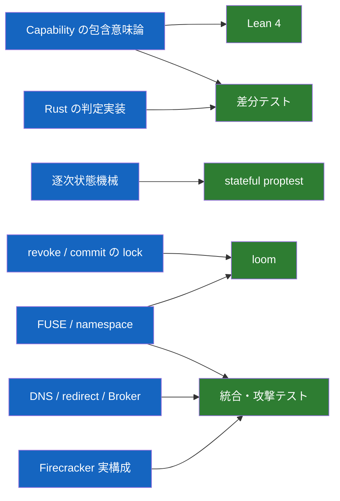
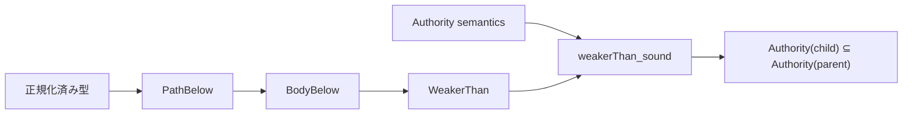
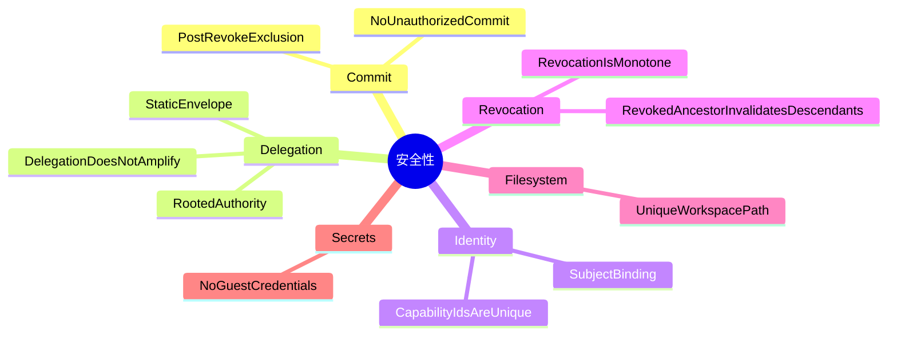

<!-- doc-type: design -->

# 検証戦略

[設計書一覧](README.md) / 検証戦略

> **対象読者:** 設計者、test を書く実装者、検証範囲のレビュー担当者

全部を1つの形式手法で証明しようとはしない。純粋関数、状態遷移、並行処理、Linux kernel との接続では、効く道具が違うからである。

この文書の「実装済み」はrepositoryにcode/APIがあること、「mock/contract検証済み」はfake、mock、module test、local contract testの結果である。privileged gateは実Linux syscallとDNS/TLS境界を、KVM gateはproduction `Runtime::launch`、jailer、dm-verity、clean snapshot capture／restore、v2 guest control、guest supervisor/isolation launcher、全13 CapFS effect、guest-to-host Broker、SessionOwner cleanupを通す。live external providerはblockedであり、VM escape耐性とhost kernel／hypervisor自体はTCBなので、VM境界全体を完全と判定しない。

## どの道具を、どこに当てるか

| 対象 | 手段 | そこで言えること | 現在の状態 |
|---|---|---|---|
| `PathBelow` / `WeakerThan` | Lean 4 | 包含判定の健全性と推移性 | 実装済み、Lean test |
| Lean と Rust | 共通 corpus の差分テスト | parse、正規化、判定結果の一致 | 150件の差分 test |
| 逐次状態機械 | stateful proptest | 生成した操作列で不変条件を破れないこと | 1,000 case の mock/reference 比較 |
| revoke / commit | loom | 小さく切った model 内の全 interleaving | bounded model は検証済み、実 adapter は未検証 |
| FUSE operation | 実 mount + KVM guest統合テスト | syscall が正しいeffectへ変換されること | host実FUSE 22件とKVM guestで全13 effectを確認。全kernel interleavingの証明ではない |
| namespace race | loom + stress test | rename、unlink、open handle の競合 | 限定的 test、全 interleaving は未検証 |
| link 対応 | 実 mount の攻撃テスト | 解決後 path での認可、root 脱出の拒否、rename 後の再解決、alias を持つ inode の全名前認可 | 深い chain と cycle（kernel の `ELOOP` に委譲）、体系的な backing 差し替え |
| SSRF | resolver / redirect test + 実HTTPS gate | 非公開宛先と rebinding の拒否 | fake境界に加えsystem DNS、TLS/SNI、address pin、rebindingを実socketで確認 |
| Host Egress Broker | module/contract test + 実HTTPS／KVM test | frame、replay、budget、typed dispatch、公開 HTTPS、GitHub plan | 公開HTTPSとguest-to-host canonical rejectionは実機確認、operator資格情報を要するlive GitHubだけblocked |
| runtime isolation | mock backend + privileged／KVM probe | ordered apply/rollback、policy validation、実kernelのnamespace/seccomp/Landlock/rootfs/device/fd/capability境界 | staged rootfsのdirect applyとproduction launcher post-exec、実rollback、KVM guestの`rootfs.source == "/"`を確認 |
| Firecracker runtime | fake境界 + Unix socket + 実lifecycle／KVM test | artifact、jailer/API順序、snapshot state、identity/workload gate | 実Firecracker、jailer、dm-verity、clean snapshot capture／restore、v2 guest gate、guest `AF_VSOCK` Brokerを確認 |
| Supervisor | protocol module + `FakeResources` + 実host／KVM runtime image | identity binding、subject lifecycle、handle cleanup、guest readinessとlauncher composition | 実kernel resource lifecycleと、guest supervisorから隔離workloadへのBroker channel／全13 CapFS effectを確認 |
| Supervisor control socket | 実`SOCK_SEQPACKET` module + KVM guest composition | accept時の`SO_PEERCRED`束縛、decode前のsubject確定、bounded datagram | 実socketとguest supervisorからのproduction compositionを確認 |
| Session orchestrator | mock state-machine + production composition + 実KVM SessionOwner | lease binding、startup rollback、stop retry、durable identity、Authority/Broker/Firecracker/workspace adapter | clean snapshotからrunning／poll／stop／closedと全owned resource cleanupを実機確認 |
| VM 境界 | representative escape試行 + 実lifecycle | jailer、kernel、mount、Landlock、seccomp設定 | 実機で代表拒否を確認。VM escape不可能性の完全証明はTCB外 |
| snapshot | 同一 snapshot の複数 restore + 実clean snapshot capture／restore | ID、workspace、Broker session の一意性 | state contractと実KVM restoreを確認。hypervisor自体の完全性はTCB |

Authority core では、versioned TSV の150件を Rust と Lean の production 判定へ流す。file に加え HTTP の method / host / path / response size、GitHub の installation / repository / operation / base/head branch を個別に壊す境界も含む。各 runner が fixture の期待値を検査したうえで、正規化した全出力も比較する。これは現在の具体的な境界のずれを自動検出する手段であり、両実装が全入力で同値だという証明ではない。

逐次状態機械では、1〜63操作の Derive/revoke 列を1,000 case 生成し、production state と独立した参照モデルを各 transition 後に比較する。subject binding、ID 非再利用、親以下の authority、静的 envelope、祖先失効をまとめて検査するが、これは生成した有限の操作列に対する test であり、状態機械全体の数学的証明ではない。[Capability state の検証範囲](../authority-core/capability-state.md#どう検証しているか)

revoke / commit については、production の `CapabilityKernel` と同じ synchronization wrapper を使い、direct revoke / 単一・compound effect、ancestor revoke / 単一・compound descendant effect、2 effects / 1 revoke の bounded model を loom で検査している。effect が実行される場合は revoke return より前に線形化点と audit outcome の確定へ到達し、revoke が先なら executor を呼ばず認可拒否になる。compound modelは、executorが部分的に呼ばれないことと、request set全件が1件のattempt / effectとして監査されることも確認する。詳しい実装と executor 契約は[Authorization guard](../authority-core/authorization-guard.md)を参照する。

loom は実システム全体の証明ではない。direct / ancestor の 2 thread model は全 interleaving を探索するが、3 thread model は CI での state explosion を避けるため preemption bound 2 である。open handle、rename、unlink、複数 revoke、実 syscall adapter は含まず、loom 自身にも完全な C11 memory model ではないという制限がある。したがって、ここで言えるのは選んだ bounded model の範囲内の結果である。

capfs namespace registry は、公開 API の contract test で path/object の一意対応、registry内のID割り当て、失敗したcreateのID未発行、remove後のID非再利用、generation、open count、create/remove/rename の失敗 atomicity を検査する。direct-child listingはnested descendantを除外してcanonical name順へ並べ、stale generationではexecutorへ入らずstream restartになることを確認する。標準thread testでは、readまたはlisting operationが現在path viewを使い終わるまで並行renameがwrite lockを取得できないことも確認する。module testではObject ID sequenceの最終値と枯渇、invalid manifestの拒否を検査する。これは1つの具体的な schedule であり、open / close / rename / revoke の全 interleaving を探索する Loom model ではない。詳しい境界は[共有 namespace registry](../capfs/namespace-registry.md)を参照する。

backing repositoryのcontract testは実directory treeに対して、root fdの保持、path順manifest、root／entry symlink、hard link、socket、非UTF-8名、canonical segment違反、entry／depth limitを検査する。startup testはmanifest全件のregistry import、path順のObject ID、初期generation、preflight失敗時にnamespaceを公開しないことを確認する。module／実FUSE testはmount IDの相違、実mount namespaceのnested mount、全unsupported object kind、runtimeのmetadata/open/read、preflight後のregular file／symlink／hard link差し替え拒否を検査する。無制限の連続raceと全mount topologyは有限テストの範囲外である。詳しい前提は[Backing repository の事前検証](../capfs/backing-preflight.md)を参照する。

subject-local node table の contract test は、root nodeの固定、同一objectへの反復LOOKUP、READDIR用の非加算live-node参照、最終FORGET後のnodeid非再利用、stale nodeと過剰FORGETの拒否、mount間の数値identity分離、32 threadの同時LOOKUPを検査する。module testはnode sequenceとlookup countの最終値・枯渇、writer panic後のfail closedを検査する。これはmemory内tableの並行性であり、kernelが発行する実FORGETやmount teardownを含むFUSE統合testではない。詳しい境界は[mount ごとの node table](../capfs/node-tables.md)を参照する。

Direct-I/O FUSE adapterのmodule testは、許可範囲と祖先だけのmetadata visibility、backingとCapabilityのrepository identity不一致、namespace／Authorityのfile・directory handle対応、全13 `FileEffect`、generation付きdirectory offset cookie、revoke後再認可、malformed FORGET後のfail closedを検査する。Linux統合testは実際にFUSEへmountし、全effect、link、nested mount、backing replacement、mutation／revokeのbounded raceまで22件を実行する。KVM SessionOwner gateは同じ全effectをguest isolation内で実行する。実kernelのFORGET全lifecycle、無制限race、全scheduler interleavingは有限テストによる完全証明の範囲外である。詳しい境界は[Direct-I/O FUSE adapter](../capfs/read-only-fuse.md)を参照する。

## Cycle 2 adapter の検証境界

### Host Egress Broker

`egress-broker`はdeterministic fakeでbounded transport、canonical CBOR dispatch、session/replay binding、budget、最終`CapabilityKernel`認可、DNS answerの全体検査、redirectごとの再解決、response streaming cap、GitHubのexpected-old plan、typed rate-limit metadataを検査する。privileged HTTPS gateはsystem DNS、TLS/SNI、address pin、redirect後の再解決／rebindingを実socketで確認する。KVM SessionOwner gateはguest supervisorと全13 CapFS effectからhost per-port Unix socketを通り、実`BrokerDispatcher`がcanonical `NotAuthorized`を返すまでを確認する。実GitHub APIだけはoperator credential不在でblockedである。詳細は [Host Egress Broker](../egress-broker/README.md) と [検証対応表](../egress-broker/verification.md) を参照する。

### runtime isolation

`runtime-isolation` は `IsolationConfig::validate` の path/limit/syscall 検査、13 段階の apply 順序、failure 時の completed step 逆順 rollback、capability 不足と Landlock ABI 不足の事前拒否を mock backend で検査する。さらに [`verify-privileged-isolation.sh`](../../scripts/ci/verify-privileged-isolation.sh) は staged rootfs に実際の Linux namespace、mount、cgroup v2、seccomp、Landlock、capability、fd 制約を適用し、direct enforce、production launcherのstart gateから`execve`後まで、許可操作、escape試行、実unmount rollbackを確認する。`rootfs.source == "/"` はreadonly SquashFS rootを使うKVM SessionOwner gateが確認する。

### Firecracker runtime

`firecracker-runtime` の test は artifact digest、mutable `latest` path、network device、workspace overlap、jailer/verity/API の順序、API error rollback、snapshot fingerprint、stale/duplicate identity、identity injection 前の workload gate を fake boundary で検査する。さらに [`verify-real-guest-control.sh`](../../scripts/ci/verify-real-guest-control.sh) は static PID 1 image を作り、実 dm-verity mapper を read-only で開き、実 Firecracker を boot して guest `AF_VSOCK` control channel の `409` gate、v2 policy-digest-bound identity/start ACK、guest supervisor/isolation launcher、guest-to-host Broker canonical rejectionを確認する。`verify-real-runtime-lifecycle.sh`と`verify-real-session-owner.sh`は実jailer lifecycle、clean snapshot capture／restore、resource cleanupまで確認する。VM escape耐性そのものはFirecracker／KVM／host kernelのTCBであり、このrepositoryのテストによる完全証明ではない。詳細は [Firecracker runtime](../firecracker-runtime/README.md) を参照する。

### Supervisor

wire module test は version、closed tag、4 KiB size、field length、body length、trailing bytes を検査する。supervisor test は `CapabilityKernel`、`StaticCallerResolver`、`FakeResources` を使い、resource setup 順、partial rollback、connection identity 優先、root/derive/revoke、stale handle、cleanup failure と `Closing` の fail-closed retry を検査する。local `SOCK_SEQPACKET` credential boundary、実host kernel resource lifecycle、実KVM内のguest supervisor readiness、workspace mount、isolation launcher、workload Broker channel、全13 CapFS effect、host control-planeからのSessionOwner lifecycleも確認済みである。詳細は [Supervisor adapter](../supervisor/README.md) を参照する。

### Session orchestrator

state-machine test は mock backend の call log と lease を使い、workspace -> Broker -> VM -> capability -> workload の commit 順、各 failure の rollback、VM kill failure 時の workspace isolation 保留、snapshot identity rejection、identity reuse、foreign lease、二重 start、stop retry を検査する。production adapter composition test は実 `CapabilityKernel` と Broker / Firecracker / workspace adapter を同じ経路へ接続し、外部 command、filesystem、API を test double にする。さらにKVM gateは実`SessionOwner`をclean snapshot captureからstart／running／poll／stop／closedまで駆動し、実CapFS、特権isolation、Broker durable evidence、owned resource cleanupを確認する。詳細は [Session orchestrator](../session-orchestrator/README.md) を参照する。

link の test は実 mount 上で `symlink(2)` / `readlink(2)` / `link(2)` を通し、target が repository の外へ出る形を作らせないこと、alias を持つ inode が全ての名前で認可されることを確認する（[symlink](capfs.md#symlink-は-registry-が-target-を所有する)、[hard link](capfs.md#hard-link-は全ての名前で認可することで閉じる)）。深い chain と cycle は kernel 自身の `ELOOP` に委ねており、独自の test は置いていない。

## Lean で証明するもの

Lean 側にも Rust と同じ tagged union を持たせる。Authority item には repository、host、operation、path、時刻を含める。file と GitHub を path-only の1型に潰すと、証明したものと実装したものが別物になる。

必須定理は containment 各層の `refl`、`trans`、`sound` とする。path と時刻窓には `complete` / `iff`、file / HTTP fetch / GitHub body と Capability 全体には、空 authority の空虚な真を避ける非空条件付きの `complete` / `iff` を実装している。異なる tagged authority family の matching と containment は明示的に `false` である。

## 正常系だけを生成しない

stateful test には、攻撃者が選びそうな操作を最初から入れる。

- Capability ID を別 subject へコピーする。
- 制約外 resource を要求する。
- revoke 済み親の子を使う。
- stale ID / stale handle を再利用する。
- 静的 envelope の外へ権限を追加する。
- `OPEN -> Revoke -> READ/WRITE` を作る。
- open 中 object を rename / unlink する。
- DNS answer や redirect を接続直前に差し替える。

loom には negative control を置いている。認可直後に shared guard を解放する壊れた版では、revoke が return した後に commit する反例が出る。production guard では同じ model の全 interleaving が pass する。negative control 自体は期待した assertion で panic することを `#[should_panic]` で test 成功条件にしている。

## 守る不変条件

TLA+ は使わない。分散 revoke、複数ホスト間の Capability 移送、複製された Broker state を導入した時点で、対象が変わったものとして再検討する。

## 関連

- [Capability モデル](capability-model.md)
- [状態機械と revoke](state-and-revocation.md)
- [実装順序](implementation-plan.md)
- [Host Egress Broker](../egress-broker/README.md)
- [Firecracker runtime](../firecracker-runtime/README.md)
- [Supervisor adapter](../supervisor/README.md)
- [Session orchestrator](../session-orchestrator/README.md)
