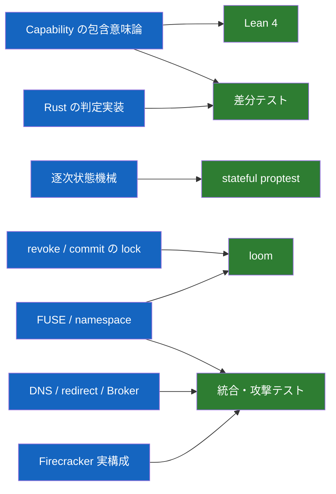
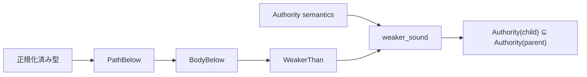
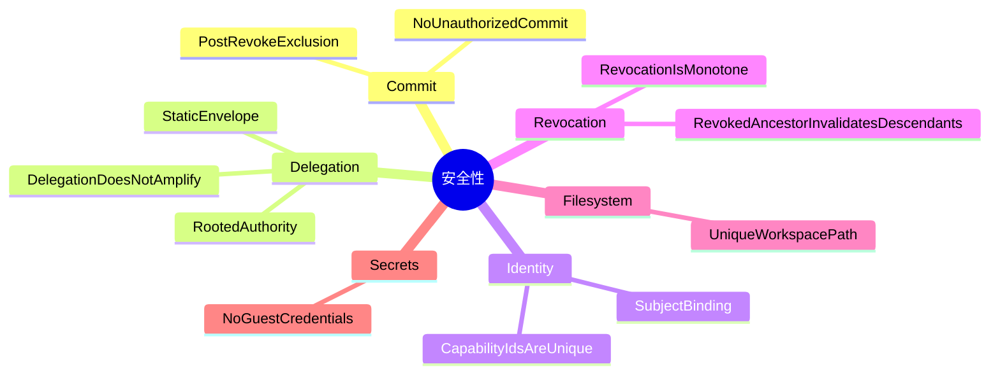

# 検証戦略

[設計書一覧](README.md) / 検証戦略

全部を1つの形式手法で証明しようとはしない。純粋関数、状態遷移、並行処理、Linux kernel との接続では、効く道具が違うからである。

## どの道具を、どこに当てるか

| 対象 | 手段 | そこで言えること |
|---|---|---|
| `PathBelow` / `WeakerThan` | Lean 4 | 包含判定の健全性と推移性 |
| Lean と Rust | 共通 corpus の差分テスト | parse、正規化、判定結果の一致 |
| 逐次状態機械 | stateful proptest | 生成した操作列で不変条件を破れないこと |
| revoke / commit | loom | 小さく切った model 内の全 interleaving |
| FUSE operation | 実 mount の統合テスト | syscall が正しい effect へ変換されること |
| namespace race | loom + stress test | rename、unlink、open handle の競合 |
| SSRF | resolver / redirect test | 非公開宛先と rebinding の拒否 |
| VM 境界 | escape 試行 | 実際の jailer、kernel、mount、seccomp 設定 |
| snapshot | 同一 snapshot の複数 restore | ID、workspace、Broker session の一意性 |

loom は実システム全体の証明ではない。production と同じ synchronization wrapper を使った bounded model の検査である、と範囲を明記する。

## Lean で証明するもの

Lean 側にも Rust と同じ tagged union を持たせる。Authority item には repository、host、operation、path、時刻を含める。file と GitHub を path-only の1型に潰すと、証明したものと実装したものが別物になる。

必須定理は `pathBelow_refl/trans/sound`、`bodyBelow_refl/trans/sound`、`weaker_refl/trans/sound`。安全性には sound で十分だが、path については実行可能な判定と集合意味論のずれをなくすため、`pathBelow_complete` と `pathBelow_iff_matches_subset` まで証明する。body と weaker の完全性は必要になった時点で検討する。

## 正常系だけを生成しない

stateful test には、攻撃者が選びそうな操作を最初から入れる。

- Capability ID を別 subject へコピーする。
- 制約外 resource を要求する。
- revoke 済み親の子を使う。
- stale ID / stale handle を再利用する。
- 静的 envelope の外へ権限を追加する。
- `OPEN -> Revoke -> READ/WRITE` を作る。
- open 中 object を rename / unlink する。
- DNS answer や redirect を接続直前に差し替える。

loom には negative control を置く。commit 時の再確認を無効にした版で反例が出て、有効にした版で同じ model の反例が消えることを CI の条件にする。

## 守る不変条件

TLA+ は使わない。分散 revoke、複数ホスト間の Capability 移送、複製された Broker state を導入した時点で、対象が変わったものとして再検討する。

## 関連文書

- [Capability モデル](capability-model.md)
- [状態機械と revoke](state-and-revocation.md)
- [実装順序](implementation-plan.md)
