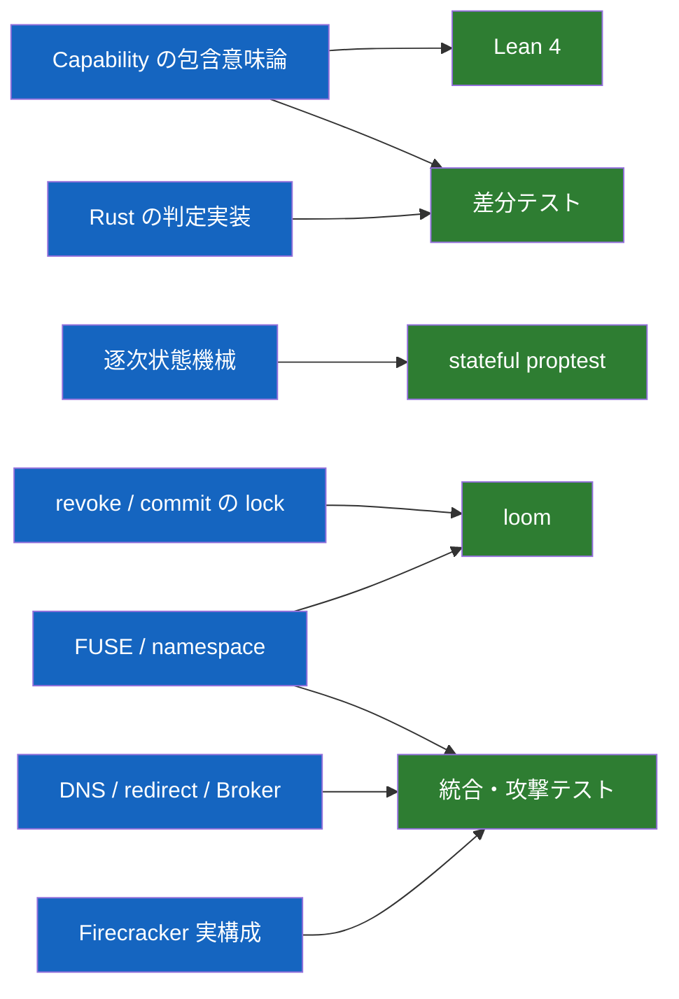
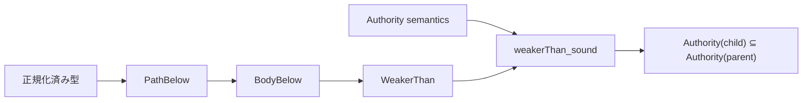
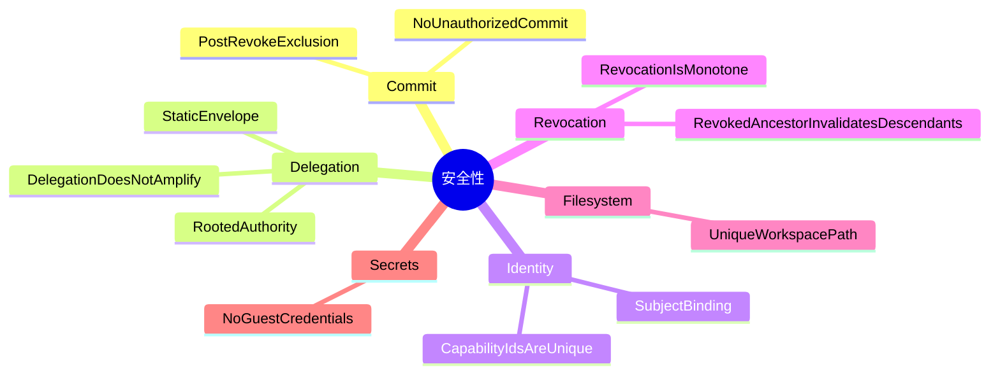

# 検証戦略

[設計書一覧](README.md) / 検証戦略

全部を1つの形式手法で証明しようとはしない。純粋関数、状態遷移、並行処理、Linux kernel との接続では、効く道具が違うからである。

## どの道具を、どこに当てるか

| 対象 | 手段 | そこで言えること |
|---|---|---|
| `PathBelow` / `WeakerThan` | Lean 4 | 包含判定の健全性と推移性 |
| Lean と Rust | 共通 corpus の差分テスト | parse、正規化、判定結果の一致 |
| 逐次状態機械 | stateful proptest | 生成した操作列で不変条件を破れないこと |
| revoke / commit | loom | 小さく切った model 内の全 interleaving |
| FUSE operation | 実 mount の統合テスト | syscall が正しい effect へ変換されること |
| namespace race | loom + stress test | rename、unlink、open handle の競合 |
| symlink resolver（後続機能） | stateful proptest + 実 mount の攻撃テスト | 解決後 path での認可、root 脱出・cycle・stale resolution の拒否 |
| SSRF | resolver / redirect test | 非公開宛先と rebinding の拒否 |
| VM 境界 | escape 試行 | 実際の jailer、kernel、mount、seccomp 設定 |
| snapshot | 同一 snapshot の複数 restore | ID、workspace、Broker session の一意性 |

現在の file-only Authority core では、versioned TSV の71件を Rust と Lean の production 判定へ流す。各 runner が fixture の期待値を検査したうえで、正規化した全出力も比較する。これは現在の具体的な境界のずれを自動検出する手段であり、両実装が全入力で同値だという証明ではない。

逐次状態機械では、1〜63操作の Derive/revoke 列を1,000 case 生成し、production state と独立した参照モデルを各 transition 後に比較する。subject binding、ID 非再利用、親以下の authority、静的 envelope、祖先失効をまとめて検査するが、これは生成した有限の操作列に対する test であり、状態機械全体の数学的証明ではない。[Capability state の検証範囲](../authority-core/capability-state.md#どう検証しているか)

revoke / commit については、production の `CapabilityKernel` と同じ synchronization wrapper を使い、direct revoke / 1 effect、ancestor revoke / descendant effect、2 effects / 1 revoke の bounded model を loom で検査している。effect が実行される場合は revoke return より前に線形化点と audit outcome の確定へ到達し、revoke が先なら executor を呼ばず認可拒否になる。詳しい実装と executor 契約は[Authorization guard](../authority-core/authorization-guard.md)を参照する。

loom は実システム全体の証明ではない。direct / ancestor の 2 thread model は全 interleaving を探索するが、3 thread model は CI での state explosion を避けるため preemption bound 2 である。open handle、rename、unlink、複数 revoke、実 syscall adapter は含まず、loom 自身にも完全な C11 memory model ではないという制限がある。したがって、ここで言えるのは選んだ bounded model の範囲内の結果である。

capfs namespace registry は、公開 API の contract test で path/object の一意対応、ID 非再利用、generation、open count、create/remove/rename の失敗 atomicity を検査する。標準 thread test では、read operation が現在 path を使い終わるまで並行 rename が write lock を取得できないことも確認する。これは1つの具体的な schedule であり、open / close / rename / revoke の全 interleaving を探索する Loom model ではない。詳しい境界は[共有 namespace registry](../capfs/namespace-registry.md)を参照する。

symlink resolver の test は初期 `capfs` の完了条件には含めない。link-free な namespace と revoke の検証を先に終え、[symlink 対応](capfs.md#symlink-は後続機能として追加する)を実装する段階で追加する。

## Lean で証明するもの

Lean 側にも Rust と同じ tagged union を持たせる。Authority item には repository、host、operation、path、時刻を含める。file と GitHub を path-only の1型に潰すと、証明したものと実装したものが別物になる。

必須定理は containment 各層の `refl`、`trans`、`sound` とする。現在の file-only Authority core では、path に `pathBelow_complete` / `pathBelow_iff_matches_subset`、時刻窓に `timeWindowBelow_complete` / `timeWindowBelow_iff_subset` まで実装している。file body と Capability 全体についても、空 authority の空虚な真を避ける非空条件付きで `complete` / `iff` を証明している。

## 正常系だけを生成しない

stateful test には、攻撃者が選びそうな操作を最初から入れる。

- Capability ID を別 subject へコピーする。
- 制約外 resource を要求する。
- revoke 済み親の子を使う。
- stale ID / stale handle を再利用する。
- 静的 envelope の外へ権限を追加する。
- `OPEN -> Revoke -> READ/WRITE` を作る。
- open 中 object を rename / unlink する。
- DNS answer や redirect を接続直前に差し替える。

loom には negative control を置いている。認可直後に shared guard を解放する壊れた版では、revoke が return した後に commit する反例が出る。production guard では同じ model の全 interleaving が pass する。negative control 自体は期待した assertion で panic することを `#[should_panic]` で test 成功条件にしている。

## 守る不変条件

TLA+ は使わない。分散 revoke、複数ホスト間の Capability 移送、複製された Broker state を導入した時点で、対象が変わったものとして再検討する。

## 関連文書

- [Capability モデル](capability-model.md)
- [状態機械と revoke](state-and-revocation.md)
- [実装順序](implementation-plan.md)
