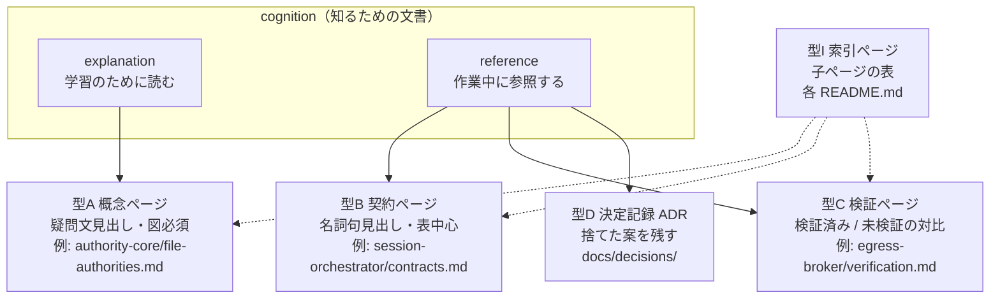

<!-- doc-type: exempt -->

# 文書規約

[ドキュメント一覧](README.md) / 文書規約

> **対象読者:** `docs/` 配下に文書を追加・変更する全員、文書レビュー担当者

このページは、この repository の文書が満たすべき構造と、その構造を `scripts/ci/check-docs.sh` がどう機械検査するかを定める。設計判断そのものは[設計書](design/README.md)、用語の定義は[用語集](glossary.md)を正とする。

## なぜ単一テンプレを使わないのか

Cycle 1 の [Authority core 文書](authority-core/README.md)と Cycle 2 の adapter 文書は、同じ「文書」でありながら読者の目的が違う。前者は「なぜこの境界なのか」を理解するために読み、後者は「この trait を実装するとき何を守るのか」を確認するために読む。この 2 つを同じ見出し規約で書こうとすると、必ず片方が破綻する。

[Diátaxis](https://diataxis.fr/start-here/) はこれを *action ↔ cognition* と *study ↔ work* の 2 軸で整理し、「境界をまたぐことが文書の問題の大半の根源である」と述べている。この repository では 2 軸のうち cognition 側だけを使い、**explanation**（学習のために読む）と **reference**（作業中に参照する）を分ける。tutorial と how-to guide は、実行可能な製品ができるまで作らない。



一つのページに型を混ぜない。概念の説明中に網羅的な API 表を書きたくなったら、それは型B の別ページである。

## 全ての型に共通する規約

### 1 行目は doc-type marker

全ての `docs/**/*.md` は次の HTML コメントで始まる。描画結果には現れず、CI がページ型を判定するために使う。

```markdown
<!-- doc-type: concept -->
```

有効な値は `concept`（型A）、`contract`（型B）、`verification`（型C）、`decision`（型D）、`design`（型S）、`index`（型I）、`exempt`（このページや[用語集](glossary.md)のような、どの型にも属さない横断文書）。

### 見出しの直後にパンくずを置く

```markdown
# <ページ名>

[<親ページ名>](README.md) / <このページ名>
```

親を持たない `docs/` 直下のページは `[ドキュメント一覧](README.md)` を親にする。

### 対象読者を明示する

```markdown
> **対象読者:** Broker 実装者、ホスト側統合担当者、セキュリティレビュー担当者
```

「実装者」「レビュー担当者」だけでは足りない。*どの境界を触る人か*を書く。この 1 行が書けないページは、書く対象が定まっていない。

### 何を説明するページかを 1 文で書く

パンくずと対象読者の後、最初の見出しの前に、対象ソースへのリンクを含む 1 文を置く。

```markdown
このページは [`crates/capfs/src/namespace.rs`](../../crates/capfs/src/namespace.rs) が、
rename 中でも各 object の現在 path を一意に決める仕組みを説明する。
```

型A と型B はソースファイルへのリンクを必須とする。文書とコードの対応が切れたとき、CI のリンク切れ検査で気付ける。

### 末尾に `## 関連` を置く

同じ crate の兄弟ページ、対応する設計ページ、関連する ADR を並べる。行き止まりのページを作らない。

## 型A: 概念ページ（explanation）

骨格: [`docs/templates/concept.md`](templates/concept.md)

**目的:** 「なぜこの構造なのか」を、その境界を初めて触る人に理解させる。

**見出しは疑問文にする。** 読者の頭にある問いをそのまま見出しにすると、節の順序が読者の思考順になり、内容が薄いときに自分で気付ける。「実装済みの境界」という見出しの下には事実を並べれば埋まってしまうが、「何を防ぎたいのか」の下には具体的な攻撃シナリオを書くしかない。

```markdown
## 何を防ぎたいのか          ← 必須。攻撃/失敗シナリオを具体値で書く。図を 1 枚置く
## <中核概念>はどう決まるか   ← 1 概念 1 節。個数は内容次第
## 何が助かるのか            ← この構造によって何のレビューが不要になるか
## 正確な保証範囲            ← 必須。この節の規約は下記
## 変更時の確認点            ← 必須。同時に直す場所のチェックリスト
## 関連                      ← 必須
```

**具体値で書く。** 「親より狭い範囲でなければ委譲できない」ではなく、`workspace / {ReadData, WriteData} / Prefix(src)` という親に対して、どの子が通り、どの子が拒否されるかを実際の値で並べる。[file-authorities.md](authority-core/file-authorities.md) がこの形の基準例である。

**図を最低 1 枚置く。** 用途で使い分ける。

| 図の種類 | 使う場面 |
|---|---|
| `flowchart LR` | 拒否判定の分岐。どの条件で deny になるか |
| `stateDiagram-v2` | lifecycle。`Ready` から `Closed` までの状態遷移と rollback |
| `sequenceDiagram` | host / guest / adapter をまたぐ操作の順序と commit point |
| `classDiagram` | 型の構造と、型どうしの保持関係 |

**下限 100 行。** これは品質の保証ではなく、明らかに書けていないページを CI で止めるための床である。

## 型B: 契約ページ（reference）

骨格: [`docs/templates/contract.md`](templates/contract.md)

**目的:** trait を実装する人、wire format を実装する人が、作業中に参照して漏れを潰す。

**見出しは名詞句にする。** 網羅性と検索しやすさが優先で、読み物としての流れは要らない。

```markdown
## <trait 名 / メッセージ名>   ← 対象ごとに 1 節
## 保証範囲外                  ← 必須。この契約が保証しないこと
## 関連                        ← 必須
```

**散文で書かない。** 型・順序・上限・エラーは表にする。[session-orchestrator/contracts.md](session-orchestrator/contracts.md) は節の切り方は正しいが、中身が段落になっている。契約は表で書く。

| 項目 | 規約 |
|---|---|
| 型 | Rust の型名をそのまま `code` で書く。散文で言い換えない |
| 順序 | 番号付きリストか `stateDiagram-v2` で固定する |
| 上限 | 数値と単位を必ず書く（`1 MiB`、`4 KiB`、`256 bytes`） |
| 失敗 | どの enum variant が返るか、呼び出し側が retry してよいか |

**下限 60 行。** 表 1 つ以上を必須とする。

## 型C: 検証ページ（reference）

骨格: [`docs/templates/verification.md`](templates/verification.md)

**目的:** 「mock test が通った」と「実機で動いた」を混同させない。

```markdown
## local test で確認したこと   ← 必須
## 実行コマンド                ← 必須。bash ブロックでコピー可能な形
## 未検証の境界                ← 必須
## 関連                        ← 必須
```

この型は [egress-broker/verification.md](egress-broker/verification.md) が既に正しい形をしている。全 crate に展開する。

`未検証の境界` は、この repository で最も重要な節である。形式検証を伴うシステムでは、証明が何を*仮定*しているかを書くのが標準的な作法で、[seL4 の proofs ページ](https://sel4.systems/Verification/proofs.html)も compiler・assembly・hardware・DMA を仮定として明示し、timing channel を対象外として明記している。この repository も同じ水準を守る。

- fake / mock / test double を使った箇所は、そう書く。
- 特権操作、外部ネットワーク、実 VM を伴う経路は、未検証なら未検証と書く。
- 「mock test の成功を実機動作の根拠にしない」という [docs/README.md](README.md) の宣言を、各 crate で具体化する。

**下限 40 行。**

## 型D: 決定記録（ADR）

**目的:** 捨てた案を残す。

`docs/` 全体を検索して「検討したが採用しなかった案」への言及が実質存在しないことが、現在の文書の最大の欠陥である。全ての決定が最初から自明だったかのように読めると、読者は判断の前提を再構成できず、後から前提が変わっても誰も気付けない。

形式は [MADR](https://adr.github.io/madr/) に従う。1 決定 1 ファイル、`docs/decisions/NNNN-<slug>.md`。骨格は [`docs/templates/decision.md`](templates/decision.md)、運用は[決定記録](decisions/README.md)を参照する。

必須節は `Status` / `背景と課題` / `検討した選択肢` / `決定` / `結果` / `関連` で、CI は「採用しなかった理由」が本文に現れることも検査する。選択肢を 1 つしか書いていない ADR は形式として成立しない。

## 型S: 設計ページ（explanation）

`docs/design/` 専用。型A との違いは、特定の module ではなく境界そのものを扱う点にある。だから `crates/**/*.rs` へのリンクは必須にしない。実装が複数 crate にまたがる、あるいはまだ実装が無い段階でも書けるようにしてある。

図は必須。設計ページで図が無いということは、構造を言葉だけで押し通そうとしているということで、たいてい読めない。下限 80 行。

見出しは疑問文でも名詞句でもよい。[capfs 設計](design/capfs.md)の「nodeid はパスではない」「rename をどう閉じるか」のような、主張が入った見出しが望ましい。

## 型I: 索引ページ（README.md）

骨格: [`docs/templates/index.md`](templates/index.md)

**目的:** 子ページへの入口と、crate 全体の実装範囲・検証境界の要約。

```markdown
## <この crate が持つ境界の要約>   ← アーキテクチャ図を 1 枚置く
## 文書一覧                    ← 必須。表で子ページを列挙する
## 関連                        ← 必須
```

**アーキテクチャ図を必須にする。** 索引ページは、その crate を初めて見る人が最初に開く場所である。module の一覧を表で読む前に、「この crate はどこに座っていて、何と話すのか」が 1 枚で分かる必要がある。

図は 3 つを描く。crate 自身の module、外側との境界（他 crate、kernel、外部サービス）、そして test double が入る trait の継ぎ目。色は[全体アーキテクチャ](design/architecture.md)と揃える。

| classDef | 用途 |
|---|---|
| `host` | host 側で動く module |
| `guest` | guest 側で動く module |
| `seam` | trait の継ぎ目。ここに test double が入る |
| `data` | on-disk / kernel の resource |
| `external` | この crate の外 |

子ページの表には、必ず**対象ソース**と**内容**の列を持たせる。[capfs/README.md](capfs/README.md) がこの形である。

索引ページに詳細を書き始めたら、それは子ページを作るべき合図である。現在の [session-orchestrator/README.md](session-orchestrator/README.md) は durable ledger の契約まで抱えており、分割対象である。

## 粒度: 1 crate に何ファイル必要か

**目安は `src` の主要 module ごとに 1 ページ。** module が持つ不変条件を 1 ページで説明できないなら、その module が大きすぎるか、ページが足りない。

現状の乖離は次のとおりである。この表は書き直しの作業リストでもある。

| crate | コード行数 | 現在の doc 行数 | 判定 |
|---|---:|---:|---|
| `authority-core` | 10,558 | 2,679 | 基準を満たす |
| `capfs` | 10,810 | 756 | 概念ページの追加が必要 |
| `session-orchestrator` | 6,379 | 192 | 分割が必要 |
| `firecracker-runtime` | 4,028 | 56 | 全面的に不足 |
| `egress-broker` | 3,852 | 182 | `dispatch` の概念ページが無い |
| `egress-protocol` | 2,957 | 164 | 概念ページの追加が必要 |
| `runtime-isolation` | 2,753 | 36 | 索引ページが存在しない |
| `supervisor` | 2,268 | 72 | 分割が必要 |

## 書き方

構造が揃っていても、全ページが同じ文型で埋まっていれば読めたものではない。次は CI では検査できないが、レビューで落とす。

**定型の書き出しを全ページで繰り返さない。** 「このページは〜を説明する」で始まるページが 40 本並ぶと、どれも読む気にならない。対象ソースへのリンクは冒頭付近にあればよく、文の形は揃える必要がない。いきなり本題から入ってもいい。

**箇条書きを無理に対称にしない。** 3 つ揃えるために内容の薄い項目を足すくらいなら 2 つでいい。逆に、粒度がばらばらなものを同じ階層に並べない。

**一般論を書かない。** 「セキュリティ上重要である」「堅牢な設計である」といった文は情報を持たない。書くなら「この検査を外すと、guest が `169.254.169.254` へ到達できる」のように、対象と結果を名指しする。

**踏んだ失敗を残す。** 「ここは間違えやすい」「最初はこう書いていたが、rename と競合して直した」といった記述は、次に触る人にとって仕様書より価値がある。実装中に引っかかった点は、思い出せるうちに書く。

**修飾を盛らない。** 「極めて」「非常に」「厳格に」は、たいてい削っても意味が変わらない。数値と条件で書けるなら、そちらにする。

**同じ段落で同じ文末を繰り返さない。** 「〜である。〜である。〜である。」が続いたら、書き手が内容ではなく形式を埋めにいっている。

## 用語

新しい語を導入したら[用語集](glossary.md)に追加する。特に、同じ語が文脈によって別の対象を指す場合（`envelope` が Broker の wire envelope と Authority の static authority envelope の両方を指す等）は、用語集で衝突を明示する。

## CI が何を検査するか

`scripts/ci/check-docs.sh` が次を検査する。CI では `scripts/ci/run.sh docs-policy` として validate stage で実行する。ローカルでも同じコマンドで実行できる。

| 検査 | 対象の型 |
|---|---|
| 1 行目の doc-type marker が有効な値 | 全型 |
| H1 が 1 つだけ存在する | 全型 |
| パンくず行が H1 の直後にある | 全型 |
| `> **対象読者:**` がある | 全型 |
| `## 関連` がある | 全型 |
| `crates/**/*.rs` へのリンクが 1 つ以上ある | `concept`, `contract` |
| ```mermaid ブロックが 1 つ以上ある | `concept`, `design`, `index` |
| `## 正確な保証範囲` がある | `concept` |
| `## 変更時の確認点` がある | `concept` |
| `## 保証範囲外` がある | `contract` |
| 表が 1 つ以上ある | `contract`, `index` |
| `## 未検証の境界` と bash ブロックがある | `verification` |
| MADR の必須節が揃っている | `decision` |
| 行数が型ごとの下限以上 | `concept`, `contract`, `verification` |
| 相対リンクの参照先が存在する | 全型 |

code fence の中身は検査対象から外す。骨格や例示として fence 内に書いた見出し・リンクが、実体として数えられることはない。`docs/templates/` 配下は骨格そのものなので、検査対象から除外する。

CI は構造しか見ない。内容が具体値で書かれているか、図が実際の機構を表しているかはレビューで見る。

引数を渡すと、その file だけを検査できる。

```bash
scripts/ci/run.sh docs-policy
scripts/ci/check-docs.sh docs/capfs/namespace-registry.md
```

## 変更時の確認点

- 型を増減するときは、この規約表、[`scripts/ci/check-docs.sh`](../scripts/ci/check-docs.sh) の型定義、`docs/templates/` の骨格ファイルを同時に更新する。
- 必須節の名前を変えるときは、全既存文書を一括で追随させてから CI を変える。片方だけ変えると validate stage が全面的に落ちる。
- crate を追加したら、索引ページと検証ページを最低限作り、[docs/README.md](README.md) の表に追加する。
- 行数の下限を変えるときは、下限が品質の代理指標にすぎないことを忘れない。下限を満たすためだけの水増しはレビューで落とす。

## 関連

- [ドキュメント一覧](README.md)
- [用語集](glossary.md)
- [決定記録](decisions/README.md)
- [設計書](design/README.md)
- [検証戦略](design/verification.md)
- [CI/CD operations](ci-cd.md)

