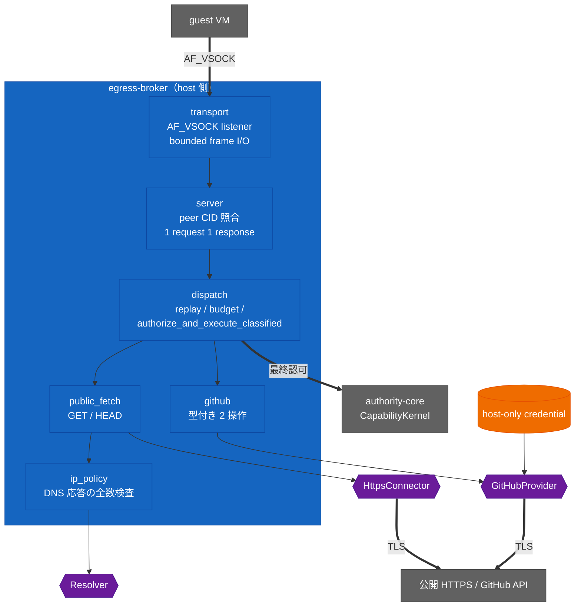

<!-- doc-type: index -->

# Host Egress Broker

[ドキュメント一覧](../README.md) / Host Egress Broker

> **対象読者:** Broker 実装者、ホスト側統合担当者、セキュリティレビュー担当者

`egress-broker` は Phase 5 のホスト側実装境界である。`egress-protocol` が定義する閉じた操作だけを受け付ける。

- 認証情報を使わない公開 HTTPS の `GET` と `HEAD`
- 型付き GitHub 操作の `PublishBranch` と `CreatePullRequest`

生の URL、任意の HTTP メソッド、任意のヘッダーや本文、proxy 認証情報、guest が指定した credential を受け付ける API はない。guest の要求は、adapter を呼ぶ前に次の順で通過する。

```text
bounded frame -> canonical CBOR -> session/replay guard -> session budget
             -> 最終 CapabilityKernel 認可 -> 型付き adapter
```

## crate の構造



紫の 3 つが trait の継ぎ目で、test はここに fake を挿す。実 Firecracker 統合では guest `AF_VSOCK` を per-port Unix socket へ転送し、session-orchestrator 側で private ancestry と Linux `SO_PEERCRED` を検査する。credential は `provider` の内側から出ず、guest の request にも outcome にも現れない。

## 実装済みの境界

| モジュール | 現在の責務 |
| --- | --- |
| [`transport`](transport.md) | `AF_VSOCK` listener 抽象、1 MiB 上限を検査してから payload を確保する frame I/O、bounded read/write/connection deadline API |
| [`server`](server.md) | accept、peer CID の照合、1 request 1 response、拒否詳細の遮断 |
| [`dispatch`](dispatch.md) | canonical CBOR 復元、replay cache、budget 予約、Capability の commit 境界、型付き adapter 呼び出し |
| `ip_policy` | DNS 応答全体の public-only 検査と host deny range |
| `public_fetch` | rustls HTTPS の `GET`/`HEAD`、redirect ごとの再検査、DNS 再解決、本文上限付き streaming |
| `github` | 型付き provider 操作、opaque credential handle、publish の事前条件、型付きエラー |

production adapter は Reqwest の rustls backend、redirect 無効、proxy 探索無効で構成される。unit test は resolver、connector、provider、credential、publish plan の fake を注入し、外部ネットワークへ接続せず、実 secret も読み込まない。production `BuiltBrokerRuntime` は `DeadlineStream` と `serve_connection_with_policy` を組み合わせ、per-read/per-write timeout と absolute connection deadline の両方を Firecracker UDS に適用する。

## セキュリティ境界

`CapabilityKernel::authorize_and_execute_classified` は、型付き adapter が記録された effect 境界へ到達するまで Capability の read guard を保持する。redirect は新しい型付き host/path 要求として同じ HTTP authority で検査し、DNS 解決の前にも確認する。DNS 応答に private、loopback、link-local、multicast、metadata、mapped、host deny のいずれかが含まれる場合は、public address が混在していても応答全体を拒否する。

`PublishBranch` は、ホストが用意した expected-old/new object の plan がなければ実行できない。rustls の GitHub provider は現在の ref object を読み、expected-old object と一致することを確認してから `force: false` で更新する。provider の結果として guest に返るのは型付き status/result metadata だけで、response body と credential は返さない。

## 検証状態

dispatch、DNS/IP policy、redirect、応答上限、GitHub の publish 事前条件、wire frame は deterministic fake または module test で検証済みである。加えて repository の opt-in KVM test は、Firecracker guest の CID 2 / fixed port 接続を Firecracker per-port Unix socket で受け、実 `BrokerDispatcher` が canonical `NotAuthorized` response を返し public / GitHub adapter を呼ばないことを確認する。実 DNS/HTTPS、実 GitHub API、ホスト secret を用いた provider、guest supervisor からの任意 capability dispatch は未検証である。

## 文書一覧

| 文書 | 対象ソース | 内容 |
|---|---|---|
| [frame から adapter までの 1 本道](dispatch.md) | [`dispatch.rs`](../../crates/egress-broker/src/dispatch.rs) | 各段の検査、認可と副作用の線形化、既知の欠陥 |
| [connection を受けて frame を往復させる](server.md) | [`server.rs`](../../crates/egress-broker/src/server.rs) | peer CID の照合、拒否詳細の遮断、失敗時の切断 |
| [transport 契約](transport.md) | [`transport.rs`](../../crates/egress-broker/src/transport.rs) | frame 境界、listener の責務、dispatch 側の義務 |
| [公開 HTTPS policy](network-policy.md) | [`public_fetch.rs`](../../crates/egress-broker/src/public_fetch.rs)、[`ip_policy.rs`](../../crates/egress-broker/src/ip_policy.rs) | DNS 応答の全数検査、deny range、redirect ごとの再認可 |
| [GitHub 型付き adapter](github.md) | [`github.rs`](../../crates/egress-broker/src/github.rs) | 2 操作への限定、publish plan、credential handle |
| [検証対応表](verification.md) | — | fake で見た範囲と、実機で未確認の範囲 |


## 関連

- [ネットワークと外部副作用の設計](../design/network-egress.md)
- [実装順序](../design/implementation-plan.md)
- [検証戦略](../design/verification.md)
