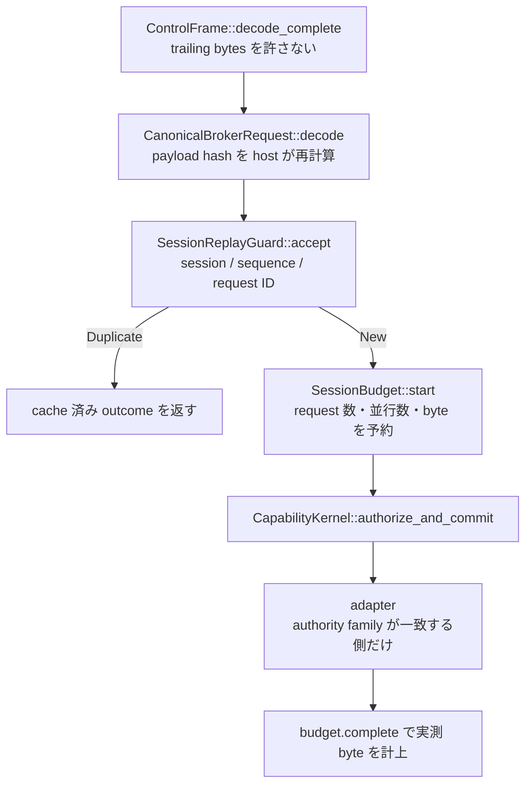

<!-- doc-type: concept -->

# frame から adapter までの 1 本道

[Host Egress Broker](README.md) / frame から adapter までの 1 本道

> **対象読者:** Broker の認可境界を触る実装者、外部副作用の重複をレビューする人

[`dispatch.rs`](../../crates/egress-broker/src/dispatch.rs) は、guest の control frame から外部副作用の adapter までの唯一の経路である。frame を 1 つ decode し、canonical CBOR に復元し、replay guard に通し、budget を予約し、`CapabilityKernel::authorize_and_commit` の内側で adapter を呼ぶ。

## 何を防ぎたいのか

外部副作用は取り返しがつかない。`CreatePullRequest` が 2 回走れば pull request が 2 つできる。だから経路の各段が、次の段へ進む条件を狭めていく。



## payload hash は host が計算し直す

wire には payload hash が載っているが、それを信用しない。

```rust
let payload_hash = PayloadHash::of_canonical_payload(&canonical_payload);
if payload_hash.as_bytes() != &received_payload_hash {
    return Err(CborError::PayloadHashMismatch);
}
```

replay guard は `(session, sequence, request ID, payload hash)` の 4 つ揃いで retry を判定する。hash を wire から取ると、この判定が guest の申告になる。

具体的な破れ方はこう。guest が request ID `R` に、以前受理された無害な payload の hash を載せて、中身だけ別の operation にする。guard は `RequestIdentityMismatch` ではなく `Duplicate` を返し、cache された outcome の経路に入る。frame が別の operation を主張しているのに、cache 済みの結果が返る。

## budget を adapter より先に取る

`budget.start` は request 数の token、並行 slot、応答 byte の予約を同時に取る。これが `executor.execute` より前にある。

逆にすると、`max_concurrent_requests` が in-flight な外部 I/O を縛らなくなる。fixture の `max_response_bytes = 128` に対して、32 MiB を宣言した fetch は、session の上限に当たる前に 32 MiB を network から読み終えている。

認可されない request も token を消費する。これは意図的で、探索の costs になる。

予約する量は operation によって出所が違う。

| operation | 予約量 |
|---|---|
| `PublicFetch` | operation が宣言した `max_response_bytes` |
| `GitHub` | host が持つ `github_response_cap` |

guest が宣言した値を public fetch で使えるのは、`http_fetch_matches` が `request.max_response_bytes <= authority.max_response_bytes` を要求し、`PublicFetcher::fetch` が redirect hop ごとに再検査するから。GitHub 側を guest 宣言にすると、provider 応答の予約量を guest が決めることになる。

`github_response_cap` は construction 時に `MAX_GITHUB_RESPONSE_BYTES` で clamp する。host が `u64::MAX` を渡しても、そこで止まる。

## 認可と副作用を 1 つの guard の内側に置く

`CapabilityKernel::authorize_and_commit` は、`state.authorizes(...)` から `commit_to_linearization(capability)` までの間、`state` の read guard を保持する。adapter の呼び出しはその内側にある。

外すと、認可の判定と HTTPS / GitHub 呼び出しの間に `revoke` が入りうる。失効した capability で pull request が作られる。audit の attempt も副作用を挟まなくなる。

## adapter は authority family で選ぶ

```rust
match (operation, capability.authority()) {
    (BrokerOperation::PublicFetch(_), AuthorityBody::HttpFetch(_)) => ...,
    (BrokerOperation::GitHub(_), AuthorityBody::GitHub(_)) => ...,
    _ => Err(AdapterError::OperationMismatch),
}
```

tuple で両方を同時に見る。`operation` だけで分岐して authority を arm の中で取り出す形にすると、arm 漏れが panic か誤った adapter 呼び出しになる。

kernel の `state.authorizes` が既に `AuthorityRequest` の variant を比較しているので、これは二重の検査である。外れると、公開 HTTP だけの capability で `CredentialProvider::credential_for` に到達し、GitHub の installation credential を取得できる。

## 実測 byte を計上してから成功を返す

```rust
if self.budget.complete(request_id, effect.response_bytes()).is_err() {
    let _ = self.budget.abort(request_id);
    (Self::rejected(request_id, BrokerRejection::AccountingInvariant), None)
}
```

`SessionBudget::complete` は予約を超える実測値に `ResponseExceedsReservation` を返し、**予約を解放しない。** だから直後の `abort` が要る。この 2 行は必ず対で置く。

計上しないと `committed_response_bytes` が増えず、`max_response_bytes` が session 合計ではなく 1 request の上限に退化する。

## 既知の欠陥: `RetryableBudget` の cache が置き換わらない

**現在の実装には、外部副作用が retry のたびに再実行される経路がある。**

`dispatch_frame` は `New` 分岐では必ず `outcomes` に書き戻すが、`Duplicate` 分岐では `dispatch_new` が `Some(cached)` を返したときしか書き戻さない。そして `dispatch_new` は次の 3 つで `None` を返す。

- 成功
- executor の全 error
- `AccountingInvariant`

したがって、いったん `CachedOutcome::RetryableBudget` が入った entry は、二度と `Final` に置き換わらない。以降の完全一致 retry はすべて `dispatch_new` に再入し、adapter を呼び直す。

調査時の実測では、一時的な `ConcurrentRequestLimitReached` の後、2 回目と 3 回目の同一 frame が両方とも `Succeeded` を返し、`started_requests()` が 3 に達した。`BrokerOperation::GitHub(CreatePullRequest)` なら retry 1 回につき pull request 1 つになる。

module doc の「完全一致 retry が adapter を再度呼ぶことはない」という記述と食い違う。修正は `New` 分岐が既に行っている書き戻しを `Duplicate` 分岐にも入れることで、2 つの分岐は同期していなければならない。

## その他の既知の問題

**`CommittedButAudit` が `NotAuthorized` になる。** kernel は `EffectCommitError::CommittedButAudit(_)` を「executor は成功したが terminal な durable receipt を永続化できなかった。外部副作用は既に存在しうるので、呼び出し側は provider の冪等性か reconciliation で解決すること」と定義している。dispatcher はこれを `ExecutorError::LockPoisoned` に写し、`BrokerRejection::NotAuthorized` として返す。しかも `budget.abort` を呼ぶ。**作成された pull request が「認可されなかった」として報告され、その byte が計上されない。**

**lock poisoning が見えない。** `ExecutorError::LockPoisoned`（kernel の writer が panic した）と `EffectCommitError::Audit(_)`（attempt すら journal できなかった）も `NotAuthorized` に潰れる。poisoned lock の後も session は動き続け、host には通常の認可拒否としか見えない。別の rejection を足すには `dispatch.rs`、`server.rs`、`egress-protocol` の `BrokerWireRejection` を同時に直す必要がある。

**`context.now` が connection ごとに 1 回しか取られない。** `serve_connection` は同じ `&DispatchContext` を `max_requests` 回渡し、`dispatch_new` はそれで毎回 `CapabilityRequest` を作る。connection の途中で `TimeWindow` が切れた capability が、その connection の最後まで認可を通す。

**HEAD が byte 予算を消費しない。** `BrokerEffect::response_bytes()` は public fetch で `response.body.len()` を返し、HEAD の応答は常に空。`start` で `max_response_bytes` を予約し、`complete` で 0 を計上する。HEAD は `max_requests` と並行 slot だけに縛られる。

**GitHub の byte 数は adapter の自己申告。** `response.response_bytes` をそのまま使う。検証するのは `TypedGitHubAdapter` だけで、別の `GitHubAdapter` 実装は過少申告できる。trait の signature には、この field が accounting の入力であることを示すものが無い。

**`dispatch_transport` が frame を 2 度触る。** `FramedTransport::read_frame` が検証した `ControlFrame` を `encode()` し直し、`decode_complete` で読み直す。1 request あたり最大 1 MiB の copy が 2 回増える。しかも `decode_complete` の doc は「buffered test input 用であり、確保順序の代わりにはならない」と述べている。`server.rs` も同じことをする。

## 正確な保証範囲

- adapter はすべて trait 越し。fake resolver / connector / provider を注入した module test で検証している。
- 実 `AF_VSOCK`、外部 DNS / HTTPS、実 GitHub API は未検証。
- 上に挙げた `RetryableBudget` の再実行は実測で確認済みだが、修正されていない。
- `CommittedButAudit` の扱いは kernel の契約と食い違っている。reconciliation の経路は無い。
- GitHub の byte 自己申告を悪用する第三者 adapter 実装は、この crate では防げない。

## 変更時の確認点

- `Duplicate` 分岐と `New` 分岐の cache 書き戻しを揃える。現在ずれているのが上記の欠陥。
- `budget.complete` の失敗と直後の `abort` は必ず対で置く。`complete` が失敗しても予約は解放されない。
- `budget.start` を `executor.execute` の後ろへ動かさない。
- adapter の選択を tuple match 以外に変えない。arm 漏れが panic か誤 adapter になる。
- `MAX_GITHUB_RESPONSE_BYTES` を上げるときは `SessionBudgetLimits::max_response_bytes` も上げる。上げないと全 GitHub request が `budget.start` で `ResponseBytesExhausted` になる。clamp は `dispatch.rs` と `github.rs` の 3 箇所にあり、揃えて直す。
- `DispatchContext` に clock を持たせる変更は、`server.rs` を同時に直さないと compile が通らない。
- rejection の種類を増やすときは `dispatch.rs`、`server.rs`、`BrokerWireRejection` の 3 箇所を同時に直す。

## 関連

- [Host Egress Broker](README.md)
- [transport 契約](transport.md)
- [公開 HTTPS policy](network-policy.md)
- [GitHub 型付き adapter](github.md)
- [検証対応表](verification.md)
- [Broker session envelope](../egress-protocol/session-envelopes.md)
- [Authorization guard](../authority-core/authorization-guard.md)
- [用語集](../glossary.md)
