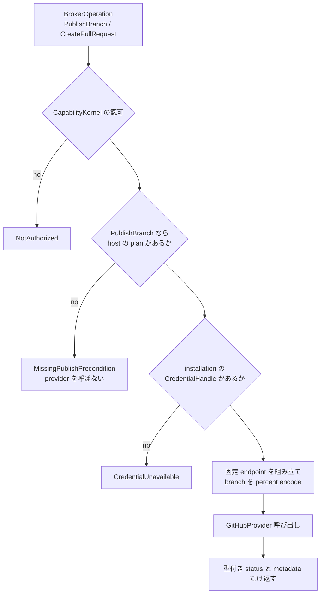

<!-- doc-type: concept -->

# GitHub 型付き adapter

[Host Egress Broker](README.md) / GitHub 型付き adapter

> **対象読者:** GitHub 操作の実装者、credential 境界のレビュー担当者

[`github.rs`](../../crates/egress-broker/src/github.rs) は、[GitHub authority](../authority-core/github-authorities.md) が許した 2 操作を実際の API 呼び出しへ変換する。汎用 HTTP fallback は無い。

## 何を防ぎたいのか

host は GitHub token を持っている。その token は installation に紐づいた広い権限を持ち、repository の削除も、branch の強制上書きも、他 repository への write もできる。

guest に渡してよいのは、その権限のごく一部でしかない。token そのものは当然渡せないが、「token を使って任意の GitHub API を呼ぶ手段」を渡すのも同じこと。

```text
危険な設計: guest が URL と method を指定できる
            -> DELETE /repos/{owner}/{repo} が呼べる

この adapter: guest が指定できるのは 2 つの operation 名だけ
            -> PublishBranch と CreatePullRequest 以外の endpoint を組み立てる経路が無い
```

endpoint は adapter が固定文字列から組み立てる。guest が渡すのは branch 名と repository identity だけで、それも[型の入口で検証済み](../authority-core/github-authorities.md#branch-名を-git-の曖昧な-shorthand-から守る)の値。



## expected-old object が無ければ provider を呼ばない

`PublishBranch` は branch を更新する。素朴に実装すると `force push` になり、guest が他人の commit を消せる。

そこで、host が用意した `PublishBranchPlan` が無ければ、provider を呼ぶ前に `MissingPublishPrecondition` で拒否する。plan は expected-old object と expected-new object を持つ。

provider は現在の ref object を読み、expected-old と一致することを確認してから `force: false` で更新する。一致しなければ `ProviderConflict`。つまり、guest が plan を作った時点から branch が動いていれば、更新は通らない。

plan の object ID は 40 文字（SHA-1）または 64 文字（SHA-256）の hexadecimal として検証される。長さと文字種だけの検査だが、これがないと任意の文字列が ref の比較対象として API に届く。

`publish_branch_without_expected_old_object_is_rejected` が、provider 呼び出しの前に落ちることを見ている。「呼んでから失敗する」のではなく「呼ばない」ことが要点で、呼んでしまうと rate limit を消費するし、失敗の仕方が provider の実装に依存する。

## credential を handle として扱う

installation から選ぶのは `CredentialHandle` で、これは token ではない。token bytes へ変換する API も持たない。

production の `RustlsGitHubProvider` は host adapter の内側だけで systemd credential
`<CREDENTIALS_DIRECTORY>/github-token` を読む。`CREDENTIALS_DIRECTORY` が宣言されている場合はこの経路が必須で、欠損・unsafe file・読取失敗を ambient `EGRESS_GITHUB_TOKEN` へ fallback しない。directory が宣言されていない場合だけ、明示された `EGRESS_GITHUB_TOKEN` を host-only fallback として使う。credential は symlink を一切たどらない descriptor で開き、regular file、単一 link、4 KiB 上限、読取前後の inode / size / owner / mode / mtime / ctime を照合する。`Debug` 実装は token を `<redacted>` と表示する。redirect と proxy 探索は無効。

token が現れない場所を並べると次のとおり。

- guest の request。そもそも credential を指定する field が無い。
- broker の outcome。返るのは型付き status と metadata だけ。
- provider の error。生の response body を返さない。
- log。`Debug` が redact する。

`typed_publish_branch_uses_plan_and_opaque_credential` が、handle 経由で provider が呼ばれ、token が outcome に現れないことを確認している。

## 失敗を型で分ける

`GitHubAdapterError` は 13 variant を持つ。

| variant | いつ |
|---|---|
| `NotAuthorized` | 選んだ authority と request が一致しない |
| `MissingPublishPrecondition` | `PublishBranch` に plan が無い |
| `CredentialUnavailable` | installation に対応する credential が無い |
| `ProviderRejected` | provider が操作を拒否 |
| `ProviderUnauthorized` | 認証失敗 |
| `ProviderForbidden` | installation に権限が無い |
| `ProviderNotFound` | repository または ref が無い |
| `ProviderConflict` | expected-old object または branch の衝突 |
| `ProviderServer { status }` | provider の 5xx |
| `RateLimited(RateLimitInfo)` | rate limit。provider が返した場合だけ remaining / reset / retry-after を持つ |
| `InvalidProviderResponse` | mutation 前に固定 schema へ変換できない応答 |
| `ProviderTransport` | 接続層の失敗 |
| `CommitUnknown` | mutation 送信後に結果を安全に証明できない。再実行を誘発する pre-commit error として扱わない |

生の provider body はどの variant にも入らない。GitHub の error message には内部 path や organization 名が含まれることがあり、guest へそのまま返すと情報漏れになる。

`RateLimitInfo` は provider が実際に header で返した値だけを保持する。返さなかった場合に推測値を埋めない。`typed_provider_rate_limit_is_preserved` がこれを確認する。

`graphql_expected_old_conflict_is_typed_and_malformed_success_is_commit_unknown` は 2 つを見ている。GraphQL 経路の衝突が mutation 前の型付き `ProviderConflict` になること、そして mutation を送った後に body が想定の形でなければ `CommitUnknown` になること。後者が重要で、「成功 status なら成功」や「malformed response なら安全に retry」と扱わない。mutation 前の固定 schema error は `InvalidProviderResponse` として区別される。

## route を組み立てる

repository の route と branch component は、長さと文字種を検査してから 2 つの固定 endpoint に嵌める。branch の予約文字は path segment として percent encode する。

`branch_route_encodes_reserved_path_bytes` が確認する経路で、branch の各 segment にある予約 byte（test では `#`）を encode しても URL の構造が変わらないことを見ている。branch 名自体は [`BranchName`](../authority-core/github-authorities.md) で検証済みで、検証済みの名前でも `/` は segment separator として含みうる（`agents/fix`）。segment 分割と encode を間違えると、別の endpoint を叩く。

## 応答も budget の対象になる

`provider_response_over_budget_is_rejected_at_the_typed_boundary` があるとおり、provider の応答が session budget を超える場合、mutation 後の `Ok` response は安全な pre-commit rejection ではなく `CommitUnknown` になる。budget の消費は公開 HTTPS と同じ枠で、GitHub 操作だけ無制限になることはない。

## 実 GitHub の opt-in smoke

実 endpoint、実 rustls client、実 credential、実 GitHub response を確認するための ignored test と gate を用意している。

```bash
scripts/ci/verify-live-github.sh
```

この gate は次の環境変数を全て要求する。不足、空値、object ID の形式不正、repository への acknowledgement 不一致は provider を呼ぶ前に exit 2 で止まる。token の値は標準出力・標準エラー・コマンドラインへ出さない。

| 環境変数 | 用途 |
|---|---|
| `CREDENTIALS_DIRECTORY` | 優先される credential directory の絶対 path。指定時は `<value>/github-token` が必須で、環境変数へ降格しない |
| `EGRESS_GITHUB_TOKEN` | directory が指定されない場合の host-only fallback。wrapper は現在この環境変数も必須にするが、directory 指定時の provider は値を使わない |
| `EGRESS_GITHUB_INSTALLATION_ID` | exact GitHub App installation identity |
| `EGRESS_GITHUB_DISPOSABLE_REPOSITORY` | mutation 対象の exact `owner/name` |
| `EGRESS_GITHUB_BASE_BRANCH` / `EGRESS_GITHUB_HEAD_BRANCH` | exact base/head branch |
| `EGRESS_GITHUB_EXPECTED_OLD_OBJECT` | `PublishBranch` の expected-old object（40/64 hex） |
| `EGRESS_GITHUB_NEW_OBJECT` | `PublishBranch` の new object（40/64 hex） |
| `EGRESS_GITHUB_DISPOSABLE_ACK` | `I_UNDERSTAND_DISPOSABLE_REPOSITORY:<owner/name>` の完全一致 |

ignored test は guest-facing raw HTTP を使わず、`TypedGitHubAdapter<RustlsGitHubProvider, ...>` に exact request、opaque credential handle、host plan を渡す。`PublishBranch` は `force: false` と expected-old を使い、stale な expected-old なら `ProviderConflict` を型付きで確認する。expected-old が現在値なら disposable branch の更新が起こり得る。続く `CreatePullRequest` は typed success を確認し、実 pull request を作成する。mutation 後の送信失敗や malformed response は `CommitUnknown` として扱われ、成功の再試行を促さない。

GitHub API の権限と既存状態をこの repository から安全に準備・削除する経路は持たないため、自動 cleanup は行わない。operator は専用 disposable repository、既存の base/head state、既存 pull request が無いことを確認し、終了後に branch / pull request を手動で cleanup する。保護された credential と実行ログを用意してこの gate を走らせるまで、live provider は verified と扱わない。

## 何が助かるのか

token の権限全体ではなく 2 操作分だけが guest に見える。新しい GitHub 操作を追加するには、authority の enum、adapter の変換、provider の実装を全部書く必要があり、設定変更では増えない。

失敗が型になっているので、retry してよいものとそうでないものを呼び出し側が判断できる。`RateLimited` と `ProviderConflict` と `ProviderTransport` は扱いが違う。

`PublishBranch` の安全性が plan の有無という 1 つの条件に落ちている。plan を作る側を見れば、何が上書きされうるかが分かる。

## 正確な保証範囲

`TypedGitHubAdapter` と fake provider による module test で、opaque credential、publish plan、rate-limit metadata、provider 呼び出し前の拒否、branch route の encoding、応答 budget を検証している。credential validator の欠損 / 制御文字拒否、systemd credentialのdescriptor固定・link拒否・優先順位、provider `Debug` / typed error の token redact も local test で確認している。

- ignored `live_github_disposable_repository_smoke` と `scripts/ci/verify-live-github.sh` は実 GitHub API、認証、応答形式、expected-old conflict、typed pull-request success を検査する。ただし、保護された disposable credential を使った実行 evidence はこの checkout には無く、live provider の status は未検証のままである。
- 実環境変数と実 credential の読み込み経路は、必要な環境変数を揃えた opt-in gate のみが実行する。通常の local test は token を読まない。
- expected-old object の比較は provider 側の実装に依存する。この adapter は plan の有無と形式しか見ていない。
- GitHub 側の権限がこの authority より狭い場合、操作は API で失敗する。adapter は事前に検出しない。
- `force: false` が実際に効くこと、expected-old conflict が API でどの status / body になるかは GitHub の API 仕様に依存する。
- token が log や core dump に現れないことは、`Debug` の redact までしか保証していない。memory 上の扱いは別。

## 変更時の確認点

- operation を足すときは、[GitHub authority](../authority-core/github-authorities.md) の enum、この adapter の変換、`GitHubProvider` trait、fake provider を同時に直す。authority だけ広げても adapter が無い状態は compile が通る。
- `PublishBranch` の plan 必須を条件付きにしない。plan 無しで通る経路が 1 つでもあると、force push と同じになる。
- error variant に provider の body を持たせない。内部情報が guest へ返る。
- `RateLimitInfo` に既定値を埋めない。provider が返さなかったことと、返した値が 0 であることは違う。
- 成功 status を成功として扱わない。mutation 後の `InvalidProviderResponse` を `CommitUnknown` として閉じる判定を外すと、malformed な 200 の後に安全でない retry が可能になる。
- branch の percent encode を segment 単位以外に変えない。`agents/fix` の `/` まで encode すると別の endpoint になる。

## 関連

- [Host Egress Broker](README.md)
- [公開 HTTPS policy](network-policy.md)
- [transport 契約](transport.md)
- [検証対応表](verification.md)
- [GitHub authority](../authority-core/github-authorities.md)
- [ネットワークと外部副作用の設計](../design/network-egress.md)
- [用語集](../glossary.md)
