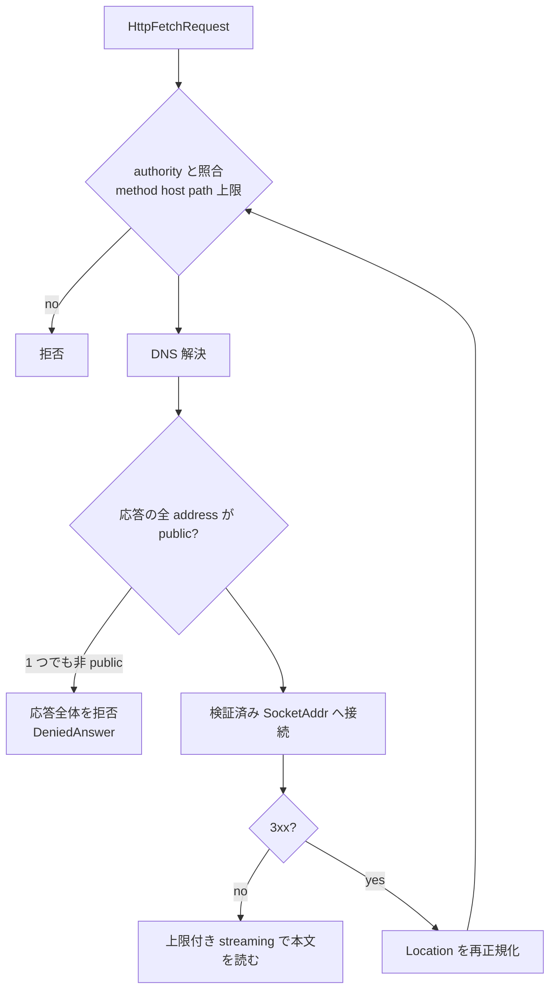

<!-- doc-type: concept -->

# 公開 HTTPS policy

[Host Egress Broker](README.md) / 公開 HTTPS policy

> **対象読者:** 公開 egress の実装者、SSRF 対策をレビューする担当者

[`public_fetch.rs`](../../crates/egress-broker/src/public_fetch.rs) と [`ip_policy.rs`](../../crates/egress-broker/src/ip_policy.rs) は、guest が要求した公開 HTTPS 取得を実際に実行する側にある。[HTTP fetch authority](../authority-core/http-fetch-authorities.md) が「どこまで許すか」を決めるのに対し、こちらは「その許可の範囲内で、host の内側に触れずに取ってくる」ことを担当する。

## 何を防ぎたいのか

host は VM の外側にいる。guest から見えない network に、metadata service、内部 API、他 session の VM が並んでいる。`https://` で始まる URL を 1 本渡せる権限は、うまく使えばそのどれかに届く。

```text
guest が要求できる host: docs.example   ← authority で許可済み
docs.example の DNS 応答: 169.254.169.254
                            ↓
             cloud metadata service の credential
```

authority 側は host 名しか見ていない。名前が正当でも、その名前が何を指すかは DNS が決める。だから解決結果を検査する層が要る。



redirect が矢印で `auth` に戻っているのが要点。redirect のたびに、authority 照合と DNS 解決をやり直す。

## 応答に 1 つでも非 public があれば全部捨てる

```rust
if addresses.iter().copied().any(|address| self.is_denied(address)) {
    return Err(IpPolicyError::DeniedAnswer);
}
```

`validate_dns_answer` は先頭の address を返すが、その前に**応答全体**を検査する。public と private が混ざった応答は、public のほうを選んで接続する、ということをしない。

混在を許すと、攻撃者が制御する DNS が `[1.2.3.4, 169.254.169.254]` を返し、実装が「最初の public を使う」なら通ってしまう。その後 TTL 0 で再解決させれば、次は private が先頭に来る。混在という状態そのものが攻撃の signal なので、全部拒否する。

空応答も `EmptyAnswer` で拒否する。resolver が空を返したときに「制限なし」と解釈する経路を作らない。

## DNS answer と resolver worker の上限

DNS answer は `MAX_DNS_ANSWER_IPS = 32` address までしか保持しない。`SystemResolver` は収集中に 33 件目を見つけた時点で `ResolveError::AnswerLimitExceeded` を返し、注入された resolver についても worker 境界で同じ上限を再確認する。上限超過は `IpPolicy` や connector へ渡さず fail-closed にする。

resolver の OS API (`getaddrinfo` / `ToSocketAddrs`) には、呼び出し側から強制キャンセルする portable な操作がない。そのため `public_fetch` は process-wide に固定 1 worker、追加キュー 8 件の同期 pool を使う。timeout した呼び出しは結果 channel を捨てるだけで、OS lookup は同じ worker が戻るまで保持する。新しい thread は request ごとに作られず、worker が塞がりキューも満杯なら `ResolveError::Unavailable` で即時拒否する。

この設計が保証するのは、Broker process 内の resolver worker と待ち行列の数が有限であることまでである。OS resolver の内部 thread、DNS server 側の処理、名前解決の強制中断は制御できない。したがって timeout は lookup をキャンセルしたことを意味せず、有限 pool の admission を解放しないことで abandoned lookup の増殖だけを防ぐ。

## IPv4-mapped IPv6 は埋め込み address が public でも拒否する

```rust
IpAddr::V6(address) => {
    // Mapped and IPv4-compatible IPv6 forms must never reach the
    // connector, even when their embedded IPv4 address is public.
    address.to_ipv4().is_some() || self.is_host_denied(IpAddr::V6(address))
}
```

`::ffff:1.2.3.4` のような mapped 形式は、埋め込まれた IPv4 が public であっても拒否する。判定を通すこと自体は難しくないが、この形式は socket API や中間層ごとに扱いが違う。ある層では IPv6 として、別の層では IPv4 として解釈される値を connector まで通すと、検査した address と接続する address が一致する保証が無くなる。

代表的な事故は `::ffff:127.0.0.1` で、IPv6 として見れば loopback range に入らない。個別に潰すより、mapped 形式を丸ごと落とすほうが確実。

## 組み込み deny range

host は CIDR を追加できるが、組み込み範囲を削除できない。`IpPolicy::strict` は追加だけを受け付ける。

| IPv4 | 内容 |
|---|---|
| `0.0.0.0/8` | unspecified |
| `10.0.0.0/8`, `172.16.0.0/12`, `192.168.0.0/16` | private |
| `100.64.0.0/10` | CGNAT |
| `127.0.0.0/8` | loopback |
| `169.254.0.0/16` | link-local。cloud metadata を含む |
| `192.0.0.0/24` | IETF protocol assignments |
| `192.0.2.0/24`, `198.51.100.0/24`, `203.0.113.0/24` | documentation |
| `192.88.99.0/24` | 6to4 relay anycast |
| `198.18.0.0/15` | benchmarking |
| `224.0.0.0/4` | multicast |
| `240.0.0.0/4` | reserved |

| IPv6 | 内容 |
|---|---|
| `::/96`, `::/128` | unspecified、IPv4-compatible |
| `::1/128` | loopback |
| `64:ff9b::/96`, `64:ff9b:1::/48` | NAT64 |
| `100::/64` | discard-only |
| `2001::/32` | Teredo |
| `2001:2::/48` | benchmarking |
| `2001:10::/28` | ORCHID |
| `2001:db8::/32` | documentation |
| `2002::/16` | 6to4 |
| `fc00::/7` | unique local |
| `fe80::/10` | link-local |
| `ff00::/8` | multicast |

NAT64 と 6to4 と Teredo を落としているのは、いずれも IPv6 address の中に IPv4 address を埋め込む仕組みだから。mapped 形式と同じ理由で、変換の解釈に依存する値を通さない。

## エラーが解決結果を返さない

`IpPolicyError` は `EmptyAnswer` と `DeniedAnswer` の 2 つだけで、どちらも address を持たない。`Display` も範囲や IP を出さない。

test 名が `special_purpose_and_mapped_addresses_are_denied_without_echoing_the_ip` になっているとおり、これは意図した設計。拒否理由に解決結果を含めると、guest が DNS 解決の oracle として使える。任意の名前を要求して「拒否された address」を読み取れば、host の内部 network を走査できてしまう。

## redirect のたびに全部やり直す

| 項目 | 値 |
|---|---|
| `DEFAULT_MAX_REDIRECTS` | 5 hop |
| `DEFAULT_MAX_RESPONSE_BYTES` | 32 MiB。request の上限でさらに狭まる |
| `HTTPS_PORT` | 443 固定 |
| `MAX_REDIRECT_LOCATION_BYTES` | 8 KiB |
| `MAX_TOTAL_TIMEOUT` | 60 秒 |
| connector 接続 timeout | 既定 10 秒 |

`Location` は canonical な HTTPS origin、port 443、userinfo 無し、query 無し、fragment 無しでなければ `RedirectRejected`。percent encoding と path 正規化を含む形も拒否する。この規則は [HTTP fetch authority](../authority-core/http-fetch-authorities.md) の `CanonicalUrlPath` と同じで、redirect 先も authority と同じ土俵に載せてから照合する。

照合に通ってから DNS を再解決する。`redirect_outside_authority_is_rejected_before_second_connector_call` が確認しているのは順序で、authority 外の redirect では connector を 2 回目に呼ばない。DNS rebinding は `redirect_re_resolves_and_rejects_dns_rebinding_to_private_address` が扱う。

自動 redirect は無効。reqwest の rustls backend を redirect 無効・proxy 探索無効で構成し、3xx は自前で処理する。library に任せると、ここまでの検査を全部飛ばして次の接続に行く。

## 本文は読みながら止める

`Content-Length` の宣言を信用しない。`GET` の本文は bounded streaming で読み、上限を最初に越えた read で `ResponseTooLarge { limit }` を返す。宣言が小さくて実体が大きい応答でも、上限を越えた分は memory に載らない。

`HEAD` は本文を読まず、返す本文も空にする。`public_head_does_not_read_or_return_the_response_body` がこれを固定している。

request の上限が host policy を超える場合は、admission の時点で clamp する。`oversized_policy_is_clamped_before_request_admission` が確認する経路で、guest が 1 TiB を要求しても 32 MiB を超えない。

60 秒の全体 timeout は、応答を極端に遅く返す相手への対策。`slow_response_reader_is_rejected_after_the_total_deadline` が該当する。

## connector が受け取るもの

connector の API に現れるのは、検証済みの `FetchTarget`、検証済みの `SocketAddr`、閉じた `HttpFetchMethod` だけ。生 URL、任意の header map、body bytes、credential は引数に無い。

型の上でそうなっているので、検査を飛ばして接続する経路を書こうとすると、必要な値を作れない。TLS の SNI と HTTP authority には canonical host を使い、接続先には検証済みの address を使う。名前と address を別々に持つことで、解決と接続の間に別の名前解決が挟まらない。

## 何が助かるのか

SSRF の検討が 1 箇所に集まる。「この URL でどこに届くか」を考えるとき、`validate_dns_answer` と redirect の再照合だけ見ればよい。

deny range が定数の配列なので、レビューで漏れを見つけやすい。追加しかできない API になっているため、host 設定で穴を開けられない。

エラーが情報を返さないので、拒否経路そのものが偵察の道具にならない。

## 正確な保証範囲

fake resolver と fake connector を使う module test で、GET / HEAD、private および混在 DNS 応答、redirect ごとの再解決、authority 外 redirect、unsafe redirect の形、応答上限、上限の clamp、全体 timeout を検証している。

- 実 DNS を引いていない。resolver は fake で、TTL、CNAME chain、DNSSEC、resolver 自身の挙動は扱っていない。
- 実 HTTPS 接続をしていない。TLS の証明書検証、SNI の扱い、ALPN は rustls に委ねていて、この crate では確認していない。
- 実ネットワーク上の DNS rebinding は未検証。fake resolver が 2 回目に別の答えを返す経路までしか見ていない。
- 検証した address と実際に接続する address が同じであることは、connector の実装に依存する。型で `SocketAddr` を渡しているが、connector がそれを使うことを強制する仕組みは無い。
- IPv6 の deny range が network の special-purpose registry を網羅しているかは確認していない。新しい範囲が割り当てられたら追随が要る。
- host の network が別途分離されていることは前提。この policy は「解決結果が public であること」しか見ていないので、public address の先に内部 service がある構成は守れない。

## 変更時の確認点

- `validate_dns_answer` を「denied を除外して残りを使う」に変えない。混在応答が通るようになる。
- `address.to_ipv4().is_some()` による mapped 拒否を、埋め込み IPv4 の判定に変えない。`::ffff:127.0.0.1` が通る。
- 組み込み deny range を削除可能にしない。追加専用であることが `IpPolicy::strict` の契約。
- `IpPolicyError` に address を持たせない。拒否理由が偵察の oracle になる。
- redirect の `Location` 検査を緩めるときは、その形が `CanonicalUrlPath` で受理されるかを確認する。authority 照合と redirect 検査で正規化の規則がずれると、redirect だけ通る path ができる。
- 自動 redirect を有効にしない。connector 側の設定 1 つで、このページの検査が全部飛ぶ。
- 上限の強制を `Content-Length` の判定に変えない。宣言と実体が違う応答を止められなくなる。

## 関連

- [Host Egress Broker](README.md)
- [GitHub 型付き adapter](github.md)
- [transport 契約](transport.md)
- [検証対応表](verification.md)
- [HTTP fetch authority](../authority-core/http-fetch-authorities.md)
- [ネットワークと外部副作用の設計](../design/network-egress.md)
- [用語集](../glossary.md)
