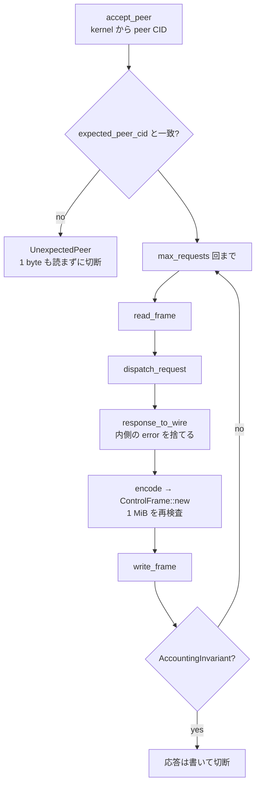

<!-- doc-type: concept -->

# connection を受けて frame を往復させる

[Host Egress Broker](README.md) / connection を受けて frame を往復させる

> **対象読者:** listener を組み込む実装者、guest への情報流出をレビューする人

[`server.rs`](../../crates/egress-broker/src/server.rs) は accept した 1 本の `AF_VSOCK` stream を、`max_requests` 回の request / response 往復として処理する。dispatch そのものは [dispatch.rs](dispatch.md) が持つ。

## peer CID を kernel から取る

```rust
if peer_cid != expected_peer_cid {
    return Err(ServerError::UnexpectedPeer { expected: expected_peer_cid, received: peer_cid });
}
```

CID は `AfVsockListener::accept_peer` が kernel から得た値で、guest が書いた byte ではない。一致しない stream は、**guest から 1 byte も読まずに** 落とす。

この検査が無いと、host の vsock port に接続できる別の VM が、この connection の `DispatchContext { caller, capability }` の下で frame を投げられる。VM B が VM A の capability で公開 HTTPS を取得し、`PublishBranch` と `CreatePullRequest` を実行し、VM A の `SessionBudget` を使い切る。

[Supervisor adapter](../supervisor/README.md) が connection から subject を解決するのと同じ形の判断で、認可の根拠を guest の申告に置かない。



## 1 request につき必ず 1 response

loop の中で `dispatch_request` を呼び、必ず 1 本の `write_frame` を行う。dispatch したが書かない経路も、2 回書く経路も無い。

transport 層に message ID の対応付けが無いので、ここがずれると request N の応答が N+1 のものとして届く。request identity は CBOR body の中にあるので、guest は decode するまで気付けない。

`max_requests` は `NonZeroUsize`。0 を表現できないので、「accept して 1 度も読まずに成功を返す」経路が型として存在しない。production の値はこの crate では決めず、[session-orchestrator](../session-orchestrator/README.md) が選ぶ。

## 拒否の詳細を guest へ返さない

```rust
BrokerRejection::PublicFetch(_) => BrokerWireRejection::PublicFetch,
BrokerRejection::GitHub(_) => BrokerWireRejection::GitHub,
```

内側の `FetchError` と `GitHubAdapterError` を `_` で捨て、安定した code だけを返す。

詳細を返すと、guest は Broker を host 内部の観測手段にできる。resolver がどの IP を返したか、`IpPolicy` がなぜ拒否したか、redirect が authority の外へ出たか、GitHub の rate limit と provider の拒否理由。これらは host の network topology と token の状態を映す。

同じ方針が [`IpPolicyError`](network-policy.md#エラーが解決結果を返さない) にもある。

## `AccountingInvariant` で connection を閉じる

```rust
let close_after_response = matches!(
    response.outcome,
    BrokerOutcome::Rejected(BrokerRejection::AccountingInvariant)
);
```

この rejection は、外部副作用が既に走った後で `budget.complete` が失敗し、予約が abort された状態を意味する。予約と実消費の対応が壊れている。

応答は書くが、その connection ではもう読まない。壊れた会計のまま新しい予約を出し続けると、`max_response_bytes` が guest の引き出せる byte 量を縛らなくなる。

## 失敗したら復旧しない

framing、dispatch、encode、write のどれが失敗しても、`?` で return して transport を drop する。byte stream を復旧させない。

部分的な `write_all` や切り詰められた payload read の後に次の `read_frame` を行うと、message の途中の byte を length prefix として読む。**次の frame 境界を guest が選べる状態**になり、canonical CBOR 層に対する decoder confusion の道具になる。

## 応答も 1 MiB を超えない

`response_to_wire` → `encode` → `ControlFrame::new` の 3 段で、いずれも size を見る。`CanonicalBrokerResponse::encode` 自身も `MAX_CONTROL_FRAME_BYTES` を再検査する。

guest 側の `FramedTransport::read_frame` は 1 MiB 超の prefix を拒否するので、超える応答を書くと guest は desync するか無制限の確保を強いられる。

## 何が助かるのか

connection 単位の責務が 1 関数に収まっている。何回読むか、いつ閉じるか、何を返すかが `serve_connection` を読めば分かる。

情報流出の検討が `response_to_wire` の 1 箇所に集まる。guest へ渡る値を増やす変更は、この関数に現れる。

## 正確な保証範囲

- 実 `AF_VSOCK` の bind / accept は未検証。test は in-memory の stream を使う。
- peer CID の照合は `accept_peer` が返す値に依存する。kernel から正しく取れることは、この crate では確認していない。
- `ConnectionReport` は `requests_served` と `accounting_invariant_closed` を返すが、これを使った運用側の処理は無い。
- timeout も idle 検出も無い。`max_requests` 回読み切るか、失敗するまで connection は開いたまま。
- `DispatchContext` は connection ごとに 1 回作られ、`now` もそこで固定される。connection 途中で有効期間が切れた capability が最後まで認可を通る。詳細は [dispatch](dispatch.md#その他の既知の問題)。

## 変更時の確認点

- peer CID の照合を、guest が送る値との比較に変えない。kernel から得た値であることが検査の根拠。
- `response_to_wire` で内側の error を渡すようにしない。host の network 状態が guest へ漏れる。rejection の種類を増やすときは `dispatch.rs`、この file、`BrokerWireRejection` の 3 箇所を同時に直す。
- 失敗後に stream を再利用しない。frame 境界の同期が取れていない。
- `max_requests` を `usize` に変えない。0 を表現できることが型として問題になる。
- `AccountingInvariant` で閉じる挙動を外さない。壊れた会計のまま session が続く。

## 関連

- [Host Egress Broker](README.md)
- [frame から adapter までの 1 本道](dispatch.md)
- [transport 契約](transport.md)
- [公開 HTTPS policy](network-policy.md)
- [検証対応表](verification.md)
- [session budget](../egress-protocol/session-budget.md)
- [用語集](../glossary.md)
