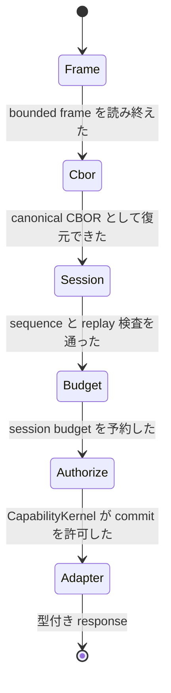

<!-- doc-type: contract -->

# transport 契約

[Host Egress Broker](README.md) / transport 契約

> **対象読者:** guest / host transport の実装者、frame 境界のレビュー担当者

[`transport.rs`](../../crates/egress-broker/src/transport.rs) と [`frame.rs`](../../crates/egress-protocol/src/frame.rs) が定める、`AF_VSOCK` stream 上の frame 境界の義務。設計上の理由は[Host Egress Broker](README.md)、上位の session 規則は[Broker session envelope](../egress-protocol/session-envelopes.md)を参照する。

## `ControlFrame`

wire 上の 1 単位。4 bytes の big-endian length prefix と payload からなる。

| 項目 | 規約 |
|---|---|
| prefix 長 | `CONTROL_FRAME_LENGTH_PREFIX_BYTES` = 4 bytes、big-endian |
| payload 上限 | 1 MiB。`ValidatedFrameLength::from_network_prefix` が判定する |
| 構築 | `ControlFrame::new(payload)`。上限超過は `FrameError::FrameTooLarge` |
| encode | `encode()` が prefix + payload を返す。`encoded_len()` は合計長 |
| decode | `decode_complete(encoded)`。余分な trailing bytes を許さない |

**上限の検査は payload を確保する前に行う。** prefix を読んだ時点で 1 MiB を超えていれば、その長さの buffer を作らずに拒否する。ここを逆にすると、guest が 4 bytes を送るだけで host に任意サイズの allocation をさせられる。

## `FramedTransport<S>`

| 項目 | 規約 |
|---|---|
| 入力型 | 任意の `Read + Write` stream。production では `VsockStream` |
| `read_frame()` | 4 bytes を読む → 長さを検査 → payload を確保して読む → `ControlFrame` |
| `write_frame(&frame)` | `encode()` の結果を書き切る |
| 失敗 | `TransportError::Io` または `TransportError::Frame` |
| retry | `Io` は connection の状態に依存する。`Frame` は同じ入力で必ず再現するので retry しない |

`FramedTransport` は decode も認可も行わない。frame の境界だけを扱う。

## `FrameError`

| variant | いつ |
|---|---|
| `FrameTooLarge { length }` | prefix の宣言、または local payload が 1 MiB を超える |
| `TruncatedPrefix` | 4 bytes 揃う前に stream が終わった |
| `TruncatedPayload { expected, actual }` | 宣言した payload 長より実際が短い |

`length` と `expected` は untrusted な宣言値であって、確保した量ではない。log に出すときはそのつもりで扱う。

## `VsockListener` / `PeerBoundListener` / `AfVsockListener`

| 項目 | 規約 |
|---|---|
| 責務 | listener の bind と accept のみ |
| 非責務 | request の decode、adapter の選択、Capability 認可 |
| `AfVsockListener::bind(cid, port, backlog)` | `VMADDR_CID_ANY` と `VMADDR_PORT_ANY` は `u32::MAX` |
| accept 後 | stream を `FramedTransport` に渡し、connection owner が `BrokerDispatcher::dispatch_transport` を呼ぶ |

accept した connection の peer identity は listener が持つ。`PeerBoundListener` はその identity を伴う accept を表す。認可に使う subject は connection から解決するのであって、wire 上の申告からではない。同じ方針が [Supervisor adapter](../supervisor/README.md) にもある。

## dispatch 側の義務

frame を受け取った後、connection owner は次の順で通す。順序を入れ替えない。

| 項目 | 規約 |
|---|---|
| sequence | 1 session につき `0` から開始し、以降は直前の次だけを受理する |
| 完全一致の retry | `(session, sequence, request ID, payload hash)` が一致すれば cache 済み `BrokerResponse` を返し、adapter を再実行しない |
| 拒否する要求 | 別 payload での request ID 再利用、sequence の飛ばし、別 session、replay capacity 超過 |
| response cache | replay capacity で上限を持つ。成功した型付き response と型付き拒否 outcome の両方を保持する |

拒否 outcome も cache するのが要点。拒否された要求を retry したとき、再計算せずに同じ拒否を返す。再計算すると、budget や時刻の変化で結果が変わりうる。

## 保証範囲外

- 実 `AF_VSOCK` の bind / accept。module test は `Cursor` 上で frame の往復を確認しているだけ。
- guest との実接続、および response を wire へ再 encode する server loop。
- payload の意味。canonical CBOR としての妥当性は [Canonical Broker CBOR](../egress-protocol/canonical-cbor.md) の担当。
- peer credential の認証。listener は identity を運ぶが、その正しさは OS に依存する。
- 1 MiB を下回る frame の flooding。frame 単位の上限はあるが、接続あたりの frame 数や帯域の制限はこの層に無い。
- connection の生存管理、timeout、切断検出。

## 関連

- [Host Egress Broker](README.md)
- [Canonical Broker CBOR](../egress-protocol/canonical-cbor.md)
- [Broker session envelope](../egress-protocol/session-envelopes.md)
- [公開 HTTPS policy](network-policy.md)
- [GitHub 型付き adapter](github.md)
- [検証対応表](verification.md)
- [用語集](../glossary.md)
