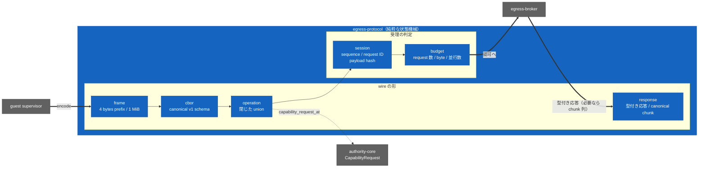

<!-- doc-type: index -->

# egress-protocol

[ドキュメント一覧](../README.md) / egress-protocol

> **対象読者:** Broker / transport 実装者、guest 側の control channel を書く人

`egress-protocol` は、guest と host の間で交わす control message の形と、session ごとの受理判定を定める。**socket も HTTP も credential も provider client も持たない。** `#![forbid(unsafe_code)]` で、依存は `sha2` と `authority-core` だけ。

purely な状態機械として書いてあるので、clock も lock も持たない。実際の I/O、outcome の cache、呼び出し順序は [egress-broker](../egress-broker/README.md) が持つ。

## crate の構造

実際の I/O、outcome の cache、呼び出し順序は [egress-broker](../egress-broker/README.md) が持つ。

## この crate が決めること

| 決めること | 対象ソース |
|---|---|
| frame の境界と 1 MiB の上限 | [`frame.rs`](../../crates/egress-protocol/src/frame.rs) |
| 唯一許される request の綴り | [`cbor.rs`](../../crates/egress-protocol/src/cbor.rs) |
| 閉じた operation の union | [`operation.rs`](../../crates/egress-protocol/src/operation.rs) |
| 型付き response の形 | [`response.rs`](../../crates/egress-protocol/src/response.rs) |
| guest 側の bounded request / response stream client | [`client.rs`](../../crates/egress-protocol/src/client.rs) |
| session、sequence、request ID、payload hash による受理判定 | [`session.rs`](../../crates/egress-protocol/src/session.rs) |
| session 全体の消費上限 | [`budget.rs`](../../crates/egress-protocol/src/budget.rs) |

budget が別に要るのは、Capability の委譲では総量を縛れないから。caller は妥当な子 capability をいくらでも作れるので、「何回呼べるか」「何 byte 読めるか」「同時に何本走らせられるか」は capability の外側で数える必要がある。

response は通常 1 MiB 以下の canonical payload なら 1 frame で返る。公開 HTTPS の大きな body は `response.rs` の canonical chunk 列に分割され、各 chunk が 1 MiB の frame 上限を守る。guest 側の [`GuestBrokerClient`](../../crates/egress-protocol/src/client.rs) は単一 response と chunk 列を同じ request identity に束ねて検証する。

## 文書一覧

| 文書 | 対象ソース | 内容 |
|---|---|---|
| [Canonical Broker CBOR](canonical-cbor.md) | [`cbor.rs`](../../crates/egress-protocol/src/cbor.rs) | v1 schema、拒否する表現、payload を外側から分ける理由 |
| [Broker session envelope](session-envelopes.md) | [`session.rs`](../../crates/egress-protocol/src/session.rs) | session、sequence、request ID、payload hash、retry の判定 |
| [session budget](session-budget.md) | [`budget.rs`](../../crates/egress-protocol/src/budget.rs) | 3 種の上限、予約と計上、失敗時の解放 |
| [検証対応表](verification.md) | — | unit test で見た範囲と、この crate の外にある境界 |

frame の境界は [transport 契約](../egress-broker/transport.md)、operation と response の型は [Host Egress Broker](../egress-broker/README.md) 側の各ページで扱う。

## 特に注意する点

- `SessionReplayGuard` の `capacity` は **session の生涯合計** であって窓ではない。`accepted` は挿入されるだけで、eviction も expiry も無い。使い切ると session は永久に固着する。実質的に「1 session が発行できる Broker request の最大数」を決めている。
- `BrokerEnvelope::from_canonical_payload` は wire payload から hash を導出し、`SessionReplayGuard::accept_payload` は受理前に payload/hash binding を再検査する。raw hash constructor と payload 無しの admission は crate-private なので、外部 transport が payload と digest を別々に組み立てることはできない。production Broker も decoder の exact payload を再検査する。
- restore で新しい `BrokerSessionId` を取ることは、この crate では強制していない。`SessionReplayGuard::new` は無条件に sequence を 0 に戻し、table を空にする。古い session ID を再利用すると、全 sequence と全 request ID が replay に開く。
- `SessionBudget::start` が拒否するのは**現在 active な** request ID だけ。`complete` や `abort` の後は同じ ID が再び使える。session 全体での一意性は replay guard だけが持つ。
- `SessionBudgetLimits::response_bytes` は `NonZeroU64` ではない。他 2 つと違って 0 が合法。

## 関連

- [Host Egress Broker](../egress-broker/README.md)
- [transport 契約](../egress-broker/transport.md)
- [frame から adapter までの 1 本道](../egress-broker/dispatch.md)
- [ネットワークと外部副作用の設計](../design/network-egress.md)
- [決定記録](../decisions/README.md)
- [用語集](../glossary.md)
