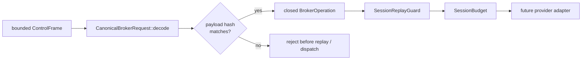

<!-- doc-type: concept -->

# Canonical Broker CBOR

[ドキュメント一覧](../README.md) / Canonical Broker CBOR

> **対象読者:** Broker / transport 実装者、wire 境界のレビュー担当者

このページは [`crates/egress-protocol/src/cbor.rs`](../../crates/egress-protocol/src/cbor.rs) が担当する、Host Egress Broker の control payload schema を説明する。ここでいう canonical は「意味が同じなら同じ bytes」という都合のよい約束ではない。decoder 自身が、v1 schema の唯一の表現以外を拒否するという意味である。

この層は vsock を開かず、HTTP / GitHub API も呼ばない。既に 1 MiB 以下と検証済みの frame payload を、replay guard と typed dispatcher に渡せる値へ復元する境界である。

## v1 request schema

外側の CBOR item は、必ず次の6要素 array である。`payload` は embedded CBOR item ではなく、その canonical bytes を入れた byte string である。これにより、payload 自身を hash の対象にしながら hash を含む outer envelope を作れる。

| index | CBOR value | 意味 |
|---:|---|---|
| 0 | unsigned `1` | protocol version |
| 1 | 16-byte byte string | host-issued `BrokerSessionId` |
| 2 | unsigned integer | session 内で厳密に増える sequence |
| 3 | 16-byte byte string | caller-issued `BrokerRequestId` |
| 4 | 32-byte byte string | `SHA-256(payload)` |
| 5 | byte string | 下表の canonical operation CBOR bytes |

`CanonicalBrokerRequest::decode` は、index 4 の値と index 5 の bytes から導出した hash が違えば reject する。成功時に得られる `BrokerEnvelope` は、この同じ hash を持つ。つまり replay guard が比較する identity と、実際に decode した operation の bytes がずれない。

payload の唯一の item は、次のどちらかである。

| operation | payload array | code 以外の自由な副作用入口 |
|---|---|---|
| `PublicFetch` | `[0, method, host, path, max_response_bytes]` | ない。`method` は `0 = GET` または `1 = HEAD`、host / path は authority-core の canonical constructor を通る |
| `GitHub` | `[1, installation, repository, operation, base, head]` | ない。`operation` は `0 = PublishBranch` または `1 = CreatePullRequest`、branch は安全な shorthand として再検証する |

installation と repository は host が割り当てる opaque identity なので、この schema は文字列の意味を解釈しない。host / URL path / branch のように authority comparison に直接使う値だけを authority-core の validator で再構築する。

## reject する表現

この decoder は汎用 CBOR parser ではない。次を全て reject する。

- array の要素数違い、unknown version、unknown operation family / method / GitHub operation。
- map、tag、float、boolean、null、negative integer、意図しない CBOR major type。
- indefinite-length item、reserved additional information、最短でない integer / length header。
- UTF-8 でない text、16 / 32 byte でない identity / hash、canonical host / URL path / branch に戻せない文字列。
- inner payload または outer request の trailing bytes、payload hash mismatch、1 MiB 超の control payload。

したがって、同じ operation を別の CBOR integer width や indefinite encoding で表して、同じ `BrokerRequestId` に別の bytes を結び付けることはできない。

## 実装境界

`cbor.rs` は wire bytes を typed request にするまでを担当する。`BrokerOperation::capability_request_at` はその closed union を、同じ tag の `CapabilityRequest` へ一意に写す。Broker adapter はこの変換結果を `CapabilityKernel` に渡せるが、成功した decode だけでは Capability を持つ、replay-safe、budget 内、または network policy を満たすことを意味しない。

| まだ別途必要なもの | 担当すべき層 |
|---|---|
| vsock listener、handshake、connection close | transport |
| Capability authorization と revoke linearization | Broker adapter + `CapabilityKernel` |
| retry outcome cache と `SessionReplayGuard` の接続 | session dispatcher |
| request count / byte / concurrency reservation | session dispatcher + `SessionBudget` |
| redirect、DNS rebinding、public IP、TLS、response streaming | public fetch adapter |
| expected-old OID、provider response、host-only credential | GitHub adapter |

この分離により、CBOR decoder へ network client や credential を置かず、transport の自由な bytes が adapter の自由な認証付き HTTP call へ変換される経路を作らない。

## payload を外側から分けている理由

外側の request は `[version, session, sequence, request, payload hash, payload]` の 6 要素で、`payload` は 2 つ目の canonical CBOR item を収めた byte string になっている。operation を外側に展開せず、byte string として埋め込んでいる。

理由は 2 つある。1 つは自己参照の回避で、hash 対象を外側の request 全体にすると、hash を書き込む前に hash を計算する必要が出る。もう 1 つは安定性で、operation bytes を独立した item にしておけば、外側の envelope の形が変わっても hash 対象は変わらない。

副作用として、wire 上で envelope と operation が視覚的にも分かれる。frame を読んだ時点で、認可に使う metadata と、adapter に渡す操作の bytes が別の場所にある。

## 正確な保証範囲

この module が保証するのは、bytes と型付き `BrokerOperation` の対応が 1 対 1 であることだけ。

- 同じ operation を表す綴りが 2 つ以上あれば、そのうち 1 つしか受理しない。非正規形は decode 前に落ちる。
- payload hash は埋め込み payload の SHA-256 と一致しなければならない。外側の request を含めた自己参照 hash にはしていないので、operation bytes は encode 後も安定する。
- 復元した `BrokerOperation` が認可されることは保証しない。認可は `CapabilityKernel` の担当で、この層は形だけを見る。
- decode が成功しても、その操作が session budget に収まることは見ていない。
- CBOR library の実装の正しさは仮定している。canonical 性の検査は自前だが、基本的な item の読み書きは委ねている。
- version 1 以外の request は拒否するが、将来 version が増えたときに v1 の解釈が変わらないことは、schema 側の運用に依存する。

## 変更時の確認点

- `OUTER_REQUEST_ITEMS`、`PUBLIC_FETCH_ITEMS`、`GITHUB_ITEMS` の値を変えるときは、encode 側と decode 側の両方を直す。片方だけでも compile は通り、round trip test を書いていない field で初めて壊れる。
- operation の discriminant（`PUBLIC_FETCH_OPERATION` = 0、`GITHUB_OPERATION` = 1 など）を再割り当てしない。古い guest が送った bytes が別の操作として復元される。
- 新しい operation を足すときは、`BROKER_CBOR_PROTOCOL_VERSION` を上げるか、既存 discriminant の後ろに追加する。間に挿入しない。
- `SESSION_ID_BYTES` / `REQUEST_ID_BYTES` / `PAYLOAD_HASH_BYTES` の長さ検査を緩めない。可変長を許すと、同じ値を表す綴りが複数できる。
- 非正規形の受理を増やさない。「読めるなら受ける」に倒すと、同じ操作に複数の payload hash が対応し、replay 判定が効かなくなる。

## 関連

- [Broker session envelope](session-envelopes.md)
- [ネットワークと外部副作用](../design/network-egress.md)
- [HTTP fetch authority](../authority-core/http-fetch-authorities.md)
- [GitHub authority](../authority-core/github-authorities.md)
