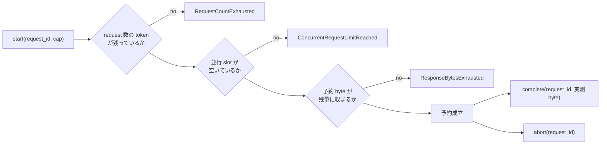

<!-- doc-type: concept -->

# session budget

[egress-protocol](README.md) / session budget

> **対象読者:** Broker の資源境界を触る実装者、DoS 経路をレビューする人

[`budget.rs`](../../crates/egress-protocol/src/budget.rs) は 1 session が消費できる総量を数える。clock も lock も持たない純粋な状態機械で、start / complete / abort の 3 操作しかない。

## Capability では総量を縛れない

Capability は「何をしてよいか」を決める。`GET docs.example /guide/** 1 MiB` を持つ subject は、その範囲の取得を許される。

**範囲は決まっているが、回数は決まっていない。** しかも caller は妥当な子 capability をいくらでも作れる。親が許す範囲を狭めた子を 1 万個 derive しても、どれも[委譲判定](../authority-core/file-authorities.md)を通る。

```text
capability が縛るもの: どの host の、どの path を、何 byte まで
capability が縛らないもの: 何回、同時に何本、session 全体で何 byte
```

したがって、総量は capability の外側で数える。それが `SessionBudget`。



## 3 種の上限

| field | 型 | 何を縛るか |
|---|---|---|
| `requests` | `NonZeroU64` | session 全体の request 数 |
| `response_bytes` | `u64` | session 全体の応答 byte 合計 |
| `concurrent` | `NonZeroUsize` | 同時に in-flight な request 数 |

`requests` と `concurrent` は `NonZero` なので、どの session も最低 1 回は request でき、最低 1 本は同時に走らせられる。

**`response_bytes` だけ `NonZero` ではない。** 0 が合法で、その場合も「宣言 `max_response_bytes` が 0 の request」は受理される。他の 2 つと型が違う点は、上限を組み立てるときに踏みやすい。

## 予約してから計上する

`start` は 3 つを同時に取る。request 数の token、並行 slot、応答 byte の予約。

予約するのは実測値ではなく宣言値。public fetch なら operation が宣言した `max_response_bytes`、GitHub なら host が持つ cap。実測は `complete` で計上する。

宣言で予約する理由は、実測が出るのは adapter が走った後だから。走った後に「上限を超えていた」と分かっても、その byte は既に network から読まれている。

## `complete` の失敗は予約を解放しない

```rust
// 予約を超える実測値のとき
// ResponseExceedsReservation を返し、reservation は残る
```

これは意図的な設計で、doc にも書いてある。**呼び出し側は失敗の直後に `abort` を呼ばなければならない。** 呼ばないと、予約した byte と並行 slot が session の生涯にわたって漏れる。

`egress-broker` の [dispatch](../egress-broker/dispatch.md) はこれを守っている。`complete` を呼ぶ 2 人目の実装者も同じことをする必要があるが、**compiler は教えてくれない。**

## request ID の一意性は持たない

`start` が拒否するのは、**現在 active な** request ID だけ。`complete` か `abort` の後は、同じ `BrokerRequestId` が再び `start` できる。2 つ目の token、2 つ目の slot、2 つ目の予約を消費する。

session 全体での一意性は [`SessionReplayGuard`](session-envelopes.md) だけが持つ。**replay guard を前に置かずに `SessionBudget` を使うと、冪等性が黙って消える。**

2 つを組み合わせて初めて「同じ request は 1 回だけ、しかも総量が縛られる」が成り立つ。

## 何が助かるのか

Capability の委譲判定と、資源の総量が別の層に分かれている。委譲を検討するとき「これを許すと何回呼べるか」を考えなくてよい。

上限が 3 つの独立した軸なので、どれが効いたかが error variant で分かる。`RequestCountExhausted` と `ConcurrentRequestLimitReached` と `ResponseBytesExhausted` は、運用上の対処が違う。

## 正確な保証範囲

- 純粋な状態機械。時刻を持たないので、「1 分あたり何回」のような rate limit は表現できない。session の生涯合計だけ。
- 実測 byte は呼び出し側の申告。`complete` に渡された値をそのまま計上する。adapter が過少申告すれば、その分は数えられない。
- `HEAD` request は予約を取って 0 を計上する。応答 body が空だから。byte 予算では縛られず、request 数と並行数だけが効く。
- 並行 slot は `start` と `complete` / `abort` の対で管理する。`abort` を呼び忘れた経路があれば slot は戻らない。
- 上限を超えたことの記録は残らない。監査は [Attempt / effect audit](../authority-core/audit-records.md) の担当。

## 変更時の確認点

- `complete` が失敗したときに予約を解放する挙動へ変えない。現在の呼び出し側は直後に `abort` を呼ぶ前提で書かれている。両方が解放すると二重解放になる。
- `start` に session 全体の request ID 一意性を持たせない。replay guard との責務が重複し、どちらが権威か曖昧になる。
- `response_bytes` を `NonZeroU64` にすると、0 byte の session を表現できなくなる。現在の型の違いは意図的かどうか確認してから変える。
- 上限を足すときは、それが session の生涯合計なのか、window なのかを決める。現在の 3 つはすべて生涯合計で、`concurrent` だけが増減する。
- fixture の値（`requests = 3`、`response_bytes = 100`、`concurrent = 2`）を変えると、既存 test の枯渇 assertion がすべてずれる。`60 + 40 = 100` のように値が計算に埋まっている。

## 関連

- [egress-protocol](README.md)
- [Broker session envelope](session-envelopes.md)
- [Canonical Broker CBOR](canonical-cbor.md)
- [frame から adapter までの 1 本道](../egress-broker/dispatch.md)
- [Capability envelope と委譲証明](../authority-core/capabilities.md)
- [ネットワークと外部副作用の設計](../design/network-egress.md)
- [用語集](../glossary.md)
