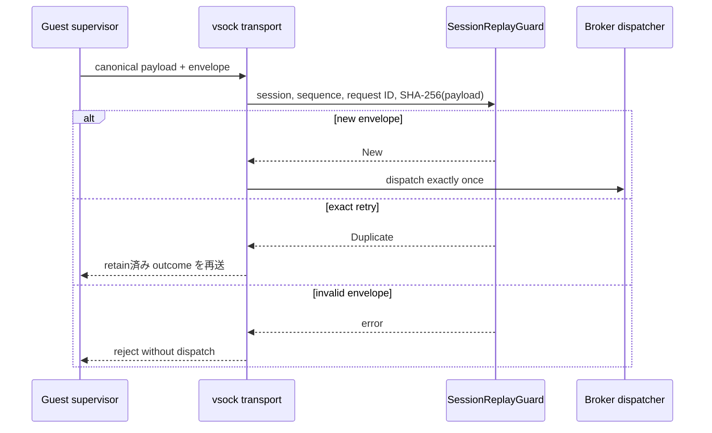

# Broker session envelope

[ドキュメント一覧](../README.md) / Broker session envelope

このページは [`crates/egress-protocol/src/session.rs`](../../crates/egress-protocol/src/session.rs) が担当する、Host Egress Broker の replay 防止と request identity の境界を説明する。

この crate はまだ vsock、CBOR、HTTP、GitHub client を実装しない。外部副作用を dispatch する前に transport が必ず通す、小さく独立した state machine だけを置いている。これにより、network client を足す前に retry と snapshot restore の安全条件を固定する。

## envelope に含めるもの

| field | 意味 | 防ぐもの |
|---|---|---|
| `BrokerSessionId` | restore 後に host が発行する128 bitの接続 identity | snapshot 前の request の混入 |
| `sequence` | session 内で 0 から厳密に増える `u64` | reorder、gap、wraparound |
| `BrokerRequestId` | caller が一回の副作用へ割り当てる128 bit identity | retry が二重送信になること |
| `PayloadHash` | canonical payload の SHA-256 | 同じ request ID への別内容のすり替え |

`SessionReplayGuard` は、最初に新しい request を一度だけ `New` として受け入れる。同じ session、sequence、request ID、payload hash の完全一致だけが `Duplicate` になる。`Duplicate` のとき dispatcher は外部操作を再実行せず、保存してある元の outcome を返す。

同じ request ID に違う sequence または payload hash を付けた場合、別 session、順序違反、request table の容量超過、`u64` sequence の尽きた後もすべて fail closed である。失敗時は guard の状態を変更しない。

## resource limit と責務の分離

deduplication table は `NonZeroUsize` の capacity を持つ。無限に request identity を保持してメモリを使い切ることはできない。容量超過なら新しい外部副作用を dispatch せずに拒否する。response の保持先、session budget、connection close は transport / Broker の責務である。

`MAX_CONTROL_FRAME_BYTES` は 1 MiB の allocation 前チェック用の上限として定義済みである。length-prefixed canonical CBOR の encode/decode と vsock I/O はまだこの crate に入れていない。そこを実装するときも、decode 前にこの上限を確認し、decode 後に canonical bytes を hash してから guard へ渡す。

## 何がまだ必要か

- canonical CBOR schema と length-prefixed frame decoder。
- vsock listener、session handshake、connection close と response cache。
- `HttpFetchRequest` / `GitHubRequest` を Broker の typed dispatch へつなぐ adapter。
- redirect / DNS / public-IP / TLS / response streaming の強制。
- broker session envelope と host 側の回数・累積 byte・並行数 budget。

この順に分けることで、任意の raw frame や retry が credential を使う操作を二重に dispatch する抜け道を作らない。

## 関連

- [ネットワークと外部副作用](../design/network-egress.md)
- [HTTP fetch authority](../authority-core/http-fetch-authorities.md)
- [GitHub authority](../authority-core/github-authorities.md)
- [実装順序](../design/implementation-plan.md)
