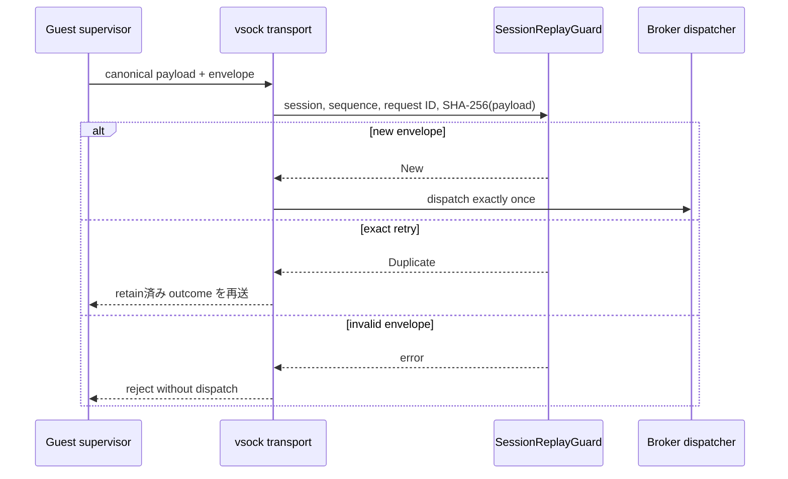

# Broker session envelope

[ドキュメント一覧](../README.md) / Broker session envelope

このページは [`crates/egress-protocol/src/session.rs`](../../crates/egress-protocol/src/session.rs) が担当する、Host Egress Broker の replay 防止と request identity の境界を説明する。

この crate はまだ vsock、CBOR、HTTP、GitHub client を実装しない。外部副作用を dispatch する前に transport が必ず通す、小さく独立した state machine と closed operation boundary だけを置いている。これにより、network client を足す前に retry と snapshot restore の安全条件を固定する。

## envelope に含めるもの

| field | 意味 | 防ぐもの |
|---|---|---|
| `BrokerSessionId` | restore 後に host が発行する128 bitの接続 identity | snapshot 前の request の混入 |
| `sequence` | session 内で 0 から厳密に増える `u64` | reorder、gap、wraparound |
| `BrokerRequestId` | caller が一回の副作用へ割り当てる128 bit identity | retry が二重送信になること |
| `PayloadHash` | canonical payload の SHA-256 | 同じ request ID への別内容のすり替え |

`SessionReplayGuard` は、最初に新しい request を一度だけ `New` として受け入れる。同じ session、sequence、request ID、payload hash の完全一致だけが `Duplicate` になる。`Duplicate` のとき dispatcher は外部操作を再実行せず、保存してある元の outcome を返す。

同じ request ID に違う sequence または payload hash を付けた場合、別 session、順序違反、request table の容量超過、`u64` sequence の尽きた後もすべて fail closed である。失敗時は guard の状態を変更しない。

## session budget

deduplication table は `NonZeroUsize` の capacity を持つ。無限に request identity を保持してメモリを使い切ることはできない。容量超過なら新しい外部副作用を dispatch せずに拒否する。

`budget.rs` は、Capability から分けるべき session-wide の消費予算を実装している。

| budget | 消費のタイミング | 失敗時の扱い |
|---|---|---|
| request count | `start` が外部 request を始めるとき | abort しても戻さない |
| total response bytes | `complete` が実受信 byte を確定するとき | active request は最大 byte を先に reservation する |
| concurrent requests | active reservation が存在する間 | `complete` / `abort` で slot を返す |

response の reservation は「同時に動く request が合計 budget を超えて読めない」ことを保証する。完了時には実際の byte 数だけを committed usage に移し、未使用 reservation は解放する。上限超過、二重 reservation、未知の completion、reservation を超えた受信 byte は状態を変えずに拒否する。

response outcome の保持先と connection close は transport / Broker の責務である。

## closed operation boundary

`operation.rs` の `BrokerOperation` は、Broker の内部 dispatcher が受け取れる外部副作用を次の二つに閉じる。

| variant | contains | dispatcher に入らないもの |
|---|---|---|
| `PublicFetch` | canonical `HttpFetchRequest` | raw URL、任意 method、header、body、credential |
| `GitHub` | canonical `GitHubRequest` | 任意 provider URL、任意 JSON body、token |

この型は実ネットワークを実行しない。transport decoder は canonical CBOR をこの union に復元し、authorization、replay guard、session budget を通過させた後にだけ、将来の provider adapter へ値を渡す。その adapter の実装はまだ残っている。

`frame.rs` は 4 byte big-endian length prefix と 1 MiB 上限を実装済みである。streaming transport は prefix を読んだ直後に `ValidatedFrameLength` で検査し、その値を超える allocation をしない。buffered decoder も truncated prefix/payload、trailing bytes、oversized length を拒否する。

[canonical CBOR schema と decoder](canonical-cbor.md) はこの crate に実装済みである。outer envelope は transmitted payload hash と embedded canonical operation payload を持ち、decoder は payload を hash して値が一致することを確認する。vsock I/O はまだこの crate に入れていない。

## 何がまだ必要か

- vsock listener、session handshake、connection close と response cache。
- closed operation union を実際の provider adapter へつなぐ dispatch。
- redirect / DNS / public-IP / TLS / response streaming の強制。
- session budget を authority と replay guard を通る typed dispatch へ接続すること。

この順に分けることで、任意の raw frame や retry が credential を使う操作を二重に dispatch する抜け道を作らない。

## 関連

- [ネットワークと外部副作用](../design/network-egress.md)
- [HTTP fetch authority](../authority-core/http-fetch-authorities.md)
- [GitHub authority](../authority-core/github-authorities.md)
- [実装順序](../design/implementation-plan.md)
