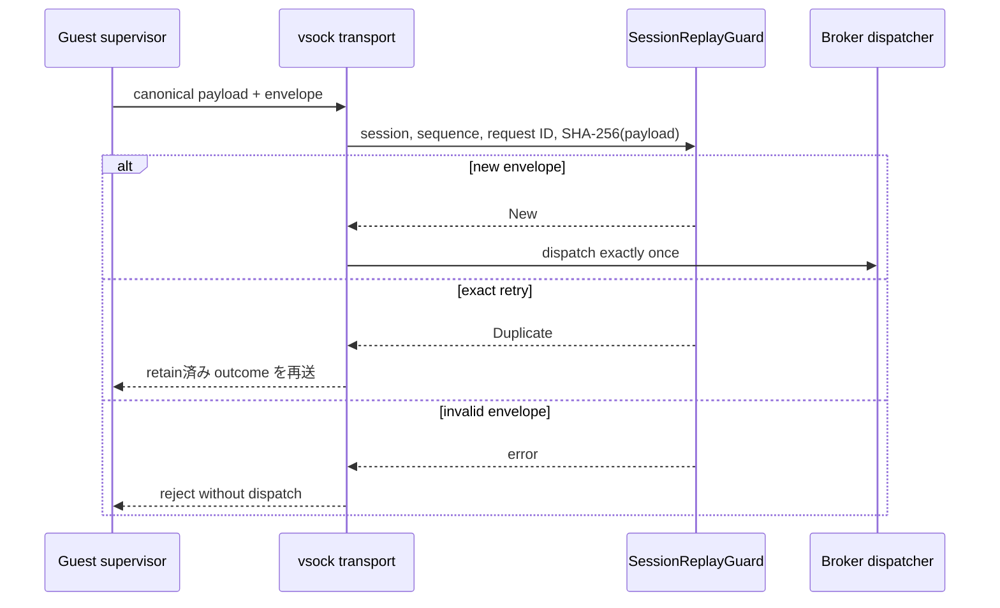

<!-- doc-type: concept -->

# Broker session envelope

[ドキュメント一覧](../README.md) / Broker session envelope

> **対象読者:** Broker / transport 実装者、replay 防止のレビュー担当者

このページは [`crates/egress-protocol/src/session.rs`](../../crates/egress-protocol/src/session.rs) が担当する、Host Egress Broker の replay 防止と request identity の境界を説明する。

この crate は vsock、HTTP、GitHub client を実装しない。CBOR request / response schema と、外部副作用を dispatch する前に transport が必ず通す、小さく独立した replay state machine を置いている。これにより、network client の前に retry と snapshot restore の安全条件を固定する。

## envelope に含めるもの

| field | 意味 | 防ぐもの |
|---|---|---|
| `BrokerSessionId` | restore 後に host が発行する128 bitの接続 identity | snapshot 前の request の混入 |
| `sequence` | session 内で 0 から厳密に増える `u64` | reorder、gap、wraparound |
| `BrokerRequestId` | caller が一回の副作用へ割り当てる128 bit identity | retry が二重送信になること |
| `PayloadHash` | canonical payload の SHA-256 | 同じ request ID への別内容のすり替え |

`SessionReplayGuard` は、最初に新しい request を一度だけ `New` として受け入れる。同じ session、sequence、request ID、payload hash の完全一致だけが `Duplicate` になる。`Duplicate` のとき dispatcher は外部操作を再実行せず、保存してある元の outcome を返す。

未検証 bytes を扱う ingress は `BrokerEnvelope::from_canonical_payload` で hash を導出し、`SessionReplayGuard::accept_payload` で同じ payload を検査してから受理する。payload hash を直接受け取る constructor と payload 無しの `accept` は crate-private で、外部 transport からは呼べない。production Broker も canonical decoder が返した exact payload を `accept_payload` へ渡す。

同じ request ID に違う sequence または payload hash を付けた場合、別 session、順序違反、request table の容量超過、`u64` sequence の尽きた後もすべて fail closed である。失敗時は guard の状態を変更しない。

## session budget

deduplication table は `NonZeroUsize` の capacity を持つ。無限に request identity を保持してメモリを使い切ることはできない。容量超過なら新しい外部副作用を dispatch せずに拒否する。

`budget.rs` は、Capability から分けるべき session-wide の消費予算を実装している。

| budget | 消費のタイミング | 失敗時の扱い |
|---|---|---|
| request count | `start` が外部 request を始めるとき | abort しても戻さない |
| total response bytes | `complete` が実受信 byte を確定するとき | active request は最大 byte を先に reservation する |
| concurrent requests | active reservation が存在する間 | `complete` / `abort` で slot を返す |

response の reservation は「同時に動く request が合計 budget を超えて読めない」ことを保証する。完了時には実際の byte 数だけを committed usage に移し、未使用 reservation は解放する。上限超過、二重 reservation、未知の completion、reservation を超えた受信 byte は状態を変えずに拒否する。

response outcome の保持先と connection close は transport / Broker の責務である。

## closed operation boundary

`operation.rs` の `BrokerOperation` は、Broker の内部 dispatcher が受け取れる外部副作用を次の二つに閉じる。

| variant | contains | dispatcher に入らないもの |
|---|---|---|
| `PublicFetch` | canonical `HttpFetchRequest` | raw URL、任意 method、header、body、credential |
| `GitHub` | canonical `GitHubRequest` | 任意 provider URL、任意 JSON body、token |

この型は実ネットワークを実行しない。sibling crate `egress-broker` の transport decoder は canonical CBOR をこの union に復元し、authorization、replay guard、session budget を通過させた後にだけ、実装済みの typed provider adapter へ値を渡す。

`frame.rs` は 4 byte big-endian length prefix と 1 MiB 上限を実装済みである。streaming transport は prefix を読んだ直後に `ValidatedFrameLength` で検査し、その値を超える allocation をしない。buffered decoder も truncated prefix/payload、trailing bytes、oversized length を拒否する。

[canonical CBOR schema と decoder](canonical-cbor.md) はこの crate に実装済みである。outer envelope は transmitted payload hash と embedded canonical operation payload を持ち、decoder は payload を hash して値が一致することを確認する。vsock I/O はこの protocol crate ではなく `egress-broker` と `session-orchestrator` が所有する。

## crate 境界

この crate は wire schema、replay、budget と guest client を所有する。listener、connection close、durable response cache、Authority Core、redirect / DNS / public-IP / TLS、typed GitHub provider への接続は `egress-broker` が所有し、production Firecracker UDS の生成と shutdown は `session-orchestrator` が所有する。

## 正確な保証範囲

envelope が保証するのは、1 つの session 内で要求の順序と同一性が判定できることだけ。

- session そのものの認証はしていない。`BrokerSessionId` を持っていることが、その session の正当な所有者である証明にはならない。connection の identity は [transport 契約](../egress-broker/transport.md)の層が持つ。
- replay 防止は bounded capacity の範囲でしか効かない。capacity を超えて古くなった `(session, sequence)` は cache から落ちる。sequence の単調性がその後の防波堤になる。
- payload hash は同一性の判定に使うだけで、完全性の証明ではない。改竄を検出する経路は TLS ではなく vsock の信頼に依存している。
- budget は要求の受理前に予約するが、実際の消費量が予約と一致することは adapter 側の実装に依存する。
- 時刻は扱わない。session の有効期間は Capability の[有効期間](../authority-core/validity-windows.md)が持つ。
- session をまたぐ順序は定義しない。2 つの session の要求の前後関係は判定できない。

## 変更時の確認点

- sequence の開始値 `0` と「直前の次だけ」の規則を緩めない。飛ばしを許すと、失われた要求と再送の区別が付かなくなる。
- 完全一致 retry の判定から field を減らさない。`(session, sequence, request ID, payload hash)` の 4 つ揃いが条件で、payload hash を外すと別内容の要求が retry として通る。
- 拒否 outcome の cache をやめない。再計算すると budget や時刻の変化で結果が変わる。
- replay capacity を変えるときは、その値が session あたりの in-flight 要求数を上回っていることを確認する。下回ると正当な retry が cache から落ちる。
- budget の予約と解放を非対称にしない。拒否された要求の予約が解放されないと、session が徐々に枯れる。
- restore 後に新しい `BrokerSessionId` を確立する手順を省かない。[snapshot と identity gate](../firecracker-runtime/snapshot-and-identity.md)がこの前提に依存している。

## 関連

- [ネットワークと外部副作用](../design/network-egress.md)
- [HTTP fetch authority](../authority-core/http-fetch-authorities.md)
- [GitHub authority](../authority-core/github-authorities.md)
- [実装順序](../design/implementation-plan.md)
