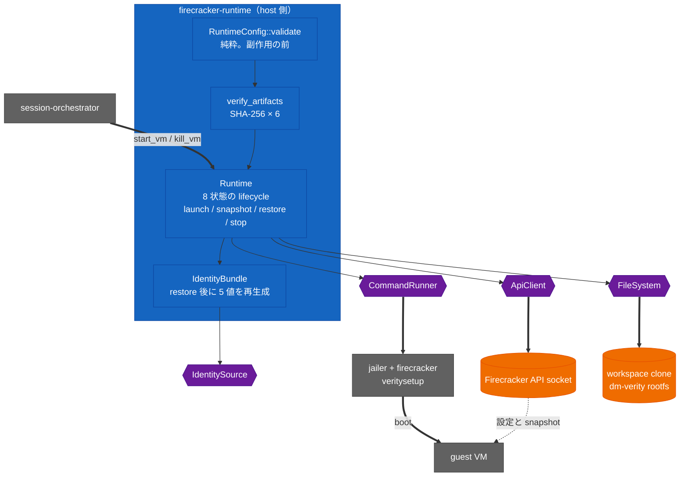

<!-- doc-type: index -->

# Firecracker runtime

[ドキュメント一覧](../README.md) / Firecracker runtime

> **対象読者:** Firecracker 統合担当者、ホスト隔離のレビュー担当者、運用担当者

`firecracker-runtime` はホスト側から 1 台の microVM を起動・snapshot・restore・停止するための crate である。artifact の digest 固定、dm-verity mapping、jailer 経由の起動、Firecracker API の呼び出し順序、restore 後の identity 再生成までを所有する。

VM の中で workload を閉じ込める部分は [runtime-isolation](../runtime-isolation/README.md)、複数 backend をまたぐ session の lifecycle は [session-orchestrator](../session-orchestrator/README.md) の担当。この crate は「VM が 1 台立ち上がって、正しい identity を持っている」ところまでを見る。

## crate の構造

紫の 4 つが唯一の副作用境界。通常の test はここに fake を挿す。一方、KVM host 向けの [`verify-real-guest-control.sh`](../../scripts/ci/verify-real-guest-control.sh) は実 Firecracker、実 dm-verity mapper、guest の `AF_VSOCK` listener、および Firecracker の guest-to-host per-port Unix socket まで通す。

## この crate が絶対にやらないこと

- guest に network device を与えない。`RuntimeConfig::validate` は `network_devices` が空でなければ `NetworkDeviceForbidden` を返す。外部通信は vsock 越しの [Host Egress Broker](../egress-broker/README.md) 経由だけ。
- digest が一致しない artifact で起動しない。検査は side effect の前。
- fingerprint が違う snapshot を restore しない。
- identity を再生成せずに workload を走らせない。restore 直後の状態は `IdentityRegenerated` であって `Running` ではない。

## 実装範囲と検証境界

lifecycle、API 呼び出し順序、rollback、identity gate は fake command runner / filesystem / API client を使う test で検証済み。`UnixApiClient` は本物の HTTP/1.x を local Unix socket 上で話す test まで通っている。

実機 test は direct Firecracker API で boot し、identity 注入前の workload start が `409` になること、canonical acknowledgement、dm-verity rootfs、guest-to-host Broker の canonical authorization rejection を確認する。`Runtime::launch` 経由の実 jailer、snapshot restore、workspace drive、外部 host egress は対象外である。詳細は[検証対応表](verification.md)。

## 文書一覧

| 文書 | 対象ソース | 内容 |
|---|---|---|
| [artifact の固定と fingerprint](pinned-artifacts.md) | [`lib.rs`](../../crates/firecracker-runtime/src/lib.rs) | SHA-256 による artifact 固定、dm-verity との結び付け、config fingerprint |
| [起動の順序と rollback](launch-sequence.md) | [`lib.rs`](../../crates/firecracker-runtime/src/lib.rs) | workspace clone から `InstanceStart` までの順序、失敗時の巻き戻し |
| [snapshot と identity gate](snapshot-and-identity.md) | [`lib.rs`](../../crates/firecracker-runtime/src/lib.rs) | 8 状態の lifecycle、restore 後の identity 再生成、workload の解放条件 |
| [workspace clone](workspace-clone.md) | [`lib.rs`](../../crates/firecracker-runtime/src/lib.rs) | symlink / hard link を許さない再帰 copy、上限、所有権 marker |
| [ホスト隔離プロファイル](host-isolation.md) | [`lib.rs`](../../crates/firecracker-runtime/src/lib.rs) | jailer の namespace、cgroup、seccomp の必須 deny |
| [検証対応表](verification.md) | — | fake で見た範囲と、実機で未確認の範囲 |

## 関連

- [隔離基盤の設計](../design/runtime-isolation.md)
- [runtime-isolation](../runtime-isolation/README.md)
- [Session orchestrator](../session-orchestrator/README.md)
- [Host Egress Broker](../egress-broker/README.md)
- [用語集](../glossary.md)
