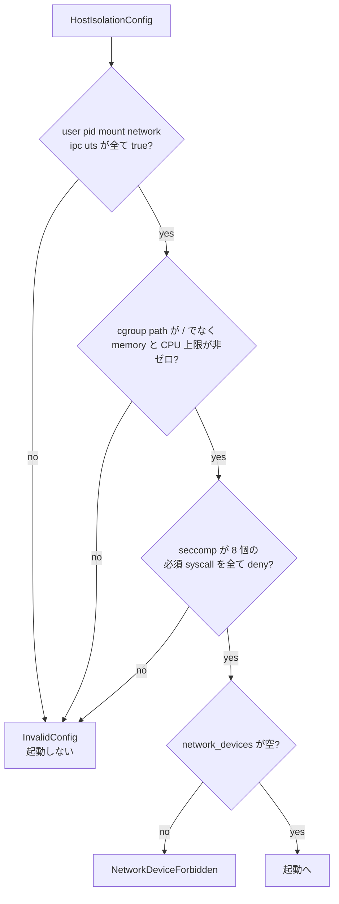

<!-- doc-type: concept -->

# ホスト隔離プロファイル

[Firecracker runtime](README.md) / ホスト隔離プロファイル

> **対象読者:** jailer の起動条件を触る実装者、host 側の被害範囲をレビューする人

VM の中で workload を閉じ込めるのは [runtime-isolation](../runtime-isolation/README.md) の仕事だが、その VM を動かす Firecracker プロセス自身も host 上では 1 プロセスにすぎない。`HostIsolationConfig` は、そのプロセスを jailer にどう閉じ込めさせるかを決める。

## 何を防ぎたいのか

前提として、Firecracker から VM 脱出が起きる可能性はゼロではない。脱出した攻撃者が最初に触れるのは Firecracker プロセスの権限であって、host の root ではない。ここを絞っておくと、脱出が起きても被害が VM 1 台分に留まる。

[`lib.rs`](../../crates/firecracker-runtime/src/lib.rs) の `RuntimeConfig::validate` は、この profile が緩んでいたら起動そのものを拒否する。



## namespace は 6 つ全部が必須

```rust
if !(self.isolation.namespaces.user
    && self.isolation.namespaces.pid
    && self.isolation.namespaces.mount
    && self.isolation.namespaces.network
    && self.isolation.namespaces.ipc
    && self.isolation.namespaces.uts)
```

`NamespaceConfig` は 6 つの bool を持つが、`false` にできる組み合わせは無い。全部 `true` でなければ `validate` が落ちる。

一見すると bool ではなく単一の flag にすべきに見える。個別に持っている理由は、jailer に渡す引数がそれぞれ対応していて、どの namespace を要求したかが config から読めるほうが監査しやすいから。将来 1 つを外す判断をするなら、その決定は ADR に残す。

network namespace が最も効く。Firecracker プロセスが host の network stack を見ないので、VM 脱出後に host の他サービスへ横移動できない。外部通信は vsock 越しの [Host Egress Broker](../egress-broker/README.md) だけを通る。

## cgroup で 2 つの上限を要求する

`CgroupConfig` は `path`、`memory_max_bytes`、`cpu_quota_micros` を持つ。検査は 2 つ。

```rust
if self.isolation.cgroup.path == Path::new("/") { /* 拒否 */ }
if self.isolation.cgroup.memory_max_bytes == 0
    || self.isolation.cgroup.cpu_quota_micros == 0 { /* 拒否 */ }
```

`path` が host の root であることを拒否するのは、cgroup 操作が host 全体に及ぶのを防ぐため。

上限がゼロの場合を拒否するのは、`0` が「制限なし」を意味しかねないから。cgroup v2 の `memory.max` は `max` という文字列で無制限を表すが、数値の `0` を書くとすべての割り当てが失敗する。どちらの解釈でも意図した動作にならないので、設定の時点で落とす。`Default` で初期化したまま渡す事故もここで止まる。

## seccomp は 8 個の deny を必須にする

```rust
const REQUIRED_BLOCKED_SYSCALLS: [&str; 8] = [
    "bpf", "connect", "mount", "perf_event_open",
    "ptrace", "setns", "socket", "unshare",
];
```

`SeccompConfig` は filter 本体を `PinnedArtifact` として持ち、それとは別に `blocked_syscalls` の一覧を宣言する。`validate` は 8 個すべてが宣言に含まれることを確認する。

ここは検査の性質を誤解しやすい。**この crate は filter を解析していない。** 宣言された一覧を文字列比較しているだけで、実際の BPF が本当にこれらを拒否するかは見ていない。宣言と実体がずれても検出できない。

それでも入れている理由は、profile を差し替えるときに「この 8 個は落とすな」という要求が config に残るから。宣言を消せば起動しなくなるので、意図せず緩めることはできない。

8 個の選び方は、VM 脱出後に最初に試されるものを並べている。`socket` と `connect` で外部通信、`mount` と `unshare` と `setns` で隔離の張り直し、`ptrace` で他プロセスへの干渉、`bpf` と `perf_event_open` で kernel への到達。

[runtime-isolation の seccomp allowlist](../runtime-isolation/seccomp-allowlist.md) とは層が違う。あちらは VM 内の workload、こちらは host 上の Firecracker プロセス。同じ syscall 名が出てくるが、対象プロセスが別。

## network device を型の外に置かない

`RuntimeConfig` は `network_devices` フィールドを持っている。空でなければ `NetworkDeviceForbidden` を返す。

フィールド自体を消せば、そもそも network device を設定できない。それをしていないのは、「設定できるが拒否される」ほうが「設定項目が存在しない」より意図が伝わるから。専用の error variant を用意しているのも同じ理由で、`InvalidConfig` の文字列に混ぜていない。

## 何が助かるのか

host 側の被害範囲が config の 1 構造体から読める。稼働中の host で jailer の引数を調べなくてよい。

profile を緩める変更が起動失敗として現れる。静かに緩んだ状態で動き続けることがない。

`NetworkDeviceForbidden` が独立した variant なので、この拒否だけを test で名指しできる。

## 正確な保証範囲

この crate が保証するのは、config が上記の条件を満たさなければ起動しないことだけ。**隔離が実際に効いていることは一切保証していない。**

- jailer が実際に 6 つの namespace を作るかは未検証。`start_jailer` は fake command runner 越しにしか実行していない。
- cgroup が実際に作られ、上限が適用されるかは未検証。
- seccomp filter の中身は解析していない。`blocked_syscalls` は宣言であって検証結果ではない。宣言と filter が食い違っていても検出しない。
- jailer に渡すコマンドラインが Firecracker の期待する形式かは未検証。
- VM 脱出が起きたときに実際に被害が VM 1 台に留まるかは、上記が全部効いていることが前提。現時点でその前提は確認できていない。
- host 側の他の防御（AppArmor、SELinux、host の seccomp）はこの crate の対象外。

## 変更時の確認点

- `REQUIRED_BLOCKED_SYSCALLS` から要素を削るときは、その syscall で VM 脱出後に何ができるようになるかを ADR に書く。8 個は最小要求であって推奨構成ではない。
- 逆に足すときは、既存の filter artifact の宣言も同時に更新する。片方だけだと既存の profile で起動できなくなる。
- `NamespaceConfig` の bool を 1 つでも省略可能にするときは、[隔離基盤の設計](../design/runtime-isolation.md)の脅威モデルを先に読み直す。
- `blocked_syscalls` の検査を「filter を解析して確認する」に強化する場合は、この文書の保証範囲の記述も同時に直す。現状は宣言の照合であることを明記している。
- `network_devices` フィールドを消す判断をするなら、`NetworkDeviceForbidden` を返す経路が無くなることを踏まえて、[ネットワークと外部副作用の設計](../design/network-egress.md)の前提を確認する。

## 関連

- [artifact の固定と fingerprint](pinned-artifacts.md)
- [起動の順序と rollback](launch-sequence.md)
- [検証対応表](verification.md)
- [runtime-isolation の seccomp allowlist](../runtime-isolation/seccomp-allowlist.md)
- [隔離基盤の設計](../design/runtime-isolation.md)
- [ネットワークと外部副作用の設計](../design/network-egress.md)
- [用語集](../glossary.md)
