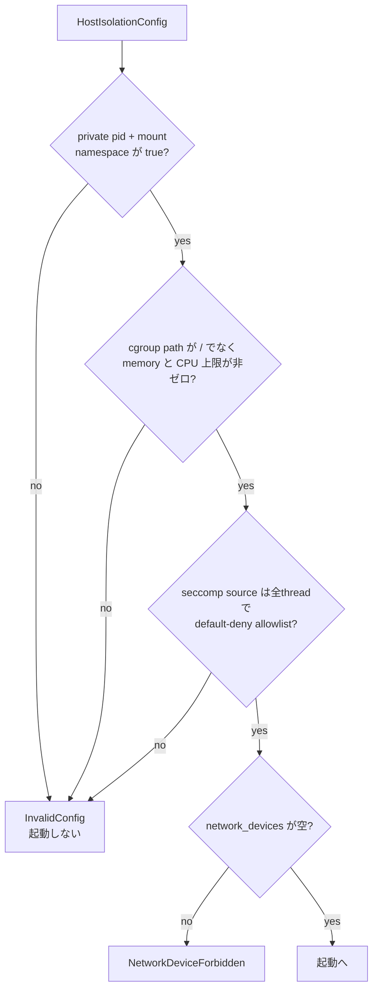

<!-- doc-type: concept -->

# ホスト隔離プロファイル

[Firecracker runtime](README.md) / ホスト隔離プロファイル

> **対象読者:** jailer の起動条件を触る実装者、host 側の被害範囲をレビューする人

VM の中で workload を閉じ込めるのは [runtime-isolation](../runtime-isolation/README.md) の仕事だが、その VM を動かす Firecracker プロセス自身も host 上では 1 プロセスにすぎない。`HostIsolationConfig` は、そのプロセスを jailer にどう閉じ込めさせるかを決める。

## 何を防ぎたいのか

前提として、Firecracker から VM 脱出が起きる可能性はゼロではない。脱出した攻撃者が最初に触れるのは Firecracker プロセスの権限であって、host の root ではない。ここを絞っておくと、脱出時の被害範囲を縮められる。ただし、下記の profile が escape proof になるわけではない。

[`lib.rs`](../../crates/firecracker-runtime/src/lib.rs) の `RuntimeConfig::validate` は、この profile が緩んでいたら起動そのものを拒否する。



## jailer が作る namespace

```rust
if !self.isolation.namespaces.pid || !self.isolation.namespaces.mount
```

`NamespaceConfig` は 6 つの bool を持つが、jailer が直接扱うのは private PID namespace と mount namespace である。この profile はその 2 つを必須にし、user/network/IPC/UTS の switch は jailer の未対応機能として明示的に拒否する。

個別の bool を残しているのは、profile がどの隔離を要求したかを config から監査できるためである。実 launch gate は Firecracker task の PID/mount namespace が test process と異なることも観測する。これは namespace 作成の実証であって、VM escape が不可能であることの証明ではない。

network device は `RuntimeConfig::validate` が常に拒否する。従ってこの runtime profile は Firecracker に host network device を渡さず、外部通信の設計は vsock 越しの [Host Egress Broker](../egress-broker/README.md) に限定する。network namespace を作ることを、この crate の検査結果として主張しない。

## cgroup で 3 つの非ゼロ制約を要求する

`CgroupConfig` は `path`、`memory_max_bytes`、`cpu_quota_micros`、`cpu_period_micros` を持つ。検査は host root を拒否することと、memory、CPU quota、CPU period をすべて非ゼロにすることである。

```rust
if self.isolation.cgroup.path == Path::new("/") { /* 拒否 */ }
if self.isolation.cgroup.memory_max_bytes == 0
    || self.isolation.cgroup.cpu_quota_micros == 0
    || self.isolation.cgroup.cpu_period_micros == 0 { /* 拒否 */ }
```

`path` が host の root であることを拒否するだけでなく、実 launch 用の cgroup path は `/sys/fs/cgroup` 配下で、workspace clone ID を leaf 名に持ち、非空の parent を含まなければならない。これらは `cgroup_parent()` が jailer へ渡す hierarchy を検査する境界である。

上限がゼロの場合を拒否するのは、`0` が「制限なし」を意味しかねないから。cgroup v2 の `memory.max` は `max` という文字列で無制限を表すが、数値の `0` を書くとすべての割り当てが失敗する。どちらの解釈でも意図した動作にならないので、設定の時点で落とす。`Default` で初期化したまま渡す事故もここで止まる。

## seccomp source・compiler・BPF を一体で検証する

```rust
const REQUIRED_BLOCKED_SYSCALLS: [&str; 6] = [
    "bpf", "mount", "perf_event_open", "ptrace", "setns", "unshare",
];
```

`SeccompConfig` は pinned JSON policy、pinned `seccompiler`、jailer が読む pinned BPF filter、
および6 syscallのexact deny宣言を持つ。起動前に全artifactのdigestを検査した上で、JSONを
最大1 MiBに制限してparseし、各thread profileがdefault-deny（`trap`、`kill_process`、
`kill_thread`、`errno`）かつ`filter_action=allow`であることを要求する。6 syscallはどのthreadの
allowlistにも存在できない。宣言側も、この6個と集合が完全一致しなければ拒否する。

`socket`を全面禁止するとFirecracker自身のUnix API/vsock backendも壊れるため、allowできるのは
引数がexact `AF_UNIX`、`SOCK_STREAM|SOCK_CLOEXEC`、protocol 0のruleだけである。`connect`は
default-deny allowlistの中でFirecrackerのUnix-domain接続に必要なため、名前だけで禁止したとは
主張しない。host network deviceは別の`NetworkDeviceForbidden`で常に拒否する。

最後に、検査済みJSON bytesをprivate temporary directoryへ書き、pinned compilerを固定引数で
再実行する。出力が単一のbounded regular fileであり、jailerへ渡すBPFとbyte-for-byte一致する
場合だけ起動する。これにより「宣言とJSON」「JSONとcompiled BPF」のずれは起動前に閉じる。
実launch gateはさらにtaskの`Seccomp: 2`を観測する。

6個のdenyは、VM escape後のnamespace張り直し、他process干渉、kernel attack surfaceへの到達を
狙う操作である。default-denyなので、ここに列挙していないsyscallもallowlistになければ拒否される。

[runtime-isolation の seccomp allowlist](../runtime-isolation/seccomp-allowlist.md) とは層が違う。あちらは VM 内の workload、こちらは host 上の Firecracker プロセス。同じ syscall 名が出てくるが、対象プロセスが別。

## network device を型の外に置かない

`RuntimeConfig` は `network_devices` フィールドを持っている。空でなければ `NetworkDeviceForbidden` を返す。

フィールド自体を消せば、そもそも network device を設定できない。それをしていないのは、「設定できるが拒否される」ほうが「設定項目が存在しない」より意図が伝わるから。専用の error variant を用意しているのも同じ理由で、`InvalidConfig` の文字列に混ぜていない。

## 何が助かるのか

host 側の被害範囲が config の 1 構造体から読める。稼働中の host で jailer の引数を調べなくてよい。

profile を緩める変更が起動失敗として現れる。静かに緩んだ状態で動き続けることがない。

`NetworkDeviceForbidden` が独立した variant なので、この拒否だけを test で名指しできる。

## 正確な保証範囲

この crate が保証するのは、config が上記の条件を満たさなければ起動しないことと、opt-in の実 launch gate が指定 host 上の一部の設置状態を観測することまでである。**これを VM escape proof と解釈してはいけない。**

- `scripts/ci/verify-real-runtime-lifecycle.sh` は実 jailer/Firecracker を通り、PID/mount namespace、cgroup leaf と memory/cpu 上限、dedicated UID、pinned executable digest、`Seccomp: 2` を観測する。
- seccomp JSONの全threadを解析し、default-deny allowlist、6個の必須deny不在、exact Unix-stream `socket` ruleを検査する。pinned compilerで再生成したBPFはjailer入力とbyte一致を要求する。
- allowlistに載る全syscallの全引数意味論を一般化して証明するものではない。引数を特別検査するのは`socket`であり、host kernelとpinned compilerはTCBに残る。
- wrapper の gate は jailer の期待する CLI、workspace/mapper/bind、shutdown cleanup も確認するが、VM escape、snapshot restore、guest CapFS、host の AppArmor/SELinux は対象外である。jailer が受け取る pinned seccomp filter の installation は `Seccomp: 2` と compiler/filter byte equality の範囲で確認するが、全 syscall の意味論は対象外である。
- VM 脱出が起きたときに実際に被害が VM 1 台に留まるかは、上記が全部効いていることが前提。現時点でその前提は確認できていない。
- host 側の他の防御（AppArmor、SELinux）はこの crate の対象外。

## 変更時の確認点

- `REQUIRED_BLOCKED_SYSCALLS` から要素を削るときは、その syscall で VM 脱出後に何ができるようになるかを ADR に書く。6個はdefault-deny policy上の必須denyであって、allowlist全体ではない。
- 逆に足すときは、JSON policy、compiled BPF、宣言を同時に更新する。どれか1つだけならsource検査またはbyte一致で起動できない。
- `NamespaceConfig` の bool を 1 つでも省略可能にするときは、[隔離基盤の設計](../design/runtime-isolation.md)の脅威モデルを先に読み直す。
- seccomp JSON parserが認識するaction、rule shape、argument制約を変える場合は、pinned compilerとの再生成試験とこの保証範囲を同時に更新する。
- `network_devices` フィールドを消す判断をするなら、`NetworkDeviceForbidden` を返す経路が無くなることを踏まえて、[ネットワークと外部副作用の設計](../design/network-egress.md)の前提を確認する。

## 関連

- [artifact の固定と fingerprint](pinned-artifacts.md)
- [起動の順序と rollback](launch-sequence.md)
- [検証対応表](verification.md)
- [runtime-isolation の seccomp allowlist](../runtime-isolation/seccomp-allowlist.md)
- [隔離基盤の設計](../design/runtime-isolation.md)
- [ネットワークと外部副作用の設計](../design/network-egress.md)
- [用語集](../glossary.md)
