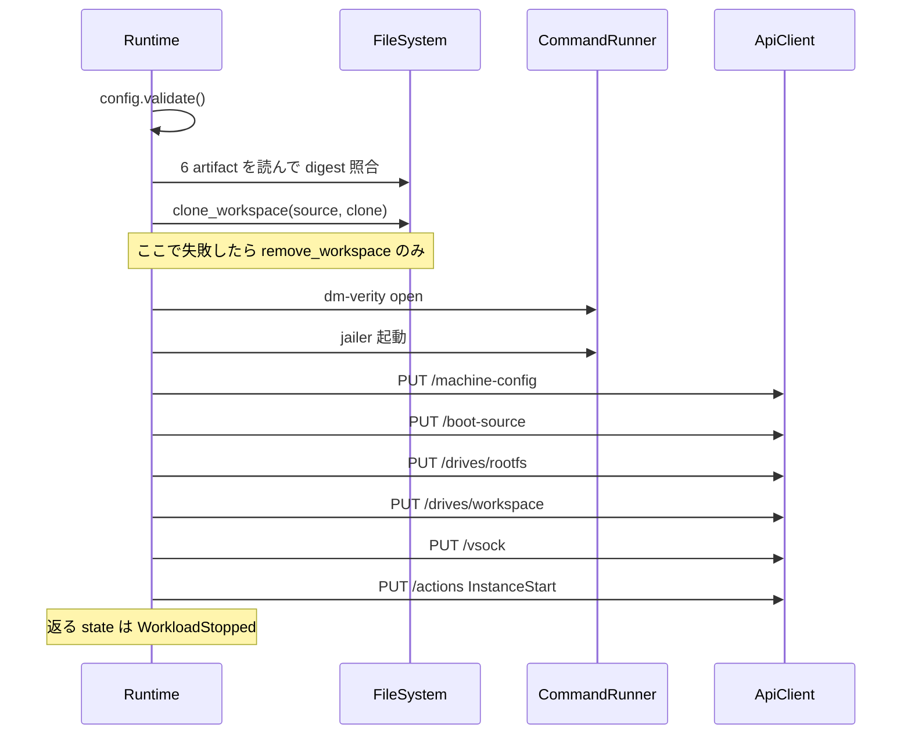

<!-- doc-type: concept -->

# 起動の順序と rollback

[Firecracker runtime](README.md) / 起動の順序と rollback

> **対象読者:** VM 起動経路を触る実装者、失敗時に host へ何が残るかを確認する人

`Runtime::launch` は 6 段階を順に進み、どこで失敗しても、そこまでに作った host resource を逆順に片付ける。[`lib.rs`](../../crates/firecracker-runtime/src/lib.rs) の該当箇所はクロージャで囲われていて、成功と失敗の両方が同じ後始末経路を通る。

## 何を防ぎたいのか

起動が途中で失敗したとき、host に残りうるものが 3 つある。clone した workspace directory、`/dev/mapper/<name>` の dm-verity mapping、起動済みの jailer プロセス。

mapping が残ると次の session が同じ mapper 名を使えない。これは分かりやすい失敗で、すぐ気付く。

厄介なのは VM プロセスだけ生き残る場合。orchestrator は起動失敗として扱うので、その workspace を解放できると考える。しかし実際には生きた VM がその workspace を掴んだままで、別の session に再割り当てされると、2 つの session が同じ tree を共有することになる。[session-orchestrator](../session-orchestrator/README.md) が VM kill 失敗時に workspace isolation を実行しないのは、この状態を作らないため。



## API 呼び出しの順序

`configure_vm` は 5 本の PUT を決まった順に投げる。Firecracker の API は状態を持ち、`InstanceStart` の時点で device 構成が終わっている必要がある。

| 順 | path | 内容 | 順序上の制約 |
|---|---|---|---|
| 1 | `/machine-config` | `vcpu_count`、`mem_size_mib` | boot source より先。起動後は変えられない |
| 2 | `/boot-source` | kernel image path、boot args | drive 設定より先 |
| 3 | `/drives/rootfs` | `/dev/mapper/<name>` を `is_root_device: true`、`is_read_only: true` で | dm-verity mapping を開いた後 |
| 4 | `/drives/workspace` | clone 済み workspace を書き込み可で | clone 完了後 |
| 5 | `/vsock` | `guest_cid` と host 側 UDS path | `InstanceStart` より先 |

rootfs は必ず `is_read_only: true` で渡す。dm-verity 越しなので書けないはずだが、API 側でも宣言しておかないと、guest が書き込みを試みたときの挙動が Firecracker の実装依存になる。二重に閉じているのは意図的。

network device の PUT は 1 本も無い。`validate()` が `network_devices` の非空を `NetworkDeviceForbidden` で拒否するので、そもそもここへ到達しない。`network_device_is_rejected_before_artifact_reads_or_launch` が確認しているのは、その拒否が artifact を読むより前に起きること。

guest CID は 3 以上でなければならない。0 から 2 は vsock の予約値で、2 は host を指す。ここを検査しないと、guest が host CID を名乗る構成を作れてしまう。

## rollback の順序

失敗経路は 2 つある。

workspace clone 自体が失敗した場合は `remove_workspace` を 1 回呼んで終わる。まだ dm-verity も jailer も触っていないので、片付けるものが 1 つしかない。

それ以降で失敗した場合は `rollback(process, verity_opened, workspace_cloned, &workspace, config)` が呼ばれる。引数のとおり、何が完了しているかを bool で持ち回り、完了したものだけを逆順に片付ける。

```text
jailer プロセス停止
  -> dm-verity mapping を閉じる
  -> workspace を削除
```

依存関係の逆順である。VM が動いたまま mapping を閉じると、VM が掴んでいる block device が消える。workspace を先に消せば、VM が開いている file が消える。

rollback 自体が失敗した場合は `with_cleanup(error, &cleanup)` が元のエラーに cleanup 失敗を添えて返す。元の失敗を cleanup 失敗で上書きしない。原因を追うとき、後始末が失敗したことより最初に何が起きたかのほうが要る情報だから。

## 停止は成功した step を繰り返さない

`RuntimeInstance` は `process_stopped`、`verity_opened`、`workspace_removed` の 3 つの bool を持つ。shutdown で成功した操作はここに記録される。

shutdown が部分的に失敗したとき、再度呼べば残りだけを試す。停止済みのプロセスに再度 signal を送ることも、削除済みの directory を再削除することもない。`shutdown_retries_each_pending_cleanup_without_repeating_successes` がこれを見ている。

orchestrator 側の retry 経路と噛み合っている。cleanup が全部 commit するまで `Stopping` に留まり、次回は未完了 stage だけを retry する、という設計がこの性質に依存している。

## InstanceStart しても Running にならない

`launch` が返す `RuntimeInstance` の state は `WorkloadStopped` である。`InstanceStart` を投げているのに停止扱いなのは、guest の init が pre-session gate で止まる設計だから。VM は boot するが、identity が注入されるまで workload を解放しない。詳細は [snapshot と identity gate](snapshot-and-identity.md)。

`RuntimeState::Running` は「VM が動いている」ではなく「workload の実行が明示的に許可された」を意味する。命名が紛らわしいので、state を条件に何かを判断するコードを書くときは確認する。

## 何が助かるのか

失敗時に host へ何が残るかが `RuntimeInstance` の 3 つの bool で分かる。ログを追う必要がない。

rollback が「完了したものだけ逆順」という 1 つの規則なので、段階を増やしても後始末の設計を考え直さなくてよい。

API 呼び出しが 1 関数に閉じているため、Firecracker の API 仕様が変わったときに直す場所が明確になる。

## 正確な保証範囲

fake adapter を使う限りにおいて、順序と rollback が上記のとおり動くことは test で確認している。

- [`real_guest_control`](../../crates/firecracker-runtime/tests/real_guest_control.rs) は実 Firecracker に `machine-config`、`boot-source`、read-only root drive、`vsock`、`InstanceStart` をこの順に送って boot する。workspace drive、`Runtime::launch` の jailer 経路、snapshot restore は同 test の対象外である。
- `veritysetup` と `jailer` の実際のコマンドラインと実行結果は未検証。`RealCommandRunner` は本物のプロセスを起動する test を持つが、対象は出力量と終了処理の確認であって Firecracker ではない。
- rollback が実際に host resource を解放することは未検証。fake filesystem は削除要求を記録するだけ。
- 起動したプロセスが jailer 配下で隔離されているかはこの crate では確認できない。[ホスト隔離プロファイル](host-isolation.md)が扱うのは config の検査までで、実効果ではない。
- guest 内部は対象外。[runtime-isolation](../runtime-isolation/README.md) と [supervisor](../supervisor/README.md) の担当。

## 変更時の確認点

- `configure_vm` に PUT を足すときは、`InstanceStart` より前であること、依存する resource（mapping、clone）が完了済みであることを確認する。
- rollback に段階を足すときは `RuntimeInstance` の bool と `rollback()` の引数を同時に直す。片方だけだと、完了していない操作を rollback しようとする。
- `is_read_only: true` を外さない。dm-verity と二重に閉じている。
- network device の PUT を足す場合は、`NetworkDeviceForbidden` と[ネットワークと外部副作用の設計](../design/network-egress.md)を先に読む。crate の前提が変わる。
- `with_cleanup` の引数順を入れ替えて、元のエラーが cleanup 失敗で隠れるようにしない。

## 関連

- [artifact の固定と fingerprint](pinned-artifacts.md)
- [snapshot と identity gate](snapshot-and-identity.md)
- [workspace clone](workspace-clone.md)
- [ホスト隔離プロファイル](host-isolation.md)
- [検証対応表](verification.md)
- [Session orchestrator](../session-orchestrator/README.md)
- [用語集](../glossary.md)
