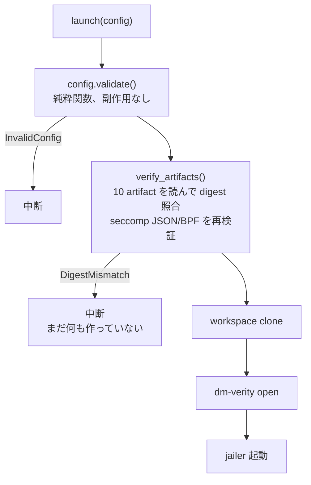

<!-- doc-type: concept -->

# artifact の固定と fingerprint

[Firecracker runtime](README.md) / artifact の固定と fingerprint

> **対象読者:** boot artifact を差し替える運用担当者、供給経路をレビューする人

`RuntimeConfig` の起動 profile に含まれる実行ファイルと image は 10 個ある。firecracker、kernel、rootfs、dm-verity hash image、veritysetup、workspace image formatter、jailer、seccomp compiler、seccomp filter、seccomp policy である。[`lib.rs`](../../crates/firecracker-runtime/src/lib.rs) はこの 10 個全てを `PinnedArtifact`、つまり path と SHA-256 digest の組として受け取る。crash recovery の `RecoveryTools` はこれとは別に `veritysetup` と `dmsetup` を pinned artifact として検証する。

## path だけで指定すると何が起きるか

`/opt/firecracker/latest/firecracker` のような path で指定した場合、その中身がいつ何に変わったかは実行時には分からない。symlink の張り替え、パッケージ更新、staging directory への書き込みのどれでも、起動する binary は変わる。

digest を持っていれば、起動前に読んで照合できる。

```rust
fn validate_artifact(label: &str, artifact: &PinnedArtifact) -> ...
```

`Runtime::launch` は `config.validate()` の直後に `verify_artifacts(config)` を呼ぶ。ここで 10 個全部を読み、`sha256()` の結果と `PinnedArtifact` の digest を比較する。さらに seccomp policy JSON の形を検査し、pinned compiler で再生成した filter が pinned BPF と byte-for-byte 一致することを確認する。1 つでも合わなければ、workspace を clone する前、dm-verity を開く前、jailer を起動する前に止まる。



test の `digest_mismatch_is_rejected_before_any_side_effect` が確認しているのはこの順序で、「不一致を検出した」ことではなく「検出した時点でまだ何も作っていない」ことを見ている。

## `latest` を型ではなく検査で拒否する

`validate_artifact` は path の形も見る。`latest_artifact_channel_is_rejected_by_validation` という test があるとおり、可変な channel を指す path は通らない。

digest 照合があるのだから、path が `latest` でも中身が違えば落ちるはずで、二重ではある。ただし `latest` を許すと、digest を更新するときに「path はそのまま、digest だけ差し替える」運用になり、どの版で動いているのかが config から読めなくなる。path 側にも版を残させている。

## dm-verity は rootfs と同じものを指さなければならない

ここは間違えやすい。`DmVerityConfig` は `data_device` と `hash_device` を持つが、これらは `PinnedArtifact` とは別のフィールドで、独立に設定できてしまう。

```rust
if self.dm_verity.data_device != self.rootfs.path {
    return Err(RuntimeError::InvalidConfig(
        "dm-verity data device must equal the pinned rootfs path"));
}
if self.dm_verity.hash_device != self.verity_hash.path {
    return Err(RuntimeError::InvalidConfig(
        "dm-verity hash device must equal the pinned hash image path"));
}
```

この 2 つの検査が無いと、digest を照合した rootfs とは別の image を dm-verity に食わせられる。照合は通るのに、実際に mount されるのは検査していない block device、という状態になる。

`root_hash` が全ゼロの場合も拒否する。`Sha256Digest::is_zero()` は、初期化を忘れた `Default` 値が通ってしまう事故を防ぐためにある。dm-verity の root hash が全ゼロというのは、実質的に検証を無効化した状態に近い。

## config 全体の fingerprint

`RuntimeConfig::snapshot_fingerprint()` は restore 互換性に関わる config から 1 つの `Sha256Digest` を作る。用途は snapshot との突き合わせで、`Snapshot` は自分が作られたときの `artifact_fingerprint` を保持している。clone ID、cgroup leaf、mapper 名、session 固有 path は別の `instance_fingerprint()` で束縛される。

```rust
if config.snapshot_fingerprint() != snapshot.artifact_fingerprint {
    return Err(RuntimeError::StaleSnapshot(
        "snapshot artifact fingerprint does not match the requested runtime"));
}
```

kernel を更新して digest を差し替えた後、古い snapshot を restore しようとすると、この検査で止まる。restore は memory image をそのまま復元するので、その memory が想定している kernel と実際に起動する kernel がずれると、何が起きるか予測できない。

fingerprint は artifact だけでなく config 全体から取る。vcpu 数や memory サイズが変わった snapshot も、同じ理由で拒否される。

## SHA-256 は自前実装ではない

`sha256()` は `sha2` crate に委譲している。この選択は積極的なもので、hash 実装を自前で持つ理由が無い。

```rust
pub fn sha256(bytes: &[u8]) -> Sha256Digest
```

NIST の test vector 2 本（空文字列と `abc`）を test に入れてある。依存を更新したときに、少なくとも既知の値がずれていないことは分かる。

`Sha256Digest::from_hex` は大文字小文字を両方受け、長さが 64 文字でなければ拒否する。運用で digest を貼り付けるときの表記ゆれを吸収しつつ、切り詰められた値は通さない。

## 何が助かるのか

「今どの版で動いているのか」が config を読めば分かる。稼働中の host に入って binary の digest を取る必要がない。

供給経路のどこかで artifact が差し替わった場合、起動が失敗する。静かに新しい binary で動き続けるより、起動しないほうが気付ける。

snapshot の互換性判定が 1 つの digest 比較になっているので、「この snapshot はまだ使えるか」を判断するのに artifact を個別に比較しなくてよい。

## 正確な保証範囲

`verify_artifacts` は指定 path の digest を side effect の前に照合する。さらに、digest 付きで実行する host command と recovery tool は、実行時に `O_NOFOLLOW` で開いた regular file を sealed executable memfd へコピーし、`/proc/self/fd/<n>` を program として起動する。`RealCommandRunner` / detached launcher は ambient environment を `env_clear()` で消す。このため、以前の「照合後に path を再解決するため TOCTOU が残る」という説明は現状実装には当たらない。

- digest 照合と memfd sealing は artifact の同一性を保証するが、artifact 自体の供給元・安全性は証明しない。信頼するのは供給元であり、この crate は同一性しか見ていない。
- 実`veritysetup`／`dmsetup`のmapping、hash-tree検証、jailer配下の起動は real lifecycle／KVM gate で検証対象になる。pinned command の no-follow・memfd・環境消去は実装・test の対象である。ただし、この文書だけで全 host 上の実機実行を主張せず、artifact 供給元、device-mapper、kernel 実装そのものは TCB に残る。
- `sha2` crate の実装の正しさは仮定している。test vector 2 本では、実装が壊れていないことの弱い証拠にしかならない。
- config fingerprint の計算対象が「変わったら snapshot を無効にすべき全項目」を漏れなく含んでいることは、証明していない。

## 変更時の確認点

- `RuntimeConfig` にフィールドを足すときは、それが `snapshot_fingerprint()` または `instance_fingerprint()` に含まれるべきかを判断する。含めるべきものを漏らすと、古い snapshot が新しい config で restore できてしまう。
- artifact を増やすときは `validate_artifact` の呼び出しと `verify_artifacts` の両方に足す。前者だけだと path の形は見るが digest を照合しない状態になる。
- `dm_verity.data_device` / `hash_device` と `rootfs` / `verity_hash` の一致検査は消さない。消すと digest 照合の意味が無くなる。
- `is_zero()` による拒否を外すときは、`Default` 由来の値がどこから来うるかを先に確認する。

## 関連

- [起動の順序と rollback](launch-sequence.md)
- [snapshot と identity gate](snapshot-and-identity.md)
- [ホスト隔離プロファイル](host-isolation.md)
- [検証対応表](verification.md)
- [隔離基盤の設計](../design/runtime-isolation.md)
- [用語集](../glossary.md)
