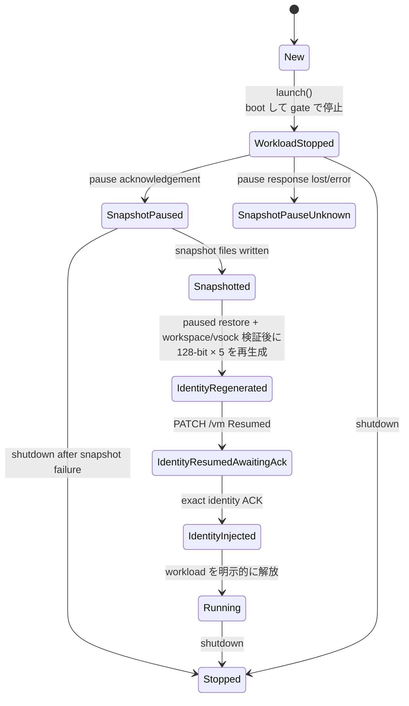

<!-- doc-type: concept -->

# snapshot と identity gate

[Firecracker runtime](README.md) / snapshot と identity gate

> **対象読者:** snapshot 経路を触る実装者、session 間の分離をレビューする人

microVM を毎回 boot から起動すると数百 ms かかる。boot 済みの状態を snapshot しておき、session ごとに restore すれば、その時間を消せる。ただし restore は memory image をそのまま複製するので、素朴にやると全 session が同じ秘密を持つことになる。

[`lib.rs`](../../crates/firecracker-runtime/src/lib.rs) の lifecycle state machine は、この問題を解くためにある。snapshot pause の成功・不明状態も identity gate と同じ state machine に明示される。

## 何を防ぎたいのか

snapshot を取った時点の guest memory には、guest supervisor の状態が保存される。identity が memory に存在する可能性はあるが、この crate は guest memory を走査して一覧化しない。`Snapshot` の `forbidden_identities` は manifest 作成側が渡す値で、`create_snapshot` は instance に保持された bundle がある場合だけその5値をコピーし、launch 直後の instance では空の一覧になる。

```text
snapshot 時点の guest memory（identity が含まれる可能性）
  VM / session / subject identity = guest state の一部

restore すると、memory state は N 台に複製される
  VM #1 : 同じ guest memory state
  VM #2 : 同じ guest memory state   <- identity gate 前
  VM #3 : 同じ guest memory state   <- identity gate 前
```

identity が衝突すると、audit record がどの session のものか判別できなくなる。もっと悪いのは Broker 側で、session ID が同じなら replay guard の sequence 空間を共有してしまう。VM #2 が送った request を VM #1 の retry として扱う経路ができる。

だから restore 後に identity を作り直すまで、workload を走らせてはいけない。



`Running` に到達する経路は `IdentityInjected` からの 1 本だけ。restore 直後の `IdentityRegenerated` から直接 `Running` へ跳べる遷移は無い。

## snapshot を取れるのは 1 状態だけ

```rust
if instance.state != RuntimeState::WorkloadStopped {
    return Err(RuntimeError::InvalidState {
        expected: "WorkloadStopped".to_owned(),
        actual: format!("{:?}", instance.state),
    });
}
```

`create_snapshot` は `WorkloadStopped` 以外を拒否する。つまり workload が一度でも走った VM からは snapshot を取れない。

理由は単純で、走った後の memory には session 固有のデータが混ざるから。identity だけなら再生成できるが、workload が読み込んだ file の内容や、確立済みの Broker session の状態までは追跡できない。「pre-session gate で止まっている VM だけが snapshot 元になれる」という制約にしておけば、snapshot に何が入っているかを考えなくて済む。

## snapshot は pause acknowledgement 後だけ保存する

`create_snapshot` は `WorkloadStopped` だけを受け付け、先に Firecracker の `PATCH /vm` (`{"state":"Paused"}`) の成功応答を受けて `SnapshotPaused` へ遷移する。その後で `PUT /snapshot/create` と snapshot/memory の digest を保存する。pause の応答が失われた場合は VM が pause 済みか分からないため `SnapshotPauseUnknown` にして、別の snapshot や workload 操作を許さず shutdown へ進む。snapshot の書き込み・hash が失敗しても paused state を通常の pre-session VM として再利用しない。

restore は `/snapshot/load` に `resume_vm:false` を明示し、workspace/vsock の bind と実行確認を終え、5 値の identity を生成して `IdentityRegenerated` で返る。restore 自体は VM を resume せず、`inject_identity` / `inject_identity_bound` が後で `PATCH /vm` (`Resumed`) を送り、`IdentityResumedAwaitingAck` から exact identity ACK を受けたときだけ `IdentityInjected` へ進む。これにより、復元直後に workload gate が先に開く経路を作らない。local test では [`snapshot_pauses_vm_before_writing_snapshot_files`](../../crates/firecracker-runtime/tests/runtime.rs)、[`snapshot_create_failure_keeps_instance_explicitly_paused`](../../crates/firecracker-runtime/tests/runtime.rs)、[`snapshot_pause_failure_enters_unknown_state_and_does_not_create_snapshot`](../../crates/firecracker-runtime/tests/runtime.rs) が pause 側を、[`restore_regenerates_all_identities_and_gates_workload_until_injection`](../../crates/firecracker-runtime/tests/runtime.rs) が restore 側を固定する。

## fingerprint が違う snapshot は restore しない

```rust
if config.snapshot_fingerprint() != snapshot.artifact_fingerprint {
    return Err(RuntimeError::StaleSnapshot(...));
}
```

`Snapshot` は作られた時点の `snapshot_fingerprint()` を保持する。kernel を差し替えた後に古い snapshot を restore しようとすると、ここで止まる。

memory image は、それを作った kernel の構造を前提にしている。別の kernel で restore した場合に何が起きるかは予測できない。動いてしまう可能性があるのが一番まずい。詳細は [artifact の固定と fingerprint](pinned-artifacts.md)。

この検査は `verify_artifacts` より前、side effect が始まる前にある。

## 5 つの identity を作り直す

`IdentityBundle` は 128-bit の `IdentityId` を 5 つ持つ。`IdentityBundle::generate` が `IdentitySource` から取得し、`validate` が 2 種類の検査をかける。

1 つは全ゼロの拒否。`IdentityId::is_zero()` は、entropy source が失敗して初期値のまま返ってきた場合に気付くためにある。

もう 1 つが `forbidden_identities` との照合。

```rust
identities.validate(Some(&snapshot.forbidden_identities))?;
```

manifest が提供した `forbidden_identities` の一覧に再生成した値が含まれていたら `StaleIdentity` を返す。確率的にはまず起きないが、entropy source が壊れて同じ値を返し続ける場合に検出できる。`duplicate_identity_generation_is_rejected_as_stale` がこの経路を見ている。runtime は guest memory から一覧を抽出しないため、一覧の完全性は snapshot を作る側の責務である。

restore が identity 検査で失敗した場合、`rollback` が jailer プロセス、dm-verity mapping、workspace を逆順に片付ける。`stale_identity_is_rejected_and_restored_process_is_rolled_back` の名前どおり、プロセスを起動した後で拒否しても resource は残らない。

## host が identity を割り当てる経路もある

`restore` は自前で生成するが、host 側が割り当てた identity を渡す経路も別にある。`restore_accepts_exact_host_allocated_identities` と `restore_rejects_host_identity_reuse_before_side_effects` がその 2 つの分岐を見ている。

後者が重要で、host が渡した identity が過去に使われたものだった場合、side effect の前に拒否する。[session-orchestrator](../session-orchestrator/README.md) の no-reuse ledger と組み合わせると、restart をまたいでも identity が再利用されないことになる。この crate 側は「渡された値が snapshot の forbidden 一覧に無いこと」しか見ておらず、ledger 全体との照合は orchestrator の責務。

## 何が助かるのか

state machine が pause/unknown と identity gate を明示するので、「この VM で workload を走らせてよいか」が 1 つの比較で判断できる。identity を注入したかどうかを別途追跡しなくてよい。`RestoredStopped` variant は enum に残るが、現行の restore 経路は検証済み workspace を bind して直ちに `IdentityRegenerated` を返す。

snapshot 元を `WorkloadStopped` に限っているため、snapshot に何が含まれるかを都度検討する必要がない。含まれるのは常に「boot 直後、workload 実行前」の状態。

restore の失敗が resource を残さないので、retry が安全に書ける。

## guest-control v1 から v2 への移行契約

| host / image | 結果 | 運用 |
|---|---|---|
| v2 production host + v2 image | policy version/digest を identity と同じ request/ACK に束縛し、guest が固定 policy から独立再計算した後だけ readiness を返す | 唯一の production 組み合わせ |
| v2 production host + v1 image | v2 endpoint または canonical ACK が成立せず workload gate は閉じたまま | image を先に更新し、snapshot を再作成する |
| legacy caller + v2 image | `guest-supervisor-init` に必須 policy 環境が無いため readiness 前に失敗する。production runtime は unbound lease/v1 start API も拒否する | legacy caller を production に戻さない |
| legacy caller + legacy image | parser compatibility と hosted regression test のみ | production 対象外 |

authority encoding version、guest repository/effect/path policy、guest init、kernel/rootfs、または
seccomp を変更したら snapshot を再作成し、host と image を同じ release 単位で展開する。現行
production snapshot template は policy digest を保持する。daemon が grant から計算した digest は
session preparation request に入り、template digest と不一致なら artifact copy や restore より前に
fail closed する。コピー後の snapshot manifest と capability lease でも同じ比較を繰り返し、最後に
guest が image 内の typed policy から独立再計算する。

cross-domain revoke は session recovery intent を identity reservation より前に永続化する。通常停止は
host の guest/Broker roots を revoke してから VM を停止し、失敗時は `Stopping` のまま同じ resource
ownership を再試行する。process crash 後も recovery journal から VM/cgroup、mapper、jail を順に回収し、
termination を確認するまで intent を完了しない。この実装により
[ADR 0018](../decisions/0018-bind-host-and-guest-authority-with-a-policy-digest-and-revocation-barrier.md)
は Accepted である。

## 正確な保証範囲

state 遷移と identity 検査は fake adapter を使う test で確認している。

- [`guest-control-init`](../../crates/firecracker-runtime/src/bin/guest-control-init.rs) は実 VM で pre-session gate を提供する。[`real_guest_control`](../../crates/firecracker-runtime/tests/real_guest_control.rs) は注入前の start を拒否し、v2 policy digest 付き identity 注入後だけ固定 workload を release する。guest runtime image は guest-supervisor-init、workload-isolation-launcher、全13 CapFS effect、Broker channelまでを通す。さらに [`real_production_session_owner_runs_ready_poll_stop_and_cleans_every_owned_resource`](../../crates/session-orchestrator/tests/real_production_lifecycle.rs) が clean snapshot capture/restore から同じ guest 経路と production `SessionOwner` cleanup までを一続きで実行する。
- raw bootのcontrol channel試験に加え、production SessionOwner gateが`Runtime::restore`とsnapshotのidentity injectionを同じlaunch経路で通す。
- `scripts/ci/verify-real-session-owner.sh` の opt-in gate は、実 Firecracker で pause → snapshot create → `/snapshot/load` (`resume_vm:false`) → workspace/vsock bind → identity injection/resume を一続きに確認する。root、KVM、vhost-vsock、device-mapper、cgroup v2、pinned artifact が必要で、wrapper を実行していない host の結果までは主張しない。
- `forbidden_identities` の一覧が「snapshot に焼き込まれた全 identity」を漏れなく含んでいることは、この crate では保証できない。一覧を作るのは snapshot を取る側。
- entropy source の品質は `IdentitySource` の実装依存。`SystemIdentitySource` は host kernel の entropy device を使うが、その品質はここでは検証していない。
- 同じ snapshot から restore した 2 台の VM が、identity 以外で区別できることは主張していない。memory の内容は同じ。

## 変更時の確認点

- `RuntimeState` に状態を足すときは、`Running` への遷移経路が `IdentityInjected` からの 1 本だけであることを保つ。ここに近道を作ると gate の意味が消える。
- `create_snapshot` の state 検査を緩めるときは、緩めた先の状態の memory に何が入っているかを列挙する。列挙できないなら緩めない。
- `IdentityBundle` の要素を増やすときは `generate`、`validate`、`ids()`、`forbidden_identities` の生成側を同時に直す。`ids()` を忘れると、新しい identity だけ forbidden 照合を通らない。
- fingerprint 検査を `verify_artifacts` より後ろへ動かさない。stale snapshot の拒否が side effect の後になる。
- state 名を条件に使うコードを書くときは、`Running` が「workload 解放済み」であって「VM 稼働中」ではないことを確認する。

## 関連

- [artifact の固定と fingerprint](pinned-artifacts.md)
- [起動の順序と rollback](launch-sequence.md)
- [workspace clone](workspace-clone.md)
- [検証対応表](verification.md)
- [Session orchestrator](../session-orchestrator/README.md)
- [Broker session envelope](../egress-protocol/session-envelopes.md)
- [用語集](../glossary.md)
