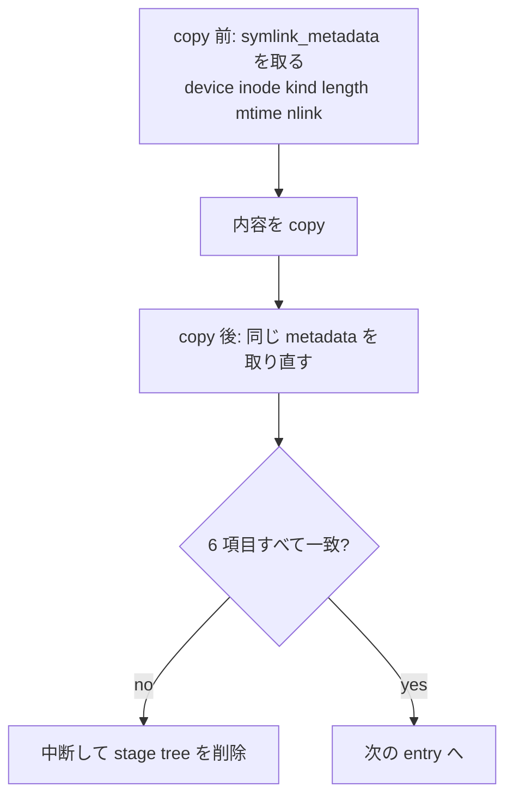

<!-- doc-type: concept -->

# workspace clone

[Firecracker runtime](README.md) / workspace clone

> **対象読者:** workspace 複製を触る実装者、host filesystem 境界のレビュー担当者

session ごとに source tree を複製して、その clone を guest へ渡す。単純な再帰 copy に見えるが、[`RealFileSystem`](../../crates/firecracker-runtime/src/lib.rs) の実装が長いのは、copy 中に source が書き換わる場合と、公開後に destination が差し替わる場合を両方閉じているから。

## symlink と hard link を通さない

`SourceSnapshot::from_metadata` は 3 種類を拒否する。

```rust
let kind = if file_type.is_symlink() {
    return Err(...("workspace contains forbidden symlink: {}", path.display()));
} else if metadata.is_dir() {
    WorkspaceNodeKind::Directory
} else if metadata.is_file() {
    if metadata.nlink() > 1 {
        return Err(...("workspace contains forbidden hardlink: {}", path.display()));
    }
    WorkspaceNodeKind::File
} else {
    return Err(...("workspace contains unsupported filesystem object: {}", path.display()));
};
```

symlink を許すと、clone 先に `/etc/shadow` を指す名前ができる。copy するのが link 自体なら実体は複製されないが、guest から見れば有効な名前になる。dm-verity 越しの rootfs は read-only でも、その名前を辿った先は host の実 file になる。

hard link は `nlink > 1` で検出する。同じ inode に複数の名前があると、clone 先の 1 つを書き換えたときに source 側も変わる。session 間の分離が崩れる。

`fs::symlink_metadata` を使っているのが要点で、`metadata` だと symlink を辿ってしまい、検出できない。`metadata_at` がこれを固定している。

device node、FIFO、socket は「unsupported」としてまとめて拒否する。workspace に置く理由が無い。

これは capfs 側の [Backing repository の事前検証](../capfs/backing-preflight.md)と同じ方針で、両方で独立に検査している。

## copy 中に source が変わっていないか

`SourceSnapshot` は copy の前に metadata を取り、`matches()` で copy 後に照合する。

| 比較する項目 | 何を検出するか |
|---|---|
| `device` + `inode` | file が別の実体に差し替えられた |
| `kind` | file が directory になった、またはその逆 |
| `length` | 内容が追記・切り詰めされた |
| `modified_seconds` + `modified_nanos` | 同じ長さのまま書き換えられた |
| `links` | copy 中に hard link が追加された |

長さだけ見ていると、同じ size で内容だけ差し替えられた場合を見逃す。mtime を ns まで取っているのはそのため。それでも 1 ns 以内に 2 回書き換えられれば検出できないが、そこは諦めている。



## 上限を 3 つ持つ

| 定数 | 値 | 何を止めるか |
|---|---|---|
| `MAX_WORKSPACE_ENTRIES` | 100,000 | entry 数の爆発。inode 枯渇 |
| `MAX_WORKSPACE_DEPTH` | 64 | 深い階層。再帰による stack 消費と、path 長の増大 |
| `MAX_WORKSPACE_BYTES` | 1 GiB | 総 byte 数。host の disk 枯渇 |

上限は copy を進めながら数える。超えた時点で中断し、stage tree を削除する。source 全体を先に走査してから判断する方式にしていないので、巨大な tree を渡されても走査だけで長時間かかることはない。

## stage して rename で公開する

destination に直接書かない。まず stage directory を作り、そこに全部 copy してから rename する。

```rust
renameat_with(CWD, &stage, CWD, destination, RenameFlags::NOREPLACE)
```

`RENAME_NOREPLACE` を使うので、destination が既に存在すれば rename は失敗する。上書きしない。中途半端な tree が destination に見えている時間帯も無い。

公開の直後にもう一度 metadata を取り、`symlink でない`、`directory である`、`記録した root の (device, inode) と一致する` の 3 つを確認する。rename と検査の間に destination が差し替えられた場合を捕まえるためで、一致しなければ `workspace destination changed during atomic publish` として削除する。

## 所有していない tree を消さない

`remove_workspace` が誤って host の別 directory を消すと、被害が大きい。そこで `RealFileSystem` は `owned_workspaces: HashMap<PathBuf, WorkspaceOwnership>` を持ち、自分が作った tree だけを削除対象にする。

`WorkspaceOwnership` は 4 つを記録する。

- `parent` — destination の親 directory の `(device, inode)`
- `root` — destination 自身の `(device, inode)`
- `marker` / `marker_token` — 所有権 marker file の名前と内容
- `nodes` — clone した全 entry の相対 path と `(device, inode)`、種別

marker は `.firecracker-runtime-owner-<pid>-<entries>` という名前の file で、中身は `<marker_name>:<総 byte 数>`。`create_new(true)` で作るので既存 file を掴むことはなく、書いた直後に `sync_all` して metadata を取り直し、symlink でない・regular file である・`nlink == 1` を確認する。

削除するときは `validate_marker` で marker の inode と内容を照合し、`validate_owned_tree` で記録した全 node の `(device, inode)` を確認する。1 つでも合わなければ削除しない。

marker 名に PID が入っているのは、同じ host で複数の runtime が動く場合に名前が衝突しないようにするため。ただしこれは衝突回避であって認証ではない。所有権の判定は inode 照合が担っている。

## 何が助かるのか

「この directory を消してよいか」の判断が inode の照合に落ちているので、path 文字列の比較に依存しない。symlink を張り替えられても、削除対象は変わらない。

copy 中の書き換えを検出するので、clone が source の一貫した snapshot であることに近い保証が得られる。完全な snapshot ではないが、静かに壊れた clone を guest へ渡すことは無い。

上限を copy しながら数えるため、悪意ある source に対して事前走査で時間を使わされない。

## 正確な保証範囲

ここまでの検査は実 filesystem に対して動く。`real_filesystem_publishes_and_removes_only_owned_complete_clones` と `real_filesystem_rejects_source_aliases_symlinks_hardlinks_and_bounds` は test double ではなく本物の tree を作って確認している。この crate で実装が実環境に触れている数少ない部分。

- clone は原子的な snapshot ではない。entry ごとに前後の metadata を照合しているだけで、tree 全体が一貫した時点を表すわけではない。file A を copy した後に file B が書き換わっても検出しない。
- mtime の粒度より速い書き換えは検出できない。
- `RENAME_NOREPLACE` は同一 filesystem 内でしか使えない。stage と destination が別 mount にある構成は想定していない。
- `owned_workspaces` はプロセス内の状態。runtime が再起動すると所有権の記録が消え、以前の clone を削除できなくなる。孤児 tree の回収経路はこの crate に無い。
- marker の PID は衝突回避であって、他プロセスによる偽造を防がない。防いでいるのは inode 照合のほう。
- guest 側で workspace がどう mount されるかは対象外。[capfs](../capfs/README.md) の担当。

## 変更時の確認点

- `metadata_at` は `symlink_metadata` を呼ぶ。`fs::metadata` に変えると symlink 検査が丸ごと無効になる。**変更しても compile は通る**ので、ここが一番危ない。
- `SourceSnapshot` に項目を足すときは `from_metadata` と `matches` の両方を直す。前者だけだと、記録はするが照合しない項目ができる。
- `RenameFlags::NOREPLACE` を外さない。外すと公開が上書きになり、既存 tree を破壊できる。
- `owned_workspaces` への挿入と `publish_clone` の成功判定の順序を入れ替えない。挿入前に検査すると、記録していない tree を検査することになる。
- 上限を上げるときは、その値が host の inode 数と disk 容量に対して妥当かを確認する。3 つは独立に効くので、1 つだけ上げても他が先に当たる。

## 関連

- [起動の順序と rollback](launch-sequence.md)
- [snapshot と identity gate](snapshot-and-identity.md)
- [検証対応表](verification.md)
- [Backing repository の事前検証](../capfs/backing-preflight.md)
- [capfs 設計](../design/capfs.md)
- [用語集](../glossary.md)
