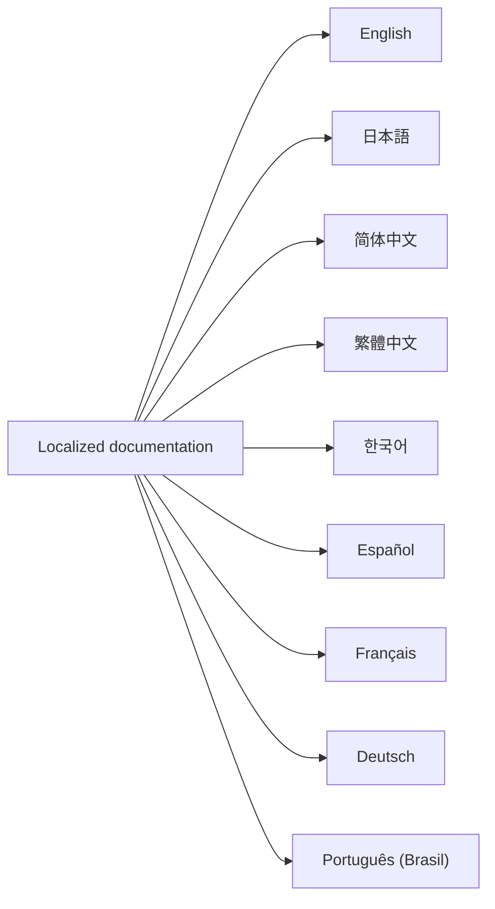

<!-- doc-type: index -->
<!-- locale: mul -->
<!-- canonical: docs/README.md -->

# Localized documentation

[Documentation index](../README.md) / Localized documentation

> **対象読者:** Readers and maintainers choosing a localized entry point

この index は、英語の root README と canonical docs index を起点に各言語の入口へ案内します。詳細技術ページは `docs/` の canonical files を参照します。現時点では詳細ページの本文に日本語が多く、各 hub は翻訳済みページであるかのように表示しません。

## Language entries

| Language | Root README | Documentation hub |
|---|---|---|
| English | [`../../README.md`](../../README.md) | [`en/README.md`](en/README.md) |
| 日本語 | [`../../README-ja.md`](../../README-ja.md) | [`ja/README.md`](ja/README.md) |
| 简体中文 | [`../../README-zh-CN.md`](../../README-zh-CN.md) | [`zh-CN/README.md`](zh-CN/README.md) |
| 繁體中文 | [`../../README-zh-TW.md`](../../README-zh-TW.md) | [`zh-TW/README.md`](zh-TW/README.md) |
| 한국어 | [`../../README-ko.md`](../../README-ko.md) | [`ko/README.md`](ko/README.md) |
| Español | [`../../README-es.md`](../../README-es.md) | [`es/README.md`](es/README.md) |
| Français | [`../../README-fr.md`](../../README-fr.md) | [`fr/README.md`](fr/README.md) |
| Deutsch | [`../../README-de.md`](../../README-de.md) | [`de/README.md`](de/README.md) |
| Português (Brasil) | [`../../README-pt-BR.md`](../../README-pt-BR.md) | [`pt-BR/README.md`](pt-BR/README.md) |

## Canonical detailed documentation

- [English root README](../../README.md)
- [Canonical documentation index](../README.md)
- [Design and architecture](../design/README.md)
- [Verification status](../verification-status.md)
- [Deployment guide](../../deploy/README.md)

詳細ページの翻訳状況は locale hub の案内文に従ってください。パス、command、code identifier、security term は canonical docs と同じ形で扱います。

## 関連

- [Canonical documentation index](../README.md)
- [English root README](../../README.md)
