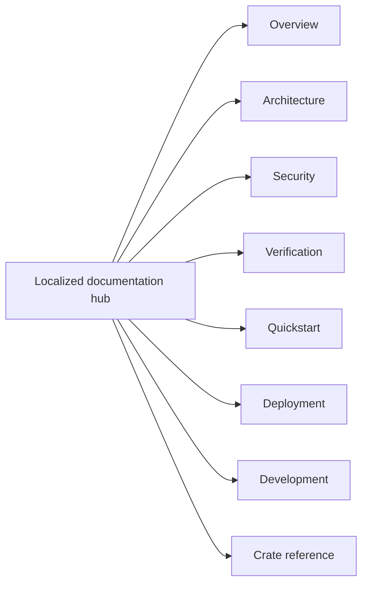

<!-- doc-type: localized -->
<!-- locale: de -->
<!-- canonical: docs/README.md -->

# Deutscher Dokumentations-Hub

[Index der kanonischen Dokumentation](../../README.md) / Deutscher Dokumentations-Hub

> **Zielgruppe:** Leser, Implementierer, Betreiber und Security-Reviewer der kanonischen Dokumentation

Dieser Hub ist der deutsche Einstieg in die Dokumentation des Repositorys. Die folgenden Links verweisen auf kanonische Detailseiten; viele davon enthalten derzeit noch japanischen Fließtext. Der Hub bedeutet daher nicht, dass jede verlinkte Seite übersetzt ist.

## Navigation

| Bereich | Kanonische Seite | Umfang |
|---|---|---|
| Überblick | [`../../README.md`](../../README.md) | Projektzweck, erzwungene Grenzen und Status des Source Repositorys |
| Architecture | [`../../design/architecture.md`](../../design/architecture.md) | Crate-übergreifende Platzierung, Runtime-Pfade und Evidence-Grenzen |
| Security | [`../../design/threat-model.md`](../../design/threat-model.md) | Threats, Trust Boundaries und ausdrückliche Non-Goals |
| Verification | [`../../verification-status.md`](../../verification-status.md) und [`../../design/verification.md`](../../design/verification.md) | Manifest-Scopes, Evidence, endliche Tests und verbleibende Grenzen |
| Quickstart | [`../../../README.md#quick-start`](../../../README.md#quick-start) | Hosted Smoke Test ohne Root, FUSE, KVM oder Provider-Credentials |
| Deployment | [`../../../deploy/README.md`](../../../deploy/README.md) | Production-Installation, systemd/polkit, Credentials und Recovery |
| Development | [`../../ci-cd.md`](../../ci-cd.md) und [`../../document-conventions.md`](../../document-conventions.md) | Gates, Pipeline-Verträge und Dokumentationsregeln |
| Crate reference | Siehe folgende Tabelle | Crate-Grenzen, Contracts und Verification-Seiten |

## Crate reference

| Crate | Implementierungseinstieg | Verification boundary |
|---|---|---|
| `authority-core` | [`../../authority-core/README.md`](../../authority-core/README.md) | [`../../authority-core/verification.md`](../../authority-core/verification.md) |
| `capfs` | [`../../capfs/README.md`](../../capfs/README.md) | [`../../capfs/verification.md`](../../capfs/verification.md) |
| `egress-protocol` | [`../../egress-protocol/README.md`](../../egress-protocol/README.md) | [`../../egress-protocol/verification.md`](../../egress-protocol/verification.md) |
| `egress-broker` | [`../../egress-broker/README.md`](../../egress-broker/README.md) | [`../../egress-broker/verification.md`](../../egress-broker/verification.md) |
| `firecracker-runtime` | [`../../firecracker-runtime/README.md`](../../firecracker-runtime/README.md) | [`../../firecracker-runtime/verification.md`](../../firecracker-runtime/verification.md) |
| `runtime-isolation` | [`../../runtime-isolation/README.md`](../../runtime-isolation/README.md) | [`../../runtime-isolation/verification.md`](../../runtime-isolation/verification.md) |
| `supervisor` | [`../../supervisor/README.md`](../../supervisor/README.md) | [`../../supervisor/verification.md`](../../supervisor/verification.md) |
| `session-orchestrator` | [`../../session-orchestrator/README.md`](../../session-orchestrator/README.md) | [`../../session-orchestrator/verification.md`](../../session-orchestrator/verification.md) |

## Sprach- und Quellenstatus

Der [Sprachindex](../README.md) verlinkt jede root-Übersetzung und jeden Hub. Implementierungsnamen, commands, paths, environment variables, numerische Grenzen, verification statuses und security terms haben ihre kanonische Quelle in den detailed docs. Leiten Sie aus einem localized Navigationslabel keine übersetzte Garantie ab.

## Verwandte Dokumente

- [Index der kanonischen Dokumentation](../../README.md)
- [Deutsches root README](../../../README-de.md)
- [Sprachindex](../README.md)
- [Englisches root README](../../../README.md)
