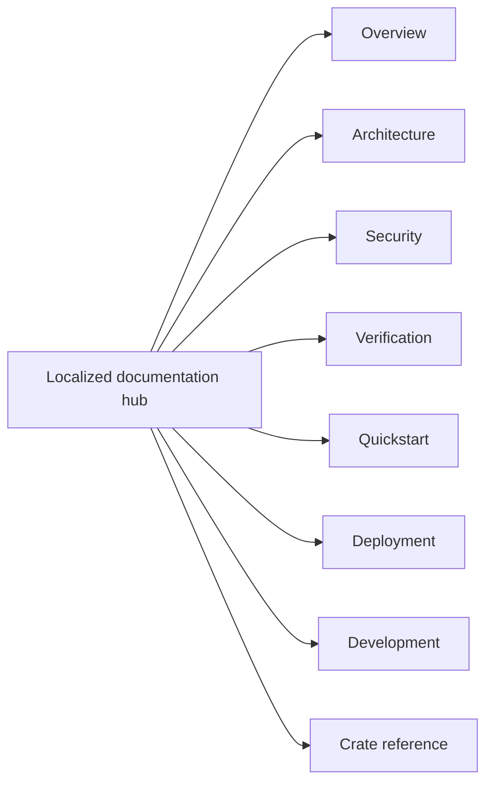

<!-- doc-type: localized -->
<!-- locale: en -->
<!-- canonical: docs/README.md -->

# English documentation hub

[Canonical documentation index](../../README.md) / English documentation hub

> **Audience:** Readers, implementers, operators, and reviewers navigating the canonical documentation

This hub is the English entry point for the repository documentation. The links below target canonical detailed pages; many of those pages currently contain Japanese prose, so this hub does not imply that every linked page has been translated.

## Navigation

| Area | Canonical page | Scope |
|---|---|---|
| Overview | [`../../README.md`](../../README.md) | Project purpose, enforced boundaries, and source-repository status |
| Architecture | [`../../design/architecture.md`](../../design/architecture.md) | Cross-crate placement, runtime paths, and evidence boundaries |
| Security | [`../../design/threat-model.md`](../../design/threat-model.md) | Threats, trust boundaries, and explicit non-goals |
| Verification | [`../../verification-status.md`](../../verification-status.md) and [`../../design/verification.md`](../../design/verification.md) | Manifest scopes, evidence, finite tests, and residual boundaries |
| Quickstart | [`../../../README.md#quick-start`](../../../README.md#quick-start) | Hosted smoke test without root, FUSE, KVM, or provider credentials |
| Deployment | [`../../../deploy/README.md`](../../../deploy/README.md) | Production installation, systemd/polkit, credentials, and recovery |
| Development | [`../../ci-cd.md`](../../ci-cd.md) and [`../../document-conventions.md`](../../document-conventions.md) | Gates, pipeline contracts, and documentation rules |
| Crate reference | See the table below | Crate boundaries, contracts, and verification pages |

## Crate reference

| Crate | Implementation entry | Verification boundary |
|---|---|---|
| `authority-core` | [`../../authority-core/README.md`](../../authority-core/README.md) | [`../../authority-core/verification.md`](../../authority-core/verification.md) |
| `capfs` | [`../../capfs/README.md`](../../capfs/README.md) | [`../../capfs/verification.md`](../../capfs/verification.md) |
| `egress-protocol` | [`../../egress-protocol/README.md`](../../egress-protocol/README.md) | [`../../egress-protocol/verification.md`](../../egress-protocol/verification.md) |
| `egress-broker` | [`../../egress-broker/README.md`](../../egress-broker/README.md) | [`../../egress-broker/verification.md`](../../egress-broker/verification.md) |
| `firecracker-runtime` | [`../../firecracker-runtime/README.md`](../../firecracker-runtime/README.md) | [`../../firecracker-runtime/verification.md`](../../firecracker-runtime/verification.md) |
| `runtime-isolation` | [`../../runtime-isolation/README.md`](../../runtime-isolation/README.md) | [`../../runtime-isolation/verification.md`](../../runtime-isolation/verification.md) |
| `supervisor` | [`../../supervisor/README.md`](../../supervisor/README.md) | [`../../supervisor/verification.md`](../../supervisor/verification.md) |
| `session-orchestrator` | [`../../session-orchestrator/README.md`](../../session-orchestrator/README.md) | [`../../session-orchestrator/verification.md`](../../session-orchestrator/verification.md) |

## Language and source status

The [language index](../README.md) links to every root translation and hub. The canonical detailed docs remain the source of truth for implementation names, commands, paths, environment variables, numeric limits, verification statuses, and security terms. Do not infer a translated guarantee from a localized navigation label.

## Related

- [Canonical documentation index](../../README.md)
- [English root README](../../../README.md)
- [Language index](../README.md)
- [English root translation metadata](../../../README.md#documentation)
