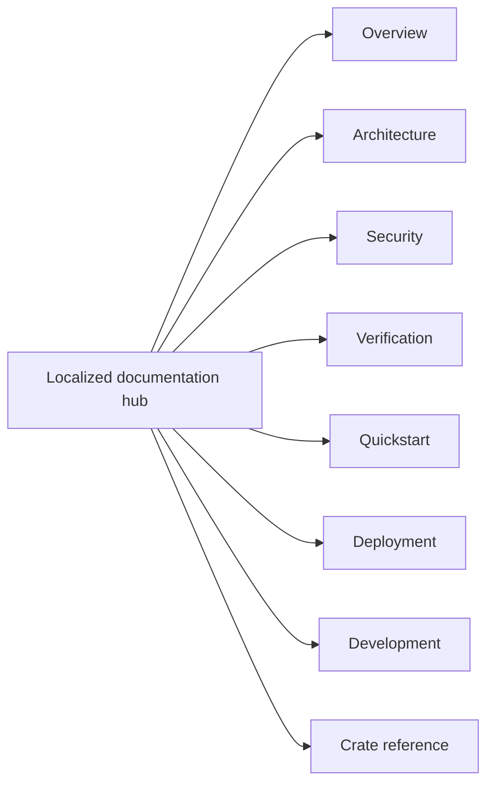

<!-- doc-type: localized -->
<!-- locale: es -->
<!-- canonical: docs/README.md -->

# Hub de documentación en español

[Canonical documentation index](../../README.md) / Hub de documentación en español

> **Audiencia:** Lectores, implementadores, operadores y revisores de seguridad que navegan la documentación en español

Este hub es la entrada en español a la documentación del repository. Los enlaces apuntan a páginas detalladas canónicas; muchas de esas páginas todavía contienen texto japonés, por lo que este hub no da a entender que todas estén traducidas.

## Navegación

| Área | Página canónica | Alcance |
|---|---|---|
| Descripción general | [`../../README.md`](../../README.md) | Propósito del proyecto, límites impuestos y estado del source repository |
| Architecture | [`../../design/architecture.md`](../../design/architecture.md) | Ubicación entre crates, rutas de runtime y límites de evidence |
| Security | [`../../design/threat-model.md`](../../design/threat-model.md) | Threats, trust boundaries y non-goals explícitos |
| Verification | [`../../verification-status.md`](../../verification-status.md) y [`../../design/verification.md`](../../design/verification.md) | Scopes del manifest, evidence, finite tests y límites residuales |
| Quickstart | [`../../../README.md#quick-start`](../../../README.md#quick-start) | Hosted smoke test sin root, FUSE, KVM ni provider credentials |
| Deployment | [`../../../deploy/README.md`](../../../deploy/README.md) | Production installation, systemd/polkit, credentials y recovery |
| Development | [`../../ci-cd.md`](../../ci-cd.md) y [`../../document-conventions.md`](../../document-conventions.md) | Gates, pipeline contracts y reglas de documentación |
| Crate reference | Consulte la tabla siguiente | Límites de crates, contracts y verification pages |

## Crate reference

| Crate | Entrada de implementación | Verification boundary |
|---|---|---|
| `authority-core` | [`../../authority-core/README.md`](../../authority-core/README.md) | [`../../authority-core/verification.md`](../../authority-core/verification.md) |
| `capfs` | [`../../capfs/README.md`](../../capfs/README.md) | [`../../capfs/verification.md`](../../capfs/verification.md) |
| `egress-protocol` | [`../../egress-protocol/README.md`](../../egress-protocol/README.md) | [`../../egress-protocol/verification.md`](../../egress-protocol/verification.md) |
| `egress-broker` | [`../../egress-broker/README.md`](../../egress-broker/README.md) | [`../../egress-broker/verification.md`](../../egress-broker/verification.md) |
| `firecracker-runtime` | [`../../firecracker-runtime/README.md`](../../firecracker-runtime/README.md) | [`../../firecracker-runtime/verification.md`](../../firecracker-runtime/verification.md) |
| `runtime-isolation` | [`../../runtime-isolation/README.md`](../../runtime-isolation/README.md) | [`../../runtime-isolation/verification.md`](../../runtime-isolation/verification.md) |
| `supervisor` | [`../../supervisor/README.md`](../../supervisor/README.md) | [`../../supervisor/verification.md`](../../supervisor/verification.md) |
| `session-orchestrator` | [`../../session-orchestrator/README.md`](../../session-orchestrator/README.md) | [`../../session-orchestrator/verification.md`](../../session-orchestrator/verification.md) |

## Estado del idioma y de la fuente

El [language index](../README.md) enlaza todas las traducciones root y todos los hubs. Los nombres de implementación, commands, paths, environment variables, límites numéricos, verification statuses y security terms tienen como fuente canónica las detailed docs. No deduzca un alcance de garantía traducido a partir de una etiqueta de navegación localized.

## Relacionado

- [Canonical documentation index](../../README.md)
- [README root en español](../../../README-es.md)
- [Language index](../README.md)
- [English root README](../../../README.md)
