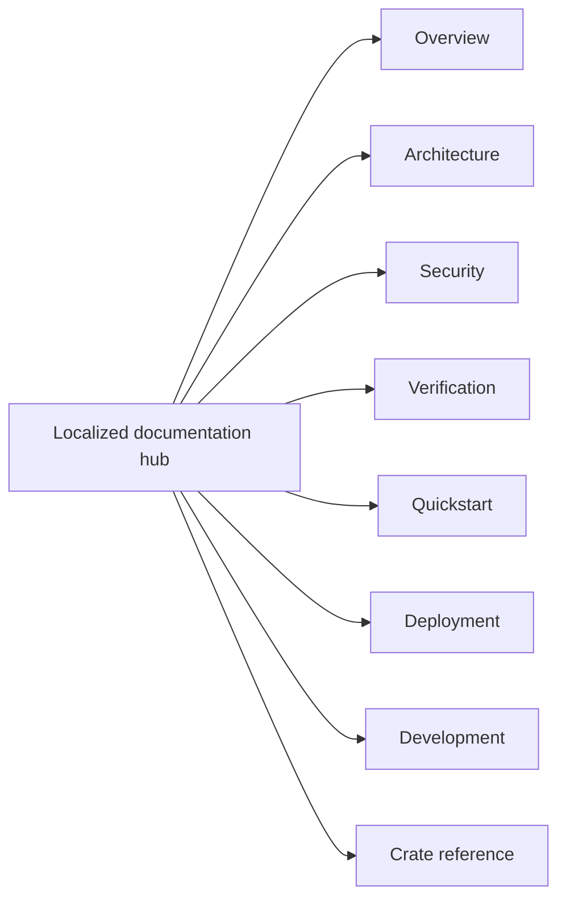

<!-- doc-type: localized -->
<!-- locale: fr -->
<!-- canonical: docs/README.md -->

# Hub de documentation en français

[Index de la documentation canonique](../../README.md) / Hub de documentation en français

> **Public:** Lecteurs, implémenteurs, opérateurs et évaluateurs qui parcourent la documentation canonique

Ce hub est le point d’entrée français vers la documentation du repository. Les liens ci-dessous ciblent les pages détaillées canoniques ; beaucoup contiennent encore du texte japonais, et ce hub ne signifie donc pas que chaque page liée est traduite.

## Navigation

| Domaine | Page canonique | Portée |
|---|---|---|
| Vue d’ensemble | [`../../README.md`](../../README.md) | Finalité du projet, limites imposées et état du source repository |
| Architecture | [`../../design/architecture.md`](../../design/architecture.md) | Répartition entre crates, chemins du runtime et limites des evidence |
| Security | [`../../design/threat-model.md`](../../design/threat-model.md) | Threats, trust boundaries et non-goals explicites |
| Verification | [`../../verification-status.md`](../../verification-status.md) et [`../../design/verification.md`](../../design/verification.md) | Scopes du manifest, evidence, tests finis et limites résiduelles |
| Quickstart | [`../../../README.md#quick-start`](../../../README.md#quick-start) | Hosted smoke test sans root, FUSE, KVM ni provider credentials |
| Deployment | [`../../../deploy/README.md`](../../../deploy/README.md) | Installation de production, systemd/polkit, credentials et recovery |
| Development | [`../../ci-cd.md`](../../ci-cd.md) et [`../../document-conventions.md`](../../document-conventions.md) | Gates, contrats du pipeline et règles documentaires |
| Crate reference | Voir le tableau ci-dessous | Limites des crates, contracts et pages de verification |

## Crate reference

| Crate | Entrée d’implémentation | Verification boundary |
|---|---|---|
| `authority-core` | [`../../authority-core/README.md`](../../authority-core/README.md) | [`../../authority-core/verification.md`](../../authority-core/verification.md) |
| `capfs` | [`../../capfs/README.md`](../../capfs/README.md) | [`../../capfs/verification.md`](../../capfs/verification.md) |
| `egress-protocol` | [`../../egress-protocol/README.md`](../../egress-protocol/README.md) | [`../../egress-protocol/verification.md`](../../egress-protocol/verification.md) |
| `egress-broker` | [`../../egress-broker/README.md`](../../egress-broker/README.md) | [`../../egress-broker/verification.md`](../../egress-broker/verification.md) |
| `firecracker-runtime` | [`../../firecracker-runtime/README.md`](../../firecracker-runtime/README.md) | [`../../firecracker-runtime/verification.md`](../../firecracker-runtime/verification.md) |
| `runtime-isolation` | [`../../runtime-isolation/README.md`](../../runtime-isolation/README.md) | [`../../runtime-isolation/verification.md`](../../runtime-isolation/verification.md) |
| `supervisor` | [`../../supervisor/README.md`](../../supervisor/README.md) | [`../../supervisor/verification.md`](../../supervisor/verification.md) |
| `session-orchestrator` | [`../../session-orchestrator/README.md`](../../session-orchestrator/README.md) | [`../../session-orchestrator/verification.md`](../../session-orchestrator/verification.md) |

## État de la langue et de la source

L’[index des langues](../README.md) relie toutes les traductions root et tous les hubs. Les noms d’implémentation, commands, paths, environment variables, limites numériques, verification statuses et security terms ont pour source canonique les detailed docs. Ne déduisez pas une garantie traduite à partir d’une simple étiquette de navigation localized.

## Documents associés

- [Index de la documentation canonique](../../README.md)
- [README root en français](../../../README-fr.md)
- [Index des langues](../README.md)
- [README root anglais](../../../README.md)
