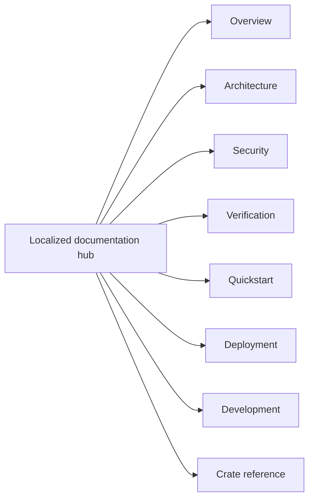

<!-- doc-type: localized -->
<!-- locale: ja -->
<!-- canonical: docs/README.md -->

# 日本語ドキュメントハブ

[英語のドキュメント一覧](../../README.md) / 日本語ドキュメントハブ

> **対象読者:** 実装者、運用担当者、セキュリティレビュー担当者、文書を日本語で探す読者

このハブは repository 文書への日本語入口です。下のリンクは canonical な詳細ページを指しますが、詳細ページの本文は現在も日本語が中心であり、すべてが英語化・翻訳済みだとは示しません。

## ナビゲーション

| 領域 | canonical ページ | 範囲 |
|---|---|---|
| 概要 | [`../../README.md`](../../README.md) | 目的、強制する境界、source repository としての状態 |
| Architecture | [`../../design/architecture.md`](../../design/architecture.md) | crate をまたぐ配置、runtime 経路、evidence の境界 |
| Security | [`../../design/threat-model.md`](../../design/threat-model.md) | threat、trust boundary、明示された non-goal |
| Verification | [`../../verification-status.md`](../../verification-status.md) と [`../../design/verification.md`](../../design/verification.md) | manifest の scope、evidence、有限 test、残存境界 |
| Quickstart | [`../../../README.md#quick-start`](../../../README.md#quick-start) | root、FUSE、KVM、provider credential なしの hosted smoke test |
| Deployment | [`../../../deploy/README.md`](../../../deploy/README.md) | production installation、systemd/polkit、credential、recovery |
| Development | [`../../ci-cd.md`](../../ci-cd.md) と [`../../document-conventions.md`](../../document-conventions.md) | gate、pipeline contract、文書規約 |
| crate reference | 下の表 | crate の境界、contract、verification page |

## crate reference

| crate | 実装入口 | 検証境界 |
|---|---|---|
| `authority-core` | [`../../authority-core/README.md`](../../authority-core/README.md) | [`../../authority-core/verification.md`](../../authority-core/verification.md) |
| `capfs` | [`../../capfs/README.md`](../../capfs/README.md) | [`../../capfs/verification.md`](../../capfs/verification.md) |
| `egress-protocol` | [`../../egress-protocol/README.md`](../../egress-protocol/README.md) | [`../../egress-protocol/verification.md`](../../egress-protocol/verification.md) |
| `egress-broker` | [`../../egress-broker/README.md`](../../egress-broker/README.md) | [`../../egress-broker/verification.md`](../../egress-broker/verification.md) |
| `firecracker-runtime` | [`../../firecracker-runtime/README.md`](../../firecracker-runtime/README.md) | [`../../firecracker-runtime/verification.md`](../../firecracker-runtime/verification.md) |
| `runtime-isolation` | [`../../runtime-isolation/README.md`](../../runtime-isolation/README.md) | [`../../runtime-isolation/verification.md`](../../runtime-isolation/verification.md) |
| `supervisor` | [`../../supervisor/README.md`](../../supervisor/README.md) | [`../../supervisor/verification.md`](../../supervisor/verification.md) |
| `session-orchestrator` | [`../../session-orchestrator/README.md`](../../session-orchestrator/README.md) | [`../../session-orchestrator/verification.md`](../../session-orchestrator/verification.md) |

## 言語と原文の状態

[言語 index](../README.md) から、すべての root 翻訳と hub へ移動できます。実装名、command、path、environment variable、数値上限、verification status、security term の正本は canonical 詳細 docs です。localized なナビゲーションの文言から、翻訳済みの保証範囲を推測しないでください。

## 関連

- [canonical ドキュメント一覧](../../README.md)
- [日本語 root README](../../../README-ja.md)
- [言語 index](../README.md)
- [英語 root README](../../../README.md)
