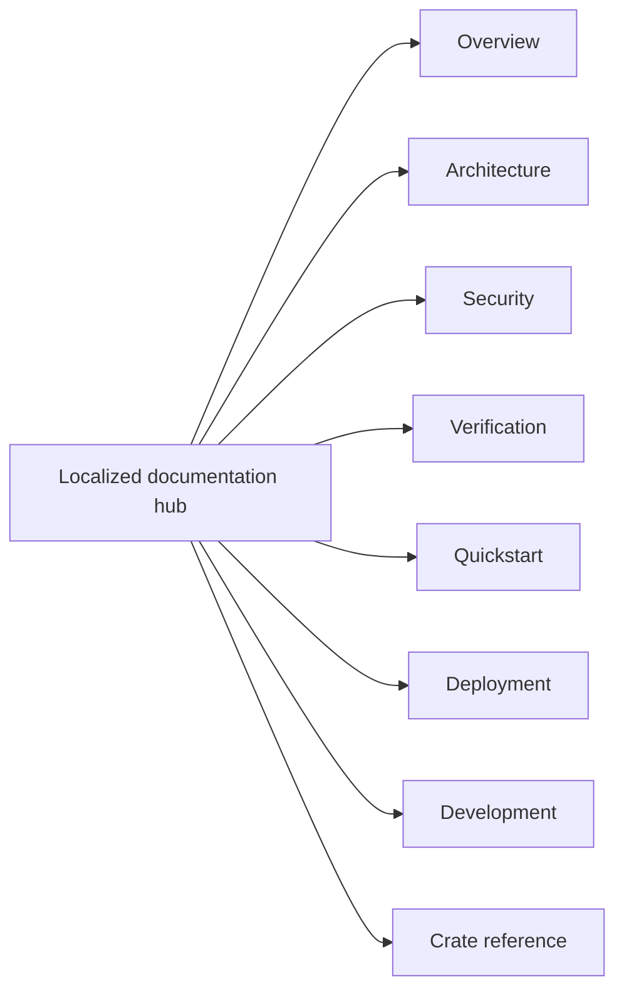

<!-- doc-type: localized -->
<!-- locale: ko -->
<!-- canonical: docs/README.md -->

# 한국어 문서 허브

[Canonical documentation index](../../README.md) / 한국어 문서 허브

> **독자:** 한국어로 문서를 탐색하는 독자, 구현자, 운영자 및 보안 검토자

이 hub는 repository 문서로 들어가는 한국어 입구입니다. 아래 링크는 canonical 상세 페이지를 가리키지만, 상세 페이지 본문에는 현재 일본어가 많이 포함되어 있으므로 모든 링크 페이지가 번역되었다고 표시하지 않습니다.

## 탐색

| 영역 | Canonical 페이지 | 범위 |
|---|---|---|
| 개요 | [`../../README.md`](../../README.md) | 프로젝트 목적, 강제되는 경계 및 source repository 상태 |
| Architecture | [`../../design/architecture.md`](../../design/architecture.md) | crate 간 배치, runtime 경로 및 evidence 경계 |
| Security | [`../../design/threat-model.md`](../../design/threat-model.md) | threat, trust boundary 및 명시된 non-goals |
| Verification | [`../../verification-status.md`](../../verification-status.md) 및 [`../../design/verification.md`](../../design/verification.md) | manifest scope, evidence, finite tests 및 잔여 경계 |
| Quickstart | [`../../../README.md#quick-start`](../../../README.md#quick-start) | root, FUSE, KVM 또는 provider credential 없이 실행하는 hosted smoke test |
| Deployment | [`../../../deploy/README.md`](../../../deploy/README.md) | production installation, systemd/polkit, credential 및 recovery |
| Development | [`../../ci-cd.md`](../../ci-cd.md) 및 [`../../document-conventions.md`](../../document-conventions.md) | gate, pipeline contract 및 문서 규칙 |
| Crate reference | 아래 표 참조 | crate 경계, contract 및 verification page |

## Crate reference

| Crate | 구현 입구 | Verification boundary |
|---|---|---|
| `authority-core` | [`../../authority-core/README.md`](../../authority-core/README.md) | [`../../authority-core/verification.md`](../../authority-core/verification.md) |
| `capfs` | [`../../capfs/README.md`](../../capfs/README.md) | [`../../capfs/verification.md`](../../capfs/verification.md) |
| `egress-protocol` | [`../../egress-protocol/README.md`](../../egress-protocol/README.md) | [`../../egress-protocol/verification.md`](../../egress-protocol/verification.md) |
| `egress-broker` | [`../../egress-broker/README.md`](../../egress-broker/README.md) | [`../../egress-broker/verification.md`](../../egress-broker/verification.md) |
| `firecracker-runtime` | [`../../firecracker-runtime/README.md`](../../firecracker-runtime/README.md) | [`../../firecracker-runtime/verification.md`](../../firecracker-runtime/verification.md) |
| `runtime-isolation` | [`../../runtime-isolation/README.md`](../../runtime-isolation/README.md) | [`../../runtime-isolation/verification.md`](../../runtime-isolation/verification.md) |
| `supervisor` | [`../../supervisor/README.md`](../../supervisor/README.md) | [`../../supervisor/verification.md`](../../supervisor/verification.md) |
| `session-orchestrator` | [`../../session-orchestrator/README.md`](../../session-orchestrator/README.md) | [`../../session-orchestrator/verification.md`](../../session-orchestrator/verification.md) |

## 언어 및 원문 상태

[언어 index](../README.md)는 모든 root 번역과 hub로 연결됩니다. 구현 이름, command, path, environment variable, 수치 제한, verification status 및 security term의 정본은 canonical 상세 docs입니다. localized 탐색 문구에서 번역된 보장 범위를 추론하지 마세요.

## 관련 문서

- [Canonical documentation index](../../README.md)
- [한국어 root README](../../../README-ko.md)
- [언어 index](../README.md)
- [English root README](../../../README.md)
