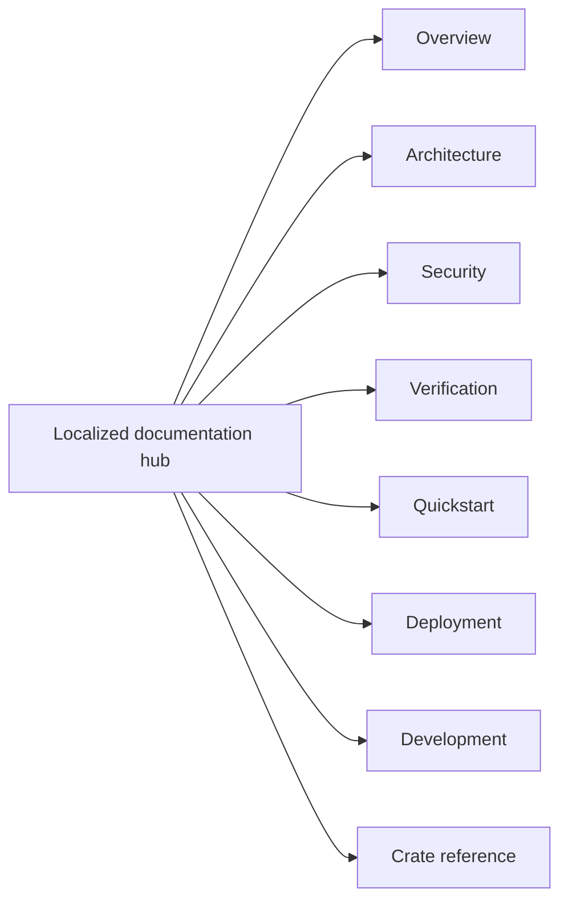

<!-- doc-type: localized -->
<!-- locale: pt-BR -->
<!-- canonical: docs/README.md -->

# Hub de documentação em português (Brasil)

[Índice da documentação canônica](../../README.md) / Hub de documentação em português (Brasil)

> **Público:** Leitores, implementadores, operadores e revisores de segurança que navegam pela documentação canônica

Este hub é a entrada em português para a documentação do repository. Os links abaixo apontam para páginas detalhadas canônicas; muitas ainda contêm texto em japonês, portanto este hub não indica que todas as páginas vinculadas estejam traduzidas.

## Navegação

| Área | Página canônica | Escopo |
|---|---|---|
| Visão geral | [`../../README.md`](../../README.md) | Objetivo do projeto, limites impostos e status do source repository |
| Architecture | [`../../design/architecture.md`](../../design/architecture.md) | Organização entre crates, caminhos do runtime e limites de evidence |
| Security | [`../../design/threat-model.md`](../../design/threat-model.md) | Threats, trust boundaries e non-goals explícitos |
| Verification | [`../../verification-status.md`](../../verification-status.md) e [`../../design/verification.md`](../../design/verification.md) | Scopes do manifest, evidence, testes finitos e limites residuais |
| Quickstart | [`../../../README.md#quick-start`](../../../README.md#quick-start) | Hosted smoke test sem root, FUSE, KVM ou provider credentials |
| Deployment | [`../../../deploy/README.md`](../../../deploy/README.md) | Instalação de produção, systemd/polkit, credentials e recovery |
| Development | [`../../ci-cd.md`](../../ci-cd.md) e [`../../document-conventions.md`](../../document-conventions.md) | Gates, contratos do pipeline e regras de documentação |
| Crate reference | Veja a tabela abaixo | Limites dos crates, contracts e páginas de verification |

## Crate reference

| Crate | Entrada da implementação | Verification boundary |
|---|---|---|
| `authority-core` | [`../../authority-core/README.md`](../../authority-core/README.md) | [`../../authority-core/verification.md`](../../authority-core/verification.md) |
| `capfs` | [`../../capfs/README.md`](../../capfs/README.md) | [`../../capfs/verification.md`](../../capfs/verification.md) |
| `egress-protocol` | [`../../egress-protocol/README.md`](../../egress-protocol/README.md) | [`../../egress-protocol/verification.md`](../../egress-protocol/verification.md) |
| `egress-broker` | [`../../egress-broker/README.md`](../../egress-broker/README.md) | [`../../egress-broker/verification.md`](../../egress-broker/verification.md) |
| `firecracker-runtime` | [`../../firecracker-runtime/README.md`](../../firecracker-runtime/README.md) | [`../../firecracker-runtime/verification.md`](../../firecracker-runtime/verification.md) |
| `runtime-isolation` | [`../../runtime-isolation/README.md`](../../runtime-isolation/README.md) | [`../../runtime-isolation/verification.md`](../../runtime-isolation/verification.md) |
| `supervisor` | [`../../supervisor/README.md`](../../supervisor/README.md) | [`../../supervisor/verification.md`](../../supervisor/verification.md) |
| `session-orchestrator` | [`../../session-orchestrator/README.md`](../../session-orchestrator/README.md) | [`../../session-orchestrator/verification.md`](../../session-orchestrator/verification.md) |

## Status do idioma e da fonte

O [índice de idiomas](../README.md) conecta todas as traduções root e todos os hubs. Nomes de implementação, commands, paths, environment variables, limites numéricos, verification statuses e security terms têm como fonte canônica as detailed docs. Não deduza uma garantia traduzida a partir de um rótulo de navegação localized.

## Relacionado

- [Índice da documentação canônica](../../README.md)
- [README root em português (Brasil)](../../../README-pt-BR.md)
- [Índice de idiomas](../README.md)
- [README root em inglês](../../../README.md)
