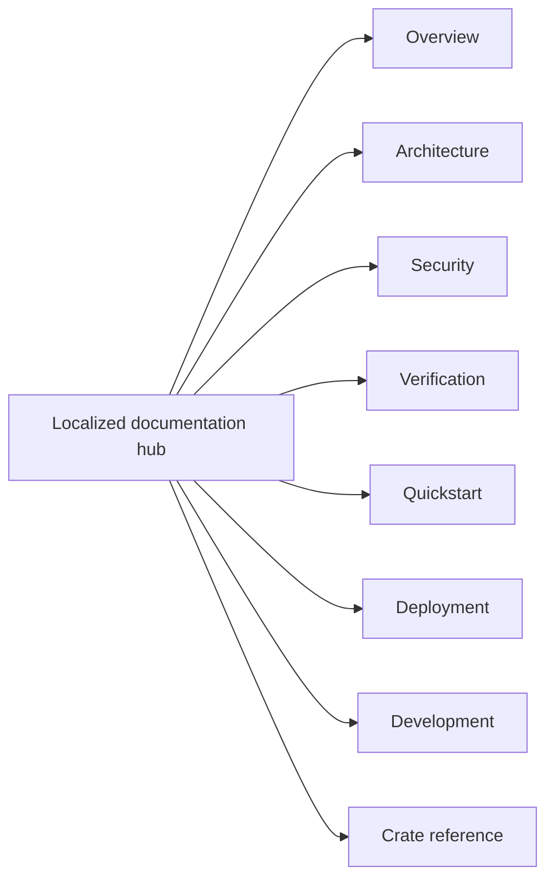

<!-- doc-type: localized -->
<!-- locale: zh-CN -->
<!-- canonical: docs/README.md -->

# 简体中文文档中心

[Canonical documentation index](../../README.md) / 简体中文文档中心

> **读者:** 以简体中文查找文档的读者、实现者、运维人员和安全审查者

此 hub 是 repository 文档的简体中文入口。下方链接指向 canonical 详细页面；这些页面的正文目前仍有大量日语，因此本 hub 不会让人误以为所有链接页面都已经翻译。

## 导航

| 区域 | Canonical 页面 | 范围 |
|---|---|---|
| 概览 | [`../../README.md`](../../README.md) | 项目目的、强制的边界和 source repository 状态 |
| Architecture | [`../../design/architecture.md`](../../design/architecture.md) | 跨 crate 的布局、runtime 路径和 evidence 边界 |
| Security | [`../../design/threat-model.md`](../../design/threat-model.md) | threat、trust boundary 和明确的 non-goals |
| Verification | [`../../verification-status.md`](../../verification-status.md) 与 [`../../design/verification.md`](../../design/verification.md) | manifest scope、evidence、finite tests 和残余边界 |
| Quickstart | [`../../../README.md#quick-start`](../../../README.md#quick-start) | 不需要 root、FUSE、KVM 或 provider credential 的 hosted smoke test |
| Deployment | [`../../../deploy/README.md`](../../../deploy/README.md) | production installation、systemd/polkit、credential 和 recovery |
| Development | [`../../ci-cd.md`](../../ci-cd.md) 与 [`../../document-conventions.md`](../../document-conventions.md) | gate、pipeline contract 和文档规则 |
| Crate reference | 见下表 | crate 边界、contract 和 verification page |

## Crate reference

| Crate | 实现入口 | Verification boundary |
|---|---|---|
| `authority-core` | [`../../authority-core/README.md`](../../authority-core/README.md) | [`../../authority-core/verification.md`](../../authority-core/verification.md) |
| `capfs` | [`../../capfs/README.md`](../../capfs/README.md) | [`../../capfs/verification.md`](../../capfs/verification.md) |
| `egress-protocol` | [`../../egress-protocol/README.md`](../../egress-protocol/README.md) | [`../../egress-protocol/verification.md`](../../egress-protocol/verification.md) |
| `egress-broker` | [`../../egress-broker/README.md`](../../egress-broker/README.md) | [`../../egress-broker/verification.md`](../../egress-broker/verification.md) |
| `firecracker-runtime` | [`../../firecracker-runtime/README.md`](../../firecracker-runtime/README.md) | [`../../firecracker-runtime/verification.md`](../../firecracker-runtime/verification.md) |
| `runtime-isolation` | [`../../runtime-isolation/README.md`](../../runtime-isolation/README.md) | [`../../runtime-isolation/verification.md`](../../runtime-isolation/verification.md) |
| `supervisor` | [`../../supervisor/README.md`](../../supervisor/README.md) | [`../../supervisor/verification.md`](../../supervisor/verification.md) |
| `session-orchestrator` | [`../../session-orchestrator/README.md`](../../session-orchestrator/README.md) | [`../../session-orchestrator/verification.md`](../../session-orchestrator/verification.md) |

## 语言与原文状态

[语言 index](../README.md) 链接到所有 root 翻译和 hub。实现名称、command、path、environment variable、数值上限、verification status 和 security term 的正本仍是 canonical 详细 docs。不要从 localized 导航文字推断已翻译的保证范围。

## 相关

- [Canonical documentation index](../../README.md)
- [简体中文 root README](../../../README-zh-CN.md)
- [语言 index](../README.md)
- [English root README](../../../README.md)
