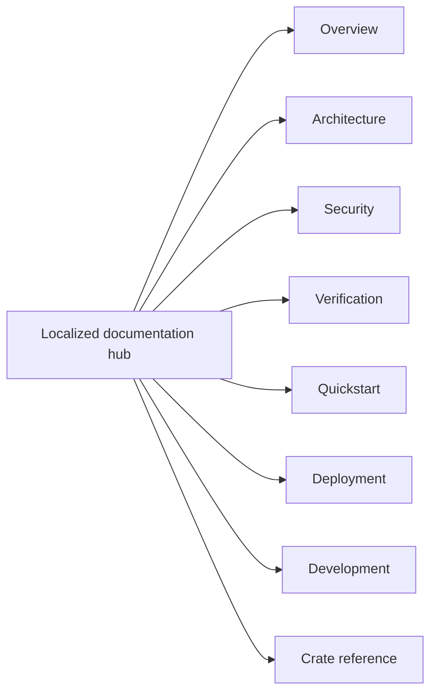

<!-- doc-type: localized -->
<!-- locale: zh-TW -->
<!-- canonical: docs/README.md -->

# 繁體中文文件中心

[Canonical documentation index](../../README.md) / 繁體中文文件中心

> **讀者:** 以繁體中文尋找文件的讀者、實作者、維運人員與安全審查者

此 hub 是 repository 文件的繁體中文入口。下方連結指向 canonical 詳細頁面；這些頁面的正文目前仍有大量日文，因此本 hub 不會讓人誤以為所有連結頁面都已翻譯。

## 導覽

| 領域 | Canonical 頁面 | 範圍 |
|---|---|---|
| 概覽 | [`../../README.md`](../../README.md) | 專案目的、強制的邊界與 source repository 狀態 |
| Architecture | [`../../design/architecture.md`](../../design/architecture.md) | 跨 crate 配置、runtime 路徑與 evidence 邊界 |
| Security | [`../../design/threat-model.md`](../../design/threat-model.md) | threat、trust boundary 與明確的 non-goals |
| Verification | [`../../verification-status.md`](../../verification-status.md) 與 [`../../design/verification.md`](../../design/verification.md) | manifest scope、evidence、finite tests 與殘餘邊界 |
| Quickstart | [`../../../README.md#quick-start`](../../../README.md#quick-start) | 不需要 root、FUSE、KVM 或 provider credential 的 hosted smoke test |
| Deployment | [`../../../deploy/README.md`](../../../deploy/README.md) | production installation、systemd/polkit、credential 與 recovery |
| Development | [`../../ci-cd.md`](../../ci-cd.md) 與 [`../../document-conventions.md`](../../document-conventions.md) | gate、pipeline contract 與文件規則 |
| Crate reference | 見下表 | crate 邊界、contract 與 verification page |

## Crate reference

| Crate | 實作入口 | Verification boundary |
|---|---|---|
| `authority-core` | [`../../authority-core/README.md`](../../authority-core/README.md) | [`../../authority-core/verification.md`](../../authority-core/verification.md) |
| `capfs` | [`../../capfs/README.md`](../../capfs/README.md) | [`../../capfs/verification.md`](../../capfs/verification.md) |
| `egress-protocol` | [`../../egress-protocol/README.md`](../../egress-protocol/README.md) | [`../../egress-protocol/verification.md`](../../egress-protocol/verification.md) |
| `egress-broker` | [`../../egress-broker/README.md`](../../egress-broker/README.md) | [`../../egress-broker/verification.md`](../../egress-broker/verification.md) |
| `firecracker-runtime` | [`../../firecracker-runtime/README.md`](../../firecracker-runtime/README.md) | [`../../firecracker-runtime/verification.md`](../../firecracker-runtime/verification.md) |
| `runtime-isolation` | [`../../runtime-isolation/README.md`](../../runtime-isolation/README.md) | [`../../runtime-isolation/verification.md`](../../runtime-isolation/verification.md) |
| `supervisor` | [`../../supervisor/README.md`](../../supervisor/README.md) | [`../../supervisor/verification.md`](../../supervisor/verification.md) |
| `session-orchestrator` | [`../../session-orchestrator/README.md`](../../session-orchestrator/README.md) | [`../../session-orchestrator/verification.md`](../../session-orchestrator/verification.md) |

## 語言與原文狀態

[語言 index](../README.md) 連結至所有 root 翻譯與 hub。實作名稱、command、path、environment variable、數值上限、verification status 與 security term 的正本仍是 canonical 詳細 docs。不要從 localized 導覽文字推斷已翻譯的保證範圍。

## 相關

- [Canonical documentation index](../../README.md)
- [繁體中文 root README](../../../README-zh-TW.md)
- [語言 index](../README.md)
- [English root README](../../../README.md)
