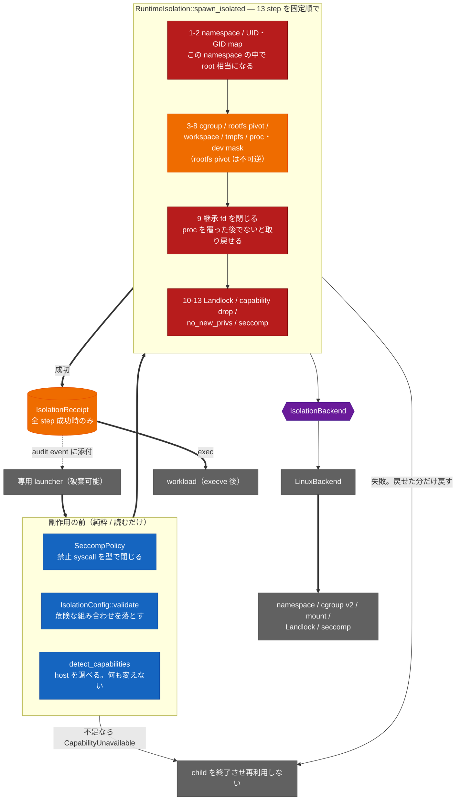

<!-- doc-type: index -->

# runtime-isolation

[ドキュメント一覧](../README.md) / runtime-isolation

> **対象読者:** guest workload を exec する直前の境界を触る実装者、特権操作のレビュー担当者

`runtime-isolation` は、workload を `execve` する直前に一度だけ実行される取引である。`RuntimeIsolation::spawn_isolated` が、純粋な事前検査と namespace の child handoff を経て、namespace、mount、cgroup、Landlock、capability、seccomp を決まった13段階で積み上げる。child 側で全部成功したときだけ [`IsolationReceipt`](../../crates/runtime-isolation/src/backend.rs) を workload entry に渡す。途中で失敗したら、戻せるものだけ戻し、不可逆な状態を持つ child/launcher は再利用しない。

`RuntimeIsolation::apply` は旧来の in-process API であり、`validate` と capability detection の後に `ChildHandoffRequired` を返す。PID namespace は次に作る child に適用されるため、実行時は専用の破棄可能な launcher から `spawn_isolated` を呼ぶ。

この crate は VM の中で動く。VM 境界そのものは [firecracker-runtime](../firecracker-runtime/README.md)、VM 内 subject の lifecycle は [supervisor](../supervisor/README.md) が持つ。ここが守るのは、その内側でさらに 1 プロセスを閉じ込める部分だけ。

## crate の構造

`spawn_isolated` は 13 step を 1 列に流すが、step は性質で 4 つに分かれる。**戻せるのは cgroup、workspace、tmpfs、`/proc`、`/dev` の mount だけ**で、namespace、rootfs pivot、fd close、Landlock、capability drop、`no_new_privs`、seccomp は kernel 上で一方向にしか進まない。

**赤い step 群は戻せない。** namespace から出ることも、`pivot_root` の前の root へ帰ることも、閉じた fd や消した capability を戻すこともできない。だから rollback は緑の step にしか実効性がなく、不可逆な step が完了済みか、不可逆な操作自体が失敗した後で失敗したら child/launcher ごと捨てる（[ADR 0016](../decisions/0016-terminate-the-child-after-an-unrollbackable-isolation-failure.md)）。

**青は 1 つも副作用を持たない。** 設定ミスと host の不足は、namespace を作る前に落ちる。ここを通過してから失敗すると、もう元のプロセスには帰れない。

順序が効く箇所は 3 つある。`/proc` を覆う前に fd を閉じると `/proc/self/fd` から取り戻せる。`no_new_privs` より先に seccomp を入れると kernel が拒否する。`pivot_root` より先に Landlock を張ると、宣言した path が旧 root 基準で解決される。詳細は [13 step の固定順序と rollback](apply-order.md)。

## 実装範囲と検証境界

ポリシー型と 13 step の順序制御、seccomp allowlist の検査に加え、実 syscall を叩く [`LinuxBackend`](../../crates/runtime-isolation/src/linux.rs) と、guest の `workload-isolation-launcher` から呼ぶ実行経路が実装されている。`scripts/ci/verify-privileged-isolation.sh` は root、user namespace、委譲済み cgroup v2、Landlock ABI 3 以上、seccomp、`clone3` 等が揃った host で staged rootfs の 13 step を実測する。設定側はこの access-mask schema に対して ABI 3 を要求する。

privileged probe は staged rootfs のdirect enforceに加え、production launcherのinherited start gateと`execve`後のhostile workloadを通し、実unmount rollbackも観測する。host rootを危険にremountしないため、`rootfs.source == "/"` はreadonly SquashFS rootを使うKVM SessionOwner gateで検証する。詳細は[検証対応表](verification.md)。

## 文書一覧

| 文書 | 対象ソース | 内容 |
|---|---|---|
| [ポリシーの事前検査](isolation-config.md) | [`config.rs`](../../crates/runtime-isolation/src/config.rs) | syscall を 1 つも呼ぶ前に落とす条件。mount target の衝突、tmpfs 上限、cgroup 名 |
| [13 step の固定順序と rollback](apply-order.md) | [`backend.rs`](../../crates/runtime-isolation/src/backend.rs) | なぜこの順序なのか、戻せない step をどう扱うか |
| [seccomp allowlist](seccomp-allowlist.md) | [`syscall.rs`](../../crates/runtime-isolation/src/syscall.rs) | 禁止 syscall を型で閉じる方法、arch 依存の番号 |
| [Landlock envelope](landlock-envelope.md) | [`linux.rs`](../../crates/runtime-isolation/src/linux.rs) | rootfs と workspace に渡す access bit の差 |
| [検証対応表](verification.md) | — | mock で見た範囲と、実機で未確認の範囲 |

## 関連

- [隔離基盤の設計](../design/runtime-isolation.md)
- [Firecracker runtime](../firecracker-runtime/README.md)
- [Supervisor adapter](../supervisor/README.md)
- [決定記録](../decisions/README.md)
- [用語集](../glossary.md)
