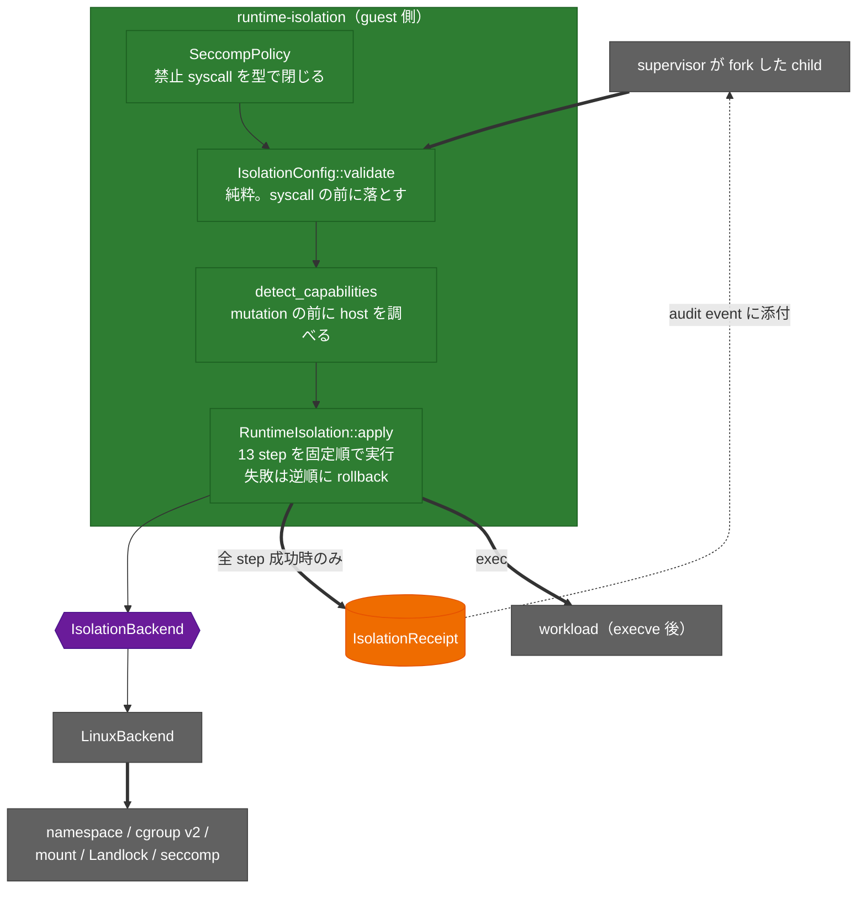

<!-- doc-type: index -->

# runtime-isolation

[ドキュメント一覧](../README.md) / runtime-isolation

> **対象読者:** guest workload を exec する直前の境界を触る実装者、特権操作のレビュー担当者

`runtime-isolation` は、workload を `execve` する直前に一度だけ実行される取引である。namespace、mount、cgroup、Landlock、capability、seccomp を決まった順に積み上げ、全部成功したら [`IsolationReceipt`](../../crates/runtime-isolation/src/backend.rs) を返す。途中で失敗したら、戻せるものだけ戻して失敗を返す。

この crate は VM の中で動く。VM 境界そのものは [firecracker-runtime](../firecracker-runtime/README.md)、VM 内 subject の lifecycle は [supervisor](../supervisor/README.md) が持つ。ここが守るのは、その内側でさらに 1 プロセスを閉じ込める部分だけ。

## crate の構造

`apply` が返す receipt は、13 step が全部成功して exec 前の境界が完成したことの機械的な証拠。部分的な receipt は存在しない。

## 実装範囲と検証境界

ポリシー型と 13 step の順序制御、seccomp allowlist の検査は完成していて、mock backend で検証済み。実際に syscall を叩く [`LinuxBackend`](../../crates/runtime-isolation/src/linux.rs) は書いてあるが、user namespace と cgroup v2 と Landlock が揃った環境でしか動かせないため、CI では capability detection の分岐までしか通っていない。

つまり「隔離が実際に効いている」ことはまだ確認できていない。詳細は[検証対応表](verification.md)。

## 文書一覧

| 文書 | 対象ソース | 内容 |
|---|---|---|
| [ポリシーの事前検査](isolation-config.md) | [`config.rs`](../../crates/runtime-isolation/src/config.rs) | syscall を 1 つも呼ぶ前に落とす条件。mount target の衝突、tmpfs 上限、cgroup 名 |
| [13 step の固定順序と rollback](apply-order.md) | [`backend.rs`](../../crates/runtime-isolation/src/backend.rs) | なぜこの順序なのか、戻せない step をどう扱うか |
| [seccomp allowlist](seccomp-allowlist.md) | [`syscall.rs`](../../crates/runtime-isolation/src/syscall.rs) | 禁止 syscall を型で閉じる方法、arch 依存の番号 |
| [Landlock envelope](landlock-envelope.md) | [`linux.rs`](../../crates/runtime-isolation/src/linux.rs) | rootfs と workspace に渡す access bit の差 |
| [検証対応表](verification.md) | — | mock で見た範囲と、実機で未確認の範囲 |

## 関連

- [隔離基盤の設計](../design/runtime-isolation.md)
- [Firecracker runtime](../firecracker-runtime/README.md)
- [Supervisor adapter](../supervisor/README.md)
- [決定記録](../decisions/README.md)
- [用語集](../glossary.md)
