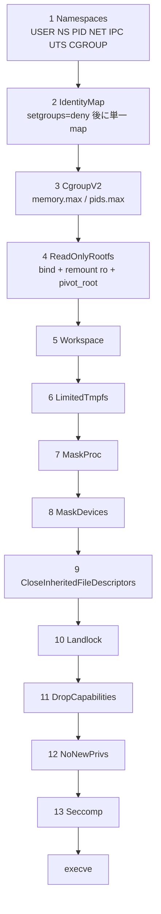

<!-- doc-type: concept -->

# 13 step の固定順序と rollback

[runtime-isolation](README.md) / 13 step の固定順序と rollback

> **対象読者:** isolation backend を触る実装者、起動失敗時の後始末をレビューする人

[`backend.rs`](../../crates/runtime-isolation/src/backend.rs) の `required_steps()` は 13 個の `IsolationStep` を配列リテラルで返す。設定で並べ替えられないし、一部だけ実行することもできない。この配列が固定されている理由と、途中で失敗したときに何が起きるかを書く。

## 何を防ぎたいのか

隔離の各操作には依存関係がある。順序を 1 つ入れ替えるだけで、境界に穴が開く。

たとえば seccomp を先に入れてしまうと、その後の `mount` や `pivot_root` が自分の filter に引っかかって失敗する。逆に Landlock を `pivot_root` より先に張ると、宣言した path は旧 root 基準で解決され、pivot 後の workload には別の tree が見えてしまう。

もっと分かりやすいのは `/proc` の masking と descriptor の close の関係。

```text
危険な順序: fd を閉じる -> /proc を覆う
            ↓
            覆う前に /proc/self/fd を開いておけば、閉じたはずの fd を取り戻せる

実際の順序: /proc を覆う -> fd を閉じる
```

`no_new_privs` も同じで、これを設定する前に seccomp filter を入れると、非特権プロセスでは `seccomp(2)` 自体が `EACCES` を返す。kernel 側の前提条件なので、順序ではなく依存として扱っている。



## なぜ user namespace が最初なのか

`CLONE_NEWUSER` を含む `unshare` が成功すると、その namespace の中では root 相当の capability を持つ。以降の `mount`、`pivot_root`、cgroup への書き込みは、host の root 権限ではなくこの namespace 内の権限で行う。逆に言えば、user namespace を作れない host ではこの crate は何もできない。

`IdentityMap` で `/proc/self/setgroups` に `deny` を書いてから UID/GID map を書く順序は、kernel が要求する。`setgroups` を許可したまま map を書くと、supplementary group を落として権限を得る古い攻撃が成立するため、非特権 user namespace では書き込み自体が拒否される。

## 戻せる step と戻せない step

`RuntimeIsolation::apply` は成功した step を `completed` に積み、どれかが失敗したら逆順に `rollback_step` を呼ぶ。

```rust
Err(original) => {
    let failures = completed
        .iter()
        .rev()
        .filter_map(|completed_step| backend.rollback_step(*completed_step, config).err())
        .collect::<Vec<_>>();
```

問題は、13 step のうち大半が kernel 上で戻せないこと。namespace から出ることはできないし、`pivot_root` の前の root には帰れない。Landlock ruleset、消した capability、`no_new_privs`、seccomp filter も同様で、いずれも一方向にしか進まない。

| step | rollback |
|---|---|
| `Namespaces` | 不可 |
| `IdentityMap` | 不可 |
| `CgroupV2` | 可。作った cgroup を削除する |
| `ReadOnlyRootfs` | `pivot_root` 前なら unmount 可、後は不可 |
| `Workspace` / `LimitedTmpfs` / `MaskProc` / `MaskDevices` | 可。unmount する |
| `CloseInheritedFileDescriptors` | 不可 |
| `Landlock` | 不可 |
| `DropCapabilities` | 不可 |
| `NoNewPrivs` | 不可 |
| `Seccomp` | 不可 |

production backend は戻せない step について `rollback_step` から `BackendError` を返す。これは実装漏れではなく、明示的な申告である。

## 部分成功を成功として扱わない

rollback に 1 つでも失敗すると `IsolationError::Rollback` が返り、元の失敗と rollback 失敗の一覧が両方入る。

```rust
IsolationError::Rollback {
    original: BackendError,
    failures: Vec<BackendError>,
}
```

呼び出し側がここでやってはいけないのは、「namespace は作れたし mount も済んでいるから、seccomp だけ諦めて続行する」という判断。境界が 1 つ欠けた状態は、境界が無い状態と同じくらい危険なことがある。seccomp が無ければ workload は `socket` を呼べるし、capability を消していなければ mount を張り直せる。

supervisor は `Rollback` を受け取ったら child を再利用せず終了させる。この判断は [ADR 0016](../decisions/README.md) に記録する予定。

## `apply` を呼ぶ場所を間違えない

`create_namespaces` は `CLONE_NEWPID` を unshare する。`unshare(CLONE_NEWPID)` は呼び出したプロセス自身を新しい PID namespace に入れず、次に `fork` した子から適用される。したがって、この取引は「workload を exec する側の child」で開始しなければならない。親 supervisor が自分のプロセスで `apply` を呼ぶと、PID namespace が意図した位置にできない。

同じ理由で、rootfs の staging directory は `apply` を呼ぶ前に親が用意しておく必要がある。

## 何が助かるのか

順序が配列リテラル 1 箇所に固定されているので、「この操作はいつ実行されるのか」を追うのに実装を読む必要がない。step を増やすときも、依存関係を検討する場所が 1 つに絞られる。

receipt に完了 step が順番どおり入るため、supervisor の audit event に添付すれば「exec 前の境界が完成した」ことの機械的な証拠になる。ログの文字列ではなく型で残るので、後から欠けた step を検出できる。

## 正確な保証範囲

ここで保証しているのは、mock backend を使う限りにおいて、13 step が定義順に呼ばれ、失敗時に完了済み step が逆順に rollback されることだけ。

次は保証していない。

- 実 kernel 上で各 step が意図どおりの境界を作ること。`LinuxBackend` の各操作は特権環境が要るため、この repository の test では実行していない。
- rollback 可能と申告した step が、実際に元の状態へ戻ること。unmount の失敗経路は実機で確認していない。
- exec 後の workload が境界を越えられないこと。これは step が正しく効いていることの帰結であって、この crate の test 対象ではない。
- VM 境界。host から見た隔離は [firecracker-runtime](../firecracker-runtime/README.md) の担当。

## 変更時の確認点

- step を増やすときは `required_steps()` の配列、`IsolationStep` enum、`Display` 実装、`LinuxBackend::apply_step` の match、rollback 可否の申告を同時に直す。match は網羅性検査があるので実装漏れは compile error になるが、**配列への追加は忘れても compile が通る**。ここが一番踏みやすい。
- 順序を変えるときは、この文書の依存関係（`/proc` mask と fd close、`no_new_privs` と seccomp、`pivot_root` と Landlock）を先に読み直す。
- rollback 可否を「可」へ変えるときは、その操作が本当に戻るのか kernel の挙動を確認する。申告だけ変えると、部分成功を成功と誤認する経路ができる。

## 関連

- [ポリシーの事前検査](isolation-config.md)
- [seccomp allowlist](seccomp-allowlist.md)
- [Landlock envelope](landlock-envelope.md)
- [検証対応表](verification.md)
- [隔離基盤の設計](../design/runtime-isolation.md)
- [用語集](../glossary.md)
