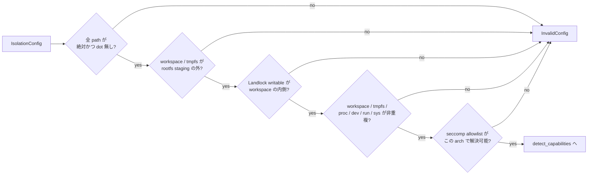

<!-- doc-type: concept -->

# ポリシーの事前検査

[runtime-isolation](README.md) / ポリシーの事前検査

> **対象読者:** 隔離ポリシーを組み立てる実装者、mount 構成をレビューする人

[`IsolationConfig::validate`](../../crates/runtime-isolation/src/config.rs) は、`RuntimeIsolation::apply` と `spawn_isolated` の事前検査で最初に呼ばれる純粋関数である。副作用を一切持たず、ポリシーの組み合わせだけを見て落とす。

## なぜ syscall の前に落とすのか

13 step のうち最初の 2 つ、namespace 作成と UID/GID map は戻せない。そこを通過してから「tmpfs の target が `/` だった」と気付いても、もう元のプロセスには帰れない。設定ミスを検出する場所は、1 つでも syscall を叩く前でなければ意味がない。

だから `validate()` は mutation を開始する前の `preflight` の 1 行目にある。旧 `apply` はこの検査と capability detection の後に child handoff 必須エラーを返し、`spawn_isolated` だけが namespace child で後続 step を実行する。

```rust
fn preflight<B: IsolationBackend>(
    backend: &mut B,
    config: &IsolationConfig,
) -> Result<(), IsolationError> {
    config.validate()?;
    let report = backend.detect_capabilities(config);
```

capability detection もこの直後、mutation の前に走る。user namespace が作れない、cgroup v2 が書けない、Landlock ABI が足りない場合は `CapabilityUnavailable` を返して何も触らずに止まる。

## 何を防ぎたいのか

`validate()` が落とす条件は、どれも「通してしまうと隔離が意味を失う」もの。

**mount target が rootfs staging の内側にある。** rootfs を `/mnt/stage` に bind mount して `pivot_root` する構成で、workspace の target を `/mnt/stage/work` にしたとする。pivot 後、その path は workload から見えない位置に移動する。workspace が消えたように見えるだけならまだしも、tmpfs が同じことになると `/tmp` が host の tree に残る。

```text
rootfs.mount_target = /mnt/stage
workspace.target    = /mnt/stage/work   -> 拒否
tmpfs.target        = /mnt/stage/tmp    -> 拒否
```

**Landlock の writable path が workspace の外にある。** Landlock は path 単位で access を宣言する。workspace の外に書き込みを許すと、capability filesystem を経由しない書き込み経路ができる。`validate()` は `writable_paths` の全要素が `workspace.target` 以下であることを要求する。

**mount target が重複する。** workspace と tmpfs が同じ path、あるいは一方が `/proc`、`/dev`、`/run`、`/sys` と同じか祖先・子孫関係にある場合は拒否する。step 7 と 8、および rootfs の immutable-root 分岐でこれらの runtime mount を覆うので、そこに workspace を置くと後から潰される。



## path の形を型の入口で狭める

`validate_absolute_clean_path` は、絶対 path であることと、`.` / `..` を含まないことだけを見る。

```rust
if !path.is_absolute()
    || path.components().any(|component|
        matches!(component, Component::CurDir | Component::ParentDir))
```

`..` を許すと `starts_with` による包含判定が壊れる。`/work/../etc` は文字列としては `/work` で始まるので、Landlock writable path の検査を素通りしてしまう。ここで弾いておけば、以降の比較は素朴な prefix 一致でよい。

symlink はこの段階では解決しない。path 文字列の形だけを見る検査なので、実体が symlink かどうかは分からない。実際に mount する時点で kernel が解決する。

## 数値の上限をどこで決めるか

| 項目 | 制約 | 定数 |
|---|---|---|
| tmpfs size | 1 byte 以上 1 GiB 以下 | `MAX_TMPFS_BYTES = 1 << 30` |
| cgroup 名の長さ | 1〜255 bytes | `MAX_CGROUP_NAME_BYTES = 255` |
| cgroup 名の文字種 | ASCII 英数字と `.` `_` `-` のみ。`.` と `..` 単体は不可 | — |
| Landlock ABI 設定 | **3 と完全一致** | `SUPPORTED_LANDLOCK_ABI = 3` |
| `memory.max` / `pids.max` | いずれも正 | — |

cgroup 名の制約は path traversal 対策。`cgroup.root` に名前を連結して directory を作るので、`..` や `/` が入ると hierarchy の外に出られる。文字種を allowlist にして、`.` と `..` を別途弾いている。

Landlock の access-mask schema は ABI 3 に固定している。`LANDLOCK_ACCESS_FS_TRUNCATE` と `LANDLOCK_ACCESS_FS_REFER` が ABI 3 で入ったためで、truncate を制御できないと、書き込み権を与えていない file を size 0 にできてしまう。host capability detection は ABI が要求値以上かを確認するが、config 自体は ABI 3 以外を受け付けない。詳細は [Landlock envelope](landlock-envelope.md)。

## seccomp だけ検査の性質が違う

`self.seccomp.validate_for_platform()` は、allowlist の全 syscall がこの target architecture で番号に解決できるかを見る。実装済みの対象は x86_64 と aarch64 で、それ以外では `Syscall::number()` が `None` を返すため、この検査は必ず失敗する。

つまり x86_64 と aarch64 以外では `validate()` が通らない。新しい architecture を追加するときは `syscall.rs` の `number()` と Linux seccomp の audit-arch check の両方に分岐を足す必要があり、片方を忘れたまま動いてしまうことはない。

## 何が助かるのか

設定ミスの大半が、プロセスの状態を変える前に型と純粋関数で落ちる。`validate()` には backend も syscall も要らないので、test は普通の unit test で書ける。特権が要らないぶん CI で常時回せる。

もう 1 つは、危険な組み合わせの一覧が 1 関数に集まっていること。「この構成は安全か」を判断するとき、13 step の実装を追う代わりに `validate()` を読めばよい。

## 正確な保証範囲

`validate()` が保証するのは、ポリシーの**組み合わせ**が既知の危険パターンに当てはまらないこと。それ以上ではない。

- path が実際に存在するか、permission があるか、symlink かどうかは見ていない。存在検査は mount 時点で kernel が行う。
- 検査を通ったポリシーが「安全である」とは言えない。ここにない危険な組み合わせは通る。allowlist に危険な syscall が無いことは別途 `SeccompPolicy::new` が見るが、許した syscall の組み合わせが安全かは判断していない。
- `detect_capabilities` の結果は host 環境に依存する。同じ config が、ある host では通り別の host では `CapabilityUnavailable` になる。
- 実mount／Landlock／seccomp／capability／descriptor境界はprivileged direct／post-exec gateとKVM guestで確認する。ただし`validate()`単体がkernel状態を観測するわけではない。[検証対応表](verification.md)を参照。

## 変更時の確認点

- 検査を足すときは、それが純粋関数のままかを確認する。filesystem を読む検査を入れると `validate()` の性質が変わり、`apply` の 1 行目で呼べる保証が崩れる。
- 上限定数を変えるときは、その値がどの攻撃を防いでいるのかを併記する。`MAX_TMPFS_BYTES` は host memory の枯渇、`MAX_CGROUP_NAME_BYTES` は path 長。
- `Component::ParentDir` の拒否を緩めると、以降の `starts_with` による包含判定が全て信用できなくなる。緩めるなら包含判定を正規化ベースに書き換える。
- `SUPPORTED_LANDLOCK_ABI` を変更するときは、access-mask schema と `LANDLOCK_ALL_ACCESS` の対応、および `REFER` / `TRUNCATE` の保証を [Landlock envelope](landlock-envelope.md) で確認する。

## 関連

- [13 step の固定順序と rollback](apply-order.md)
- [seccomp allowlist](seccomp-allowlist.md)
- [Landlock envelope](landlock-envelope.md)
- [検証対応表](verification.md)
- [隔離基盤の設計](../design/runtime-isolation.md)
- [用語集](../glossary.md)
