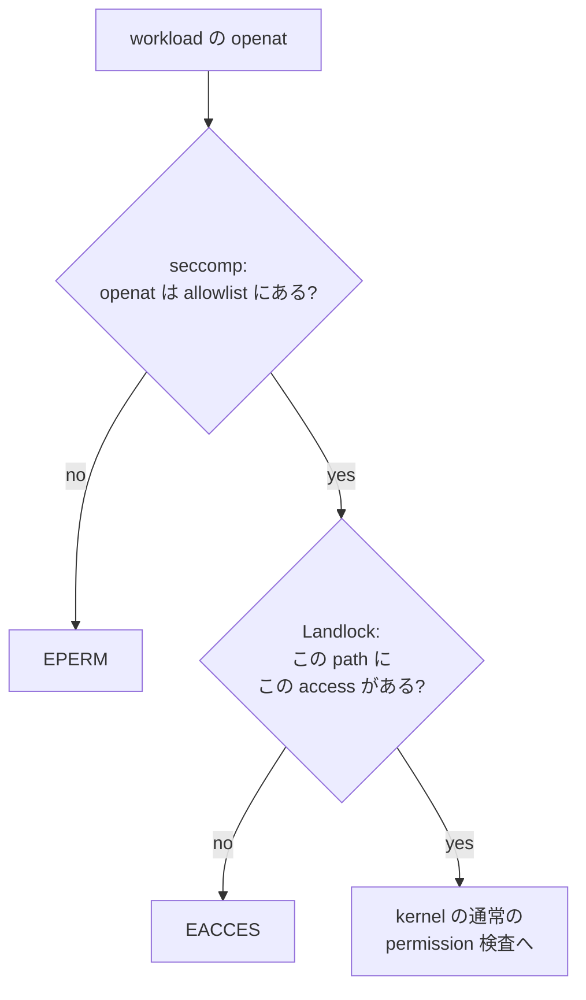

<!-- doc-type: concept -->

# Landlock envelope

[runtime-isolation](README.md) / Landlock envelope

> **対象読者:** file 境界を触る実装者、workspace の書き込み権をレビューする人

seccomp が「どの syscall を呼べるか」を決めるのに対し、Landlock は「どの path に何をしてよいか」を決める。[`linux.rs`](../../crates/runtime-isolation/src/linux.rs) は 2 種類の access mask を定義していて、rootfs と workspace で別のものを使う。

## seccomp では足りない理由

seccomp allowlist は `openat` を許可している。許可しないと workload が何も読めない。しかし `openat` を許した時点で、その syscall がどの path を開くかは filter から見えない。classic BPF は引数のポインタを追えないので、path 文字列を検査できない。

つまり seccomp だけだと「file を開いてよい」か「一切開けない」の二択になる。実際に必要なのは「rootfs は読める、workspace は読み書きできる、それ以外は触れない」なので、path を理解する別の仕組みが要る。それが Landlock。



2 つは重なっているのではなく、別の軸で切っている。`socket` は seccomp が止め、`/etc/shadow` は Landlock が止める。

## 2 つの mask の差

```rust
const LANDLOCK_READ_ONLY_ACCESS: u64 =
    LANDLOCK_ACCESS_FS_EXECUTE | LANDLOCK_ACCESS_FS_READ_FILE | LANDLOCK_ACCESS_FS_READ_DIR;

const LANDLOCK_WORKSPACE_ACCESS: u64 = LANDLOCK_READ_ONLY_ACCESS
    | LANDLOCK_ACCESS_FS_WRITE_FILE
    | LANDLOCK_ACCESS_FS_REMOVE_DIR
    | LANDLOCK_ACCESS_FS_REMOVE_FILE
    | LANDLOCK_ACCESS_FS_MAKE_DIR
    | LANDLOCK_ACCESS_FS_MAKE_REG
    | LANDLOCK_ACCESS_FS_REFER
    | LANDLOCK_ACCESS_FS_TRUNCATE;
```

| access bit | rootfs | workspace | 備考 |
|---|:-:|:-:|---|
| `EXECUTE` | ✓ | ✓ | workspace 上の file も実行できる |
| `READ_FILE` | ✓ | ✓ | |
| `READ_DIR` | ✓ | ✓ | |
| `WRITE_FILE` | | ✓ | |
| `TRUNCATE` | | ✓ | ABI 3 で追加 |
| `MAKE_REG` | | ✓ | regular file の作成 |
| `MAKE_DIR` | | ✓ | |
| `REMOVE_FILE` | | ✓ | |
| `REMOVE_DIR` | | ✓ | |
| `REFER` | | ✓ | ABI 3 で追加。rename / link の移動 |
| `MAKE_CHAR` | | | character device |
| `MAKE_BLOCK` | | | block device |
| `MAKE_SOCK` | | | Unix domain socket |
| `MAKE_FIFO` | | | 名前付き pipe |
| `MAKE_SYM` | | | symlink |

宣言していない bit は、その path 以下で拒否される。`LANDLOCK_ALL_ACCESS` は全 bit の和で、ruleset を作るときの handled access として使う。handled に含めて rule に含めない、が「禁止」の表現になる。

## 作らせないものが 5 つある

workspace で唯一作れるのは regular file と directory。残り 5 種類を落としている理由はそれぞれ違う。

**device node（`MAKE_CHAR` / `MAKE_BLOCK`）。** workspace に `/dev/sda` 相当の block device node を作られると、Landlock も capability filesystem も経由せずに backing store へ到達できる。step 8 で `/dev` を空の tmpfs で覆っているが、覆っているのは `/dev` であって、workspace 内に node を作る経路は別に塞ぐ必要がある。seccomp 側でも `mknod` / `mknodat` を禁止しているので二重に閉じている。

**socket（`MAKE_SOCK`）。** Unix domain socket は seccomp の network 禁止をすり抜ける経路になりうる。`socket(2)` を禁止しているので現状は作れないが、mask 側でも落としておく。

**FIFO（`MAKE_FIFO`）。** workload は単一プロセスなので使い道が無い。増える surface を減らす。

**symlink（`MAKE_SYM`）。** これが一番効く。symlink を作れると、workspace 内の名前から workspace 外の実体を指せる。capfs は symlink を扱うが、target が repository の外へ出ないことを registry が保証している（[Backing repository の事前検証](../capfs/backing-preflight.md)）。workload が capfs を迂回して backing tree に直接 symlink を作れるなら、その保証が消える。

`REFER` は許可している。これが無いと workspace 内での rename ができない。ABI 3 未満の kernel では `REFER` そのものが存在せず、rename が一律拒否される。これが `MIN_LANDLOCK_ABI = 3` の理由の半分。

## TRUNCATE を独立させる意味

もう半分の理由が `TRUNCATE`。ABI 2 以前は truncate を制御する bit が無く、`WRITE_FILE` の一部として扱われていた。逆に言うと、書き込み権を与えていない file に対して `ftruncate` で size を 0 にできる状態だった。

capfs 側では `Truncate` を `WriteData` とは別の `FileEffect` として持っている（[File authority](../authority-core/file-authorities.md)）。Landlock 側で分離できないと、Capability モデルで分けている区別が下位層で潰れる。ABI 3 を要求しているのは、この 2 層の粒度を揃えるため。

## ABI が足りない host では起動しない

`detect_capabilities` が Landlock ABI を query し、`config.landlock.required_abi` 未満なら `CapabilityReport::is_sufficient` が `false` を返す。`apply` は `CapabilityUnavailable` で止まり、mutation を一切行わない。

「Landlock が使えないので、その分は seccomp で頑張る」という縮退は無い。境界が 1 つ欠けた状態で workload を起動するくらいなら、起動しないほうがよい。

## 何が助かるのか

rootfs と workspace の権限差が定数 2 つに集約されているので、「workload はどこに何を書けるのか」がその 2 行を読めば分かる。個々の mount option や permission bit を追わなくてよい。

作らせない 5 種類が bit の不在として表現されているため、レビューで「symlink を作れるか」を確認するとき、`MAKE_SYM` が `LANDLOCK_WORKSPACE_ACCESS` に含まれていないことを見れば済む。

## 正確な保証範囲

ここで説明したのは access mask の定義とその意図だけ。実際に Landlock が効いていることは確認していない。

- `LinuxBackend` の Landlock 適用は特権と ABI 3 以上の kernel を要する。この repository の test では実行していない。
- ruleset を張る path が `config.landlock.read_only_paths` / `writable_paths` と一致していること、rule の追加が全 path について成功していることは、mock backend では見ていない。
- Landlock は `pivot_root` の後に張る。宣言した path が pivot 後の名前空間で正しく解決されるかは実機でしか確認できない。
- Landlock はすでに開いている fd には遡って効かない。step 9 で継承 fd を閉じているのはこのため。閉じ漏れがあった場合の挙動は未検証。
- capfs 層の再認可（[Direct-I/O FUSE adapter](../capfs/read-only-fuse.md)）とは独立した層。Landlock が許しても Capability が無ければ capfs が拒否する。逆も同じ。

## 変更時の確認点

- `LANDLOCK_WORKSPACE_ACCESS` に bit を足すときは、それが capfs 側の `FileEffect` のどれに対応するかを確認する。対応が無い bit を足すと、Capability を経由しない操作が生まれる。
- `MAKE_SYM` を足そうとしている場合は、[Backing repository の事前検証](../capfs/backing-preflight.md)の symlink target 検査が前提を失うことを先に確認する。
- `MIN_LANDLOCK_ABI` を上げるときは、新しい ABI で追加された bit を `LANDLOCK_ALL_ACCESS` に含める。handled access に入れ忘れると、その操作は制御されないまま通る。
- ABI を下げるときは `TRUNCATE` と `REFER` が失われる。前者は capfs の effect 分離が壊れ、後者は rename が使えなくなる。

## 関連

- [seccomp allowlist](seccomp-allowlist.md)
- [ポリシーの事前検査](isolation-config.md)
- [13 step の固定順序と rollback](apply-order.md)
- [検証対応表](verification.md)
- [隔離基盤の設計](../design/runtime-isolation.md)
- [capfs 設計](../design/capfs.md)
- [用語集](../glossary.md)
