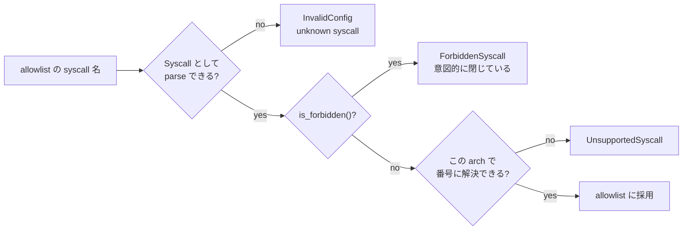

<!-- doc-type: concept -->

# seccomp allowlist

[runtime-isolation](README.md) / seccomp allowlist

> **対象読者:** allowlist を変更する実装者、syscall 境界のレビュー担当者

[`syscall.rs`](../../crates/runtime-isolation/src/syscall.rs) の `Syscall` は 100 種類以上の variant を持つ enum で、危険な variant は `is_forbidden()` により allowlist へ入れられない。既定の `SeccompPolicy::conservative()` は x86_64 で 55 個の syscall を列挙し、aarch64 では番号を持つ 48 個へ絞り込む。`SeccompPolicy::new` はこの集合から任意の非空 subset を受け付けるが、forbidden variant は必ず `ForbiddenSyscall` を返す。

なぜ「禁止するもの」をわざわざ enum に載せているのか、という話から始める。

## 危険な syscall を型に載せる理由

allowlist 方式なら、危険な syscall は単に「書かなければ」よい。載せる必要はない。実際そう作ることもできた。

ただしそれだと、allowlist を文字列で受け取る箇所で `"socket"` と書かれたときに「知らない名前」として拒否することしかできない。エラーは `unknown syscall 'socket'` になる。読んだ人は綴りを疑うか、対応していないだけだと思って追加しようとする。

`Syscall::Socket` を variant として持ち、`is_forbidden()` で `true` を返すようにすると、エラーが変わる。

```text
forbidden syscall 'Socket' cannot enter the allowlist
```

これは「知らない」ではなく「意図的に閉じている」という表明で、追加しようとした人がその場で止まる。設計判断をコンパイル可能な形で残していることになる。



`FromStr` は許可されるものを先に match し、外れたものを `parse_forbidden_syscall` に回す。この 2 段構えのおかげで、禁止 syscall も名前から復元でき、エラーメッセージに具体名が出る。

## 何を閉じているのか

禁止群は目的別に分けると読みやすい。

| 分類 | syscall | 閉じる理由 |
|---|---|---|
| network | `socket`, `connect`, `bind`, `listen`, `accept`, `accept4`, `sendto`, `sendmsg`, `recvfrom`, `recvmsg`, `socketpair` | 外部通信は全て Broker 経由。workload から直接 socket を作れると egress 制御が丸ごと迂回される |
| namespace / mount | `mount`, `umount2`, `unshare`, `setns`, `pivot_root`, `chroot`, `open_tree`, `move_mount`, `fsopen`, `fsconfig`, `fsmount`, `fspick`, `mount_setattr` | 隔離を張り直せる。特に `unshare` は新しい user namespace で capability を取り戻せる |
| 他プロセス干渉 | `ptrace`, `process_vm_readv`, `process_vm_writev`, `kcmp`, `pidfd_open`, `pidfd_getfd`, `pidfd_send_signal`, `process_madvise`, `process_mrelease` | PID namespace 内の他プロセスに触れる。`pidfd_getfd` は他プロセスの fd を複製できる |
| 特権昇格 | `setuid`, `setgid`, `setreuid`, `setregid`, `setgroups`, `setresuid`, `setresgid`, `setfsuid`, `setfsgid`, `capset`, `prctl`, `seccomp`, `personality` | 消したはずの capability を戻す、あるいは filter を上書きする |
| kernel 操作 | `bpf`, `perf_event_open`, `init_module`, `delete_module`, `finit_module`, `kexec_load`, `kexec_file_load`, `reboot`, `swapon`, `swapoff`, `syslog`, `sethostname`, `setdomainname` | kernel の状態を変える、あるいは host の情報を読む |
| filesystem 迂回 | `name_to_handle_at`, `open_by_handle_at`, `fanotify_init`, `fanotify_mark`, `mknod`, `mknodat` | path 解決を経由せず inode に到達する、device node を作る |
| その他 | `ioctl`, `userfaultfd`, `io_uring_setup`, `io_uring_enter`, `io_uring_register`, `clone`, `clone3`, `fork`, `vfork`, `shmget`, `shmat`, `shmctl`, `shmdt`, `add_key`, `request_key`, `keyctl` | 下記 |

`ioctl` を丸ごと閉じているのは、device 依存の巨大な surface だから。cmd 番号ごとに許可する仕組みを classic BPF で書くこともできるが、許可すべき cmd の一覧を維持できる自信がなかった。必要になったら例外を足すのではなく、その操作を Broker 側の型付き操作として設計し直す。

`io_uring` は submission queue 経由で filter を迂回できる時期があった。現在の kernel では `IORING_OP` 単位の制御があるが、seccomp filter は syscall 境界でしか見えないため、この crate では扱わない。

`clone` / `fork` を閉じているので workload は単一プロセスになる。`wait4` は許可しているが、これは exec 前の init 側で使う想定。

## 既定の 55 個（x86_64）

`SeccompPolicy::conservative()` が返す既定の allowlist は、動的リンクされた通常の workload が起動して file を読み書きし、終了するまでに必要な最小限を列挙する。x86_64 では 55 個すべてが残り、aarch64 では legacy path-only syscall の番号が無いため 48 個になる。

内訳は、file I/O（`read`, `write`, `pread64`, `pwrite64`, `close`, `openat`, `getdents64`）、metadata（`fstat`, `newfstatat`, `statx`, `fchmod`, `ftruncate`）、directory 操作（`mkdir`, `mkdirat`, `unlink`, `unlinkat`, `rmdir`, `rename`, `renameat`, `linkat`, `symlink`, `symlinkat`, `readlink`, `readlinkat`, `chdir`, `getcwd`）、memory（`mmap`, `mprotect`, `munmap`, `madvise`, `brk`）、signal（`rt_sigaction`, `rt_sigprocmask`, `rt_sigreturn`）、exec と終了（`execve`, `execveat`, `wait4`, `exit`, `exit_group`）、実行時に libc が使うもの（`futex`, `sched_yield`, `clock_gettime`, `getpid`, `gettid`, `sched_getaffinity`, `sigaltstack`, `getrandom`, `set_robust_list`, `set_tid_address`, `rseq`, `prlimit64`, `arch_prctl`）である。

path を取る syscall は `*at` 系だけではない。x86_64 では `mkdir`、`unlink`、`rmdir`、`rename`、`symlink`、`readlink`、`chmod` という legacy path syscall も既定 allowlist に含まれる。一方、aarch64 の `number()` はこれらの legacy 番号を返さず、対応する `*at` 系を残す。path の許可は syscall の種類だけを示し、実際の path 境界は Landlock が担う。

## 空の allowlist を拒否する

```rust
if allowed.is_empty() {
    return Err(IsolationError::InvalidConfig(
        "seccomp allowlist must not be empty; default deny would make the workload unstartable"
    ));
}
```

default-deny なので、空 allowlist は「全 syscall を拒否」を意味する。filter を入れた瞬間に `execve` すら通らず、workload は起動しない。これは安全側に倒れているので事故にはならないが、原因が分かりにくい失敗になる。だから設定の時点で落とす。

`new()` は最後に `sort_unstable()` と `dedup()` をかける。`allows()` が `binary_search` を使うためで、重複した指定は静かに 1 つにまとめられる。

## architecture 依存を隠さない

`Syscall::number()` は x86_64 と aarch64 で実数を返し、その他の arch では `_ = self; None` を返す。

```rust
#[cfg(not(any(target_arch = "x86_64", target_arch = "aarch64")))]
pub(crate) const fn number(self) -> Option<i32> {
    let _ = self;
    None
}
```

`validate_for_platform()` が allowlist 内の全 syscall について `number()` を確認するので、x86_64 と aarch64 以外では必ず `UnsupportedSyscall` で止まる。「番号が分からないので素通しする」という経路は無い。Linux BPF の architecture check も x86_64 と aarch64 の audit architecture を明示し、それ以外の target は filter compile を拒否する。

生成する BPF filter には arch check が入る。想定外の arch で呼ばれた場合、filter は `EPERM` ではなく process kill を返す。x32 ABI のように同じ番号が別の syscall を指す環境で、番号だけ見て許可してしまうのを防ぐため。

## 何が助かるのか

allowlist を広げようとしたとき、危険なものは compile ではなく実行時の型付きエラーで止まる。レビューで見落としても `ForbiddenSyscall` が出るので、CI が拾う。

禁止理由が enum の doc comment に 1 行ずつ付いているため、「なぜこれが入っていないのか」を調べるのに設計文書を探す必要がない。

## 正確な保証範囲

この module が保証するのは、`SeccompPolicy` を構築できた時点で、allowlist に禁止 syscall が含まれず、全要素がこの arch で番号に解決できることだけ。

- 生成された BPF filter が kernel で意図どおり動くことは検証していない。`LinuxBackend` の seccomp 適用は特権環境が要る。
- 許可した 55 個（aarch64 では 48 個）の組み合わせが安全であることは主張していない。`mmap` + `mprotect` で W^X を破る、path syscall で意図しない tree に到達する、といった話はここでは扱わない。後者は [Landlock envelope](landlock-envelope.md) の担当。
- syscall 番号の正しさは手で書いた表に依存する。x86_64 の番号を機械的に検証する仕組みは無い。
- vDSO 経由で呼ばれる `clock_gettime` は syscall 境界を通らないことがある。filter があってもなくても動く場合がある。

## 変更時の確認点

- `Syscall` に variant を足すときは、enum、`is_forbidden()`、`FromStr` の match（許可側か `parse_forbidden_syscall` のどちらか）、x86_64 / aarch64 の `number()` を同時に直す。`number()` を忘れると `validate_for_platform` が落ちるので、許可側に足した場合は気付ける。**禁止側に足した場合は `number()` 不要**。
- 許可 syscall を増やすときは、[隔離基盤の設計](../design/runtime-isolation.md)の脅威モデルに照らして、その syscall で越えられる境界が無いかを見る。特に path を取るもの、fd を作るもの、他プロセスを参照するもの。
- `conservative()` を変えると既定の挙動が変わる。ここは「動く最小限」であって「推奨構成」ではない。
- arch を増やすときは `number()` の `cfg` 分岐と、BPF filter の arch check の両方を足す。片方だけだと、番号は解決できるが filter が kill する状態になる。

## 関連

- [ポリシーの事前検査](isolation-config.md)
- [13 step の固定順序と rollback](apply-order.md)
- [Landlock envelope](landlock-envelope.md)
- [検証対応表](verification.md)
- [隔離基盤の設計](../design/runtime-isolation.md)
- [ネットワークと外部副作用の設計](../design/network-egress.md)
- [用語集](../glossary.md)
