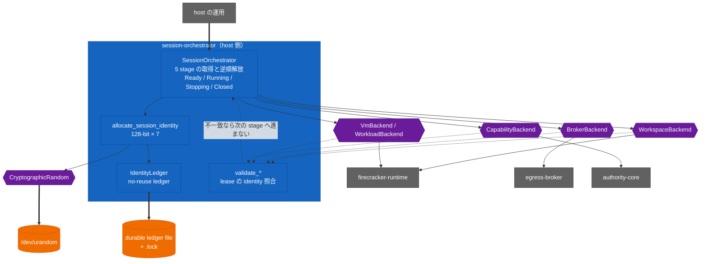

<!-- doc-type: index -->

# Session orchestrator

[ドキュメント一覧](../README.md) / Session orchestrator

> **対象読者:** host lifecycle 統合担当者、Firecracker/Broker/Authority adapter の設計者、レビュー担当者

`session-orchestrator` は、隔離された一つの agent session のホスト側 lifecycle state machine である。resource の確保順序と identity binding を所有し、Authority Core、Broker listener、Firecracker runtime、workspace の production adapter を提供する。FUSE mount、provider request、特権 isolation の具体的な副作用は、それぞれの専用 adapter が所有する。

## crate の構造

この crate が直接触る I/O は ledger file と `/dev/urandom` だけ。残りは全部 trait 越しで、紫の継ぎ目に test の fake が入る。

## 文書一覧

| 文書 | 対象ソース | 内容 |
|---|---|---|
| [session の commit 順序と cleanup](lifecycle.md) | [`lib.rs`](../../crates/session-orchestrator/src/lib.rs) | 5 stage の取得順、逆順の解放、`Stopping` に留まる条件 |
| [identity と ledger](identity-ledger.md) | [`lib.rs`](../../crates/session-orchestrator/src/lib.rs) | 7 つの identity、on-disk format、durability 順序、排他所有 |
| [lease の binding](lease-binding.md) | [`lib.rs`](../../crates/session-orchestrator/src/lib.rs) | backend が返す lease の照合、型で守る順序 |
| [production backend 契約](contracts.md) | [`authority_backend.rs`](../../crates/session-orchestrator/src/authority_backend.rs) ほか | adapter 実装者の義務 |
| [検証対応表](verification.md) | — | mock で見た範囲と、実機・並行性で未検証の範囲 |

## 特に注意する点

- lease を保存する行と cleanup flag を落とす行は別の文になっている。flag 側を忘れても compile が通り、`stop_session` は成功を返しながら VM が動き続ける。
- `CleanupProgress` の `true` は「実行した」ではなく「対象が無かった」の場合がある。監査記録として読まない。
- `SessionOrchestrator::new` は default type parameter で process-local ledger を選ぶ。production が `new_durable` を忘れても contract test は全部通る。
- `LifecycleState` の 9 値のうち、`state()` が返しうるのは 4 つだけ。残り 5 つに match するコードは到達しない。
- identity の `Display` は on-disk path と Authority Core の subject 名を作る。hex の書式を変えると両方が黙って変わる。

## 関連

- [production backend 契約](contracts.md)
- [Firecracker runtime](../firecracker-runtime/README.md)
- [Supervisor adapter](../supervisor/README.md)
- [Host Egress Broker](../egress-broker/README.md)
- [決定記録](../decisions/README.md)
- [実装順序](../design/implementation-plan.md)
- [検証戦略](../design/verification.md)
- [用語集](../glossary.md)
