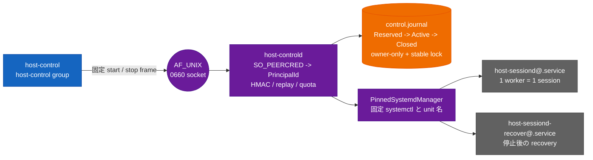

<!-- doc-type: concept -->

# multi-session control plane

[Session orchestrator](README.md) / multi-session control plane

> **対象読者:** `host-controld` の運用担当者、control socket と systemd 境界のレビュー担当者

`host-controld` は、一つの session を一つの `host-sessiond@.service` に割り当てる
single-host controller である。session を同じ privileged process や microVM に多重化する
仕組みではない。caller は `host-control` で固定 wire frame を送り、controller は kernel が
観測した Unix peer UID、HMAC、durable journal、quota を順に検査してから、閉じた systemd
operation だけを実行する。

## 対象ソース

- [`control_plane.rs`](../../crates/session-orchestrator/src/control_plane.rs): controller journal、quota、replay、recovery、worker ownership
- [`control_transport.rs`](../../crates/session-orchestrator/src/control_transport.rs): principal 導出、frame、response の canonical encoding
- [`host-controld.rs`](../../crates/session-orchestrator/src/bin/host-controld.rs): `SO_PEERCRED`、socket、bounded daemon loop
- [`host-control.rs`](../../crates/session-orchestrator/src/bin/host-control.rs): key 検査、client timeout、start/stop CLI

## 境界



controller の journal は session orchestrator が使う identity ledger や、worker 内の
`session-recovery.wal` とは別の file である。controller journal は admission と worker 所有権を
記録し、identity ledger は 128-bit identity の no-reuse を記録し、session recovery journal は
KVM・cgroup・mapper・jail の cleanup checkpoint を記録する。

## caller identity と wire frame

socket の path、key、frame に caller identity を載せない。`host-controld` が accepted Unix
socket の `SO_PEERCRED` から effective UID を取得し、次の固定 domain で 16 byte の
`PrincipalId` を導出する。

```text
SHA-256("host-controld/principal/uid/v1\0" || uid.to_be_bytes())[0..16]
```

socket の group access は admission の補助条件に過ぎず、UID は kernel observation が source
である。`host-control` は root-owned group-readable key（exact 32 bytes、mode `0440`）を読み、
自分の UID に対応する principal で HMAC を作る。key は guest へ渡らず、wire に credential や
path は現れない。

frame は 2 byte big-endian の body length prefix を持つ。body は version と operation の直後に
固定長フィールドだけを置く。

| operation | body | length prefix を含む frame |
|---|---|---:|
| start | `1, 1, request_id(16), tag(32)` | 52 byte |
| stop | `1, 2, request_id(16), tag(32), session_id(16)` | 68 byte |

`tag` は HMAC-SHA-256 で、start は operation・principal・request ID、stop はそれに session ID
を束縛する。zero ID、未知 operation、長さ違い、replay、別 principal の stop は拒否する。
response body は `Started(session_id)`（18 byte）、`Stopped`（2 byte）、`Denied`（2 byte）の
いずれかで、失敗理由・credential・任意の error text は返さない。client の start は systemd
worker の起動期限を含む 360 秒、stop は recovery までを含む 660 秒で response を待つ。

## journal と admission の順序

controller は起動時に owner-only `control.journal` と stable sidecar lock を開く。journal は
atomic create、safe parent、regular file、single link、owner、mode `0600`、header/record checksum、
sequence、transition を検査する。record は 128 byte、header は 64 byte、最大 record 数は
1,000,000 である。安全な torn tail だけは record 境界まで切り詰めるが、checksum が壊れた
full record や path/inode/length の drift は controller handle を poison し、restart が必要になる。

```text
start:
  verify HMAC -> reject request replay -> check global/principal quota
      -> check journal health -> choose unused non-zero session ID
      -> append Reserved + sync -> start exact worker
      -> append Active + sync -> return Started(session ID)

stop:
  verify HMAC -> reject request replay -> require owning principal
      -> check journal health -> stop exact worker
      -> run exact recovery -> append Closed + sync -> return Stopped
```

`Reserved` は worker effect より前に永続化される。spawn failure でも request と session ID は
burn され、`Closed` を記録して新しい ID を使う。`Active` の append が失敗した場合は worker
を best-effort で止めるが、journal error を成功に変換しない。controller restart 時は未 `Closed`
の全 session を stable session ID 順に `ControlWorkerFactory::recover` へ渡し、全ての exact
cleanup が完了しない限り新しい request を受け付けない。

poll で worker が `Running` なら保持する。`Closed` が観測できたときだけ `Closed` record を
append する。health status が取得できない場合は clean close とみなさず、stop と recovery を
試す。cleanup が不完全なら worker と journal ownership を保持し、後続 worker の cleanup も
勝手に成功扱いにしない。shutdown も session ID 順で、最初の retryable failure とそれ以降の
worker を保持する。

## 運用上の注意

- controller は一つの host の owner である。journal lock を共有して multi-host failover や
  replicated session state を実現するものではない。
- `/etc/host-controld/control.key`、journal、socket parent、worker の state root は、unit と
  environment example が示す owner・group・mode・absolute path を守る。key を checkout、guest、
  caller の home から読み替えない。
- journal、recovery file、Broker WAL、mapper、jail、cgroup を手動削除しない。controller の
  restart reconciliation が exact cleanup を証明できない場合は fail closed であり、残留物を
  消して quota や no-reuse 記録を先に進める操作ではない。
- `host-controld` は capability を持たない systemd service で、systemd/polkit が許す操作も
  固定 template と固定 verb に限られる。systemd、unit state、worker の詳細は
  [systemd worker 境界](systemd-worker.md) を参照する。

## 正確な保証範囲

この実装と unit test が固定するのは、同一 host 上での peer UID principal、HMAC admission、
quota、request/session no-reuse、journal fencing、exact worker cleanup の境界である。HMAC key
を読める host 管理者や、`host-controld` が検査する前の malformed frame は worker effect へ
到達しない。socket が group-readable であることだけから、caller が任意の session を stop
できるとは判断しない。

test では固定 frame、principal、HMAC、quota、journal transition、controller fencing、restart
reconciliation、health failure、retryable cleanup を検査する。実 systemd gate では非特権 daemon、
polkit、worker kill、recovery、controller restart を接続する。

## 保証範囲外

HMAC key を読める host 管理者、`host-controld`/systemd/Firecracker の TCB 侵害、分散 lock、
multi-host failover、外部 provider の可用性や安全性はこの control plane の保証外である。
controller journal は worker resource の実解放を独自に証明せず、worker 側の recovery journal
と systemd recovery の成功報告に依存する。

## 変更時の確認点

- frame の version、operation、固定長、2 byte length prefix を同じ変更で更新する。start は
  52 byte、stop は 68 byte、response は最大 18 byteで、任意 error text を追加しない。
- principal の domain、UID の big-endian encoding、HMAC の binding domain、zero ID と replay の
  拒否を変えると、client と daemon の両方を更新し、foreign stop の拒否を再検証する。
- `Reserved -> Active -> Closed` の順序を崩さない。worker effect 前の `Reserved`、cleanup 完了
  後だけの `Closed`、spawn failure 時の request/session ID burn を維持する。
- journal の path/inode/length poison、stable lock、owner-only mode、torn tail の扱いを緩めない。
  path の復元後に同じ controller handle を再利用できるようにしてはならない。
- systemd operation を追加するときは `PinnedSystemdManager`、polkit、unit template、実機 gate
  を同時に更新し、任意 unit・任意 verb・任意 argument の入力経路を作らない。

## 検証

| 対象 | 固定している test / gate |
|---|---|
| frame 長、principal 導出、response の closed union | `control_transport` unit test |
| HMAC、foreign stop、request replay、quota | `bad_authentication_foreign_stop_and_request_replay_fail_closed`、`authenticated_scheduler_runs_multiple_one_session_workers_with_quotas` |
| journal の checksum、torn tail、fencing、path drift、poison | `control_plane` の journal unit tests |
| restart reconciliation と ID no-reuse | `restart_recovers_reserved_or_active_workers_and_never_reuses_ids` |
| worker health failure と retryable cleanup | `unavailable_health_fails_closed_and_retains_incomplete_cleanup`、`poll_closes_only_workers_that_report_completed_cleanup` |
| 実 socket、polkit、systemd、worker kill 後 recovery | `scripts/ci/verify-real-systemd-control-plane.sh` |

## 関連

- [systemd worker 境界](systemd-worker.md)
- [session recovery journal](recovery.md)
- [session の commit 順序と cleanup](lifecycle.md)
- [identity と ledger](identity-ledger.md)
- [検証対応表](verification.md)
- [deployment boundary](../../deploy/README.md)
