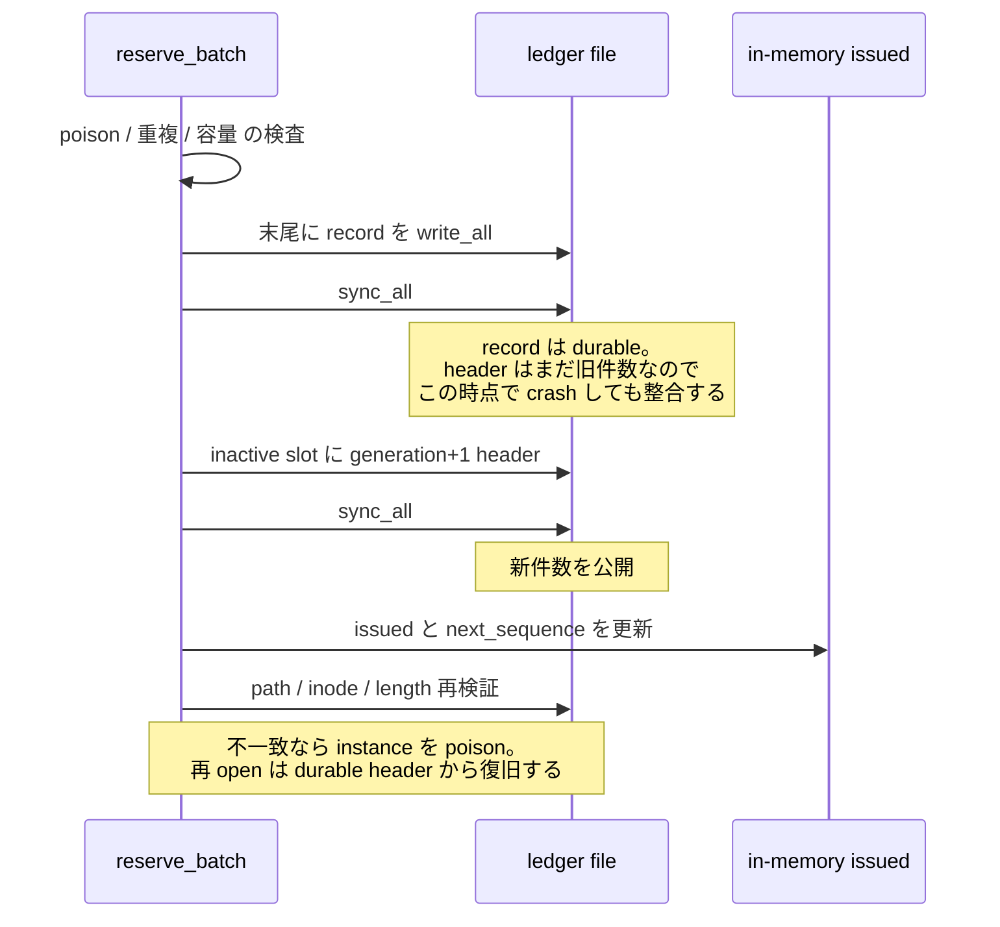

<!-- doc-type: concept -->

# identity と ledger

[Session orchestrator](README.md) / identity と ledger

> **対象読者:** identity の一意性をレビューする人、ledger file を運用する人

[`lib.rs`](../../crates/session-orchestrator/src/lib.rs) は session ごとに 7 つの 128-bit identity を抽選し、no-reuse ledger に予約してから backend を呼ぶ。ledger は on-disk format を持ち、破損と多重所有を検出する。

## 7 つの identity

| kind | on-disk tag | 何を指すか |
|---|---|---|
| `Vm` | 1 | Firecracker VM |
| `Session` | 2 | orchestrated session |
| `Subject` | 3 | VM 内の subject |
| `Workspace` | 4 | workspace clone |
| `Capability` | 5 | root capability |
| `Request` | 6 | lifecycle / Broker control request |
| `BrokerSession` | 7 | Broker connection |

**tag は永続 format の一部で、enum の discriminant ではない。** 値を入れ替えると、既存 ledger の record が別 domain として読まれる。

一意性は domain をまたぐ。同じ 16 bytes が 2 度現れることを、kind に関係なく拒否する。VM ID として使った値は、以後どの session でも subject ID にならない。

## 予約が先、side effect が後

`allocate_session_identity` が 7 値を抽選し、`ledger.reserve_batch` で予約してから `clone_workspace` を呼ぶ。順序の理由は[session の commit 順序](lifecycle.md#commit-の順序)。

重複検査は 2 方向。既に commit 済みの集合との照合と、同じ batch 内での照合。

```rust
if self.issued.contains(identity) || !pending.insert(*identity) {
    return Err(LedgerError::Duplicate { kind: *kind, identity: *identity });
}
```

後者が無いと、偏った、あるいは replay された entropy source が 1 回の session 内で同じ値を 2 度出しても通る。決定の背景は [ADR 0015](../decisions/0015-persist-the-identity-ledger-across-restarts.md)。

## on-disk format

| 定数 | 値 |
|---|---|
| current magic / version | `b"SORLEDG2"` / `2` |
| current commit header | 64 bytes × 2 slots |
| data offset | 128 bytes |
| `LEDGER_RECORD_BYTES` | `32` |
| `MAX_LEDGER_RECORDS` | `1_048_576` |
| `MAX_LEDGER_BYTES` | `33_554_560`（約 32 MiB） |
| checksum | CRC-32、reversed poly `0xEDB8_8320` |

新規 ledger は generation 付き commit header を2スロット持つ。各 header は magic、version、
物理 slot、generation、record 数、commit 済み data 長、reserved、CRC-32 を持つ。record は
version、kind tag、reserved、sequence、identity、CRC-32。旧 `SORLEDG1` は移行のため完全検証後に
読み書きできるが、新規作成には使わない。

1 session あたり 7 record なので、上限は 149,796 session。超えると `CapacityExceeded` を返し、以降の session が全部止まる。fail closed。

file 全体を `read_to_end` で memory に読むので、size の上限がそのまま allocation の上限になっている。

open 時には次を検査する。

- 2 header の CRC、slot、generation、件数、data 長。generation が同じ healthy header 同士の
  内容が食い違えば拒否する。初期 generation 0 は両 slot が揃わなければ拒否する。
- 選択した最新 commit と全 committed record の CRC-32。
- record の sequence が 0 から連続していること。中間の record を消すと検出する。
- commit 範囲外の tail は、次 sequence から始まる完全に妥当な staged record と、最後の
  構造的に妥当な partial record の組み合わせだけを許し、sync 済み committed length まで戻す。
  1 byte の無関係な suffix や checksum 不正の完全 record は拒否して保存する。
- 同じ 16 bytes が 2 度出ないこと。
- file length、header 宣言件数、append 後の長さがすべて hard bound 内であること。

## 書き込みの durability 順序

```text
poison 検査
  -> 重複検査
  -> 容量検査
  -> current committed length に record を write_all
  -> sync_all           ← record は staged、最新 header はまだ旧 commit 範囲
  -> inactive slot に generation+1 header を write_all
  -> sync_all           ← 新しい件数を公開
  -> in-memory の issued と next_sequence を更新
  -> parent/lock/path/inode/length を再検証
```



**record の sync が commit header の write より前にある。** header 書き込み中に crash しても
もう一方の slot が直前の commit を残す。record は揃っているが新 header が未 commit の場合だけ、
再 open が staged tail として安全に検証・破棄する。

## poison

書き込みか sync が不確かな結果になったら、その instance は `poisoned` になり、以降の予約を全部拒否する。

```rust
if self.poisoned {
    return Err(LedgerError::Unavailable { reason: "..." });
}
```

部分的に書けた batch の後、in-memory の `issued` と file が食い違う。続行すると、free だと思っている identity が既に disk 上にある（あるいは逆）状態で払い出す。

commit header の `sync_all` 後は disk 上の予約が正本である。以降の再検証が失敗した場合は
`Err` と同時に instance を poison し、caller は同じ session 開始を成功扱いしない。再 open は
2 header と staged tail を照合するため、commit 済み identity が free pool に戻ることはない。
header に到達しなかった batch は未 commit なので、その session attempt 自体を失敗として扱う。

## 排他所有

`<ledger path>.lock` は消さない stable sidecar で、ledger owner はその `0600` regular file に
kernel の exclusive file lock を保持する。process 終了時は descriptor close により自動解放され、
次 owner は同じ inode を開いて lock を取得する。multi-thread processの`fork`から`exec`までの間は
別threadがdropしたCLOEXEC descriptorをchildが一時保持し得るため、同じ検証済みsidecarに対する
`WouldBlock`だけを250ms以内で再試行する。期限後もownerが残る場合は`Locked`でfail closedし、
permission/path/inode/link-count検査はlock取得後に再度行う。

2 つの orchestrator process が同じ ledger を開こうとしても、stable sidecar の kernel lock を同時に保持できるのは一方だけである。後から来た process は `Locked` で停止し、両方が同じ offset に append する経路はこの所有境界を通過しない。

lock file の path/inode、owner、mode、link count は取得時と append 前後に再検証する。同一 process、
cross-process、crash 後の再取得、hardlink/cross-path alias は test で固定されている。advisory lock
なので ledger/lock の parent は owner-controlled でなければならず、権限検査を回避できる配置は拒否する。

## path の検査

parent directory を先に開いて inode を保持し、Linux ではその `/proc/self/fd/<dirfd>/name` を
`O_NOFOLLOW` 付きで開く。ledger と lock は regular file、single-link、effective UID owner、
exact `0600` であることを要求する。各 append は held descriptor と現在の path の device/inode、
親 directory identity、file length を再照合する。

symlink を許すと、低権限の user が orchestrator の書き込みを自分の file へ向けられる。あるいは、orchestrator が write 権を持つ任意の host file に 32 byte の record を append させられる。

symlink、path replacement、unsafe parent、mode/owner/link-count drift は fail closed になり、live
writer は以後 poison される。

## checksum は MAC ではない

CRC-32 は破損の検出であって、改竄の検出ではない。ledger file に書ける者は、record を消して CRC を計算し直せる。identity を free pool に戻せる。

実際の防御は filesystem の permission と advisory な sidecar lock だけ。

## 何が助かるのか

identity の一意性が 1 つの file に集約されている。「この値は使われたか」を調べるのに、session の記録を横断しなくてよい。

on-disk format が固定長 record なので、破損した位置を offset で特定できる。`LedgerError::Corrupt` が offset と理由を持つ。

## 正確な保証範囲

- unit test と `tests/ledger.rs` は redundant header の全1-byte tear、inactive slot 破損、committed
  record 破損、valid staged tail、invalid suffix、path/length replacement、unsafe parent、
  ledger/lock symlink、unknown kind、非連続 sequence、reserved byte、exact mode、同一/cross-process
  lock、stale lock再取得を実行する。
- production composition は recovery intent を先に永続化し、その後の7 identity reservation と
  journal checkpoint を照合する。部分予約、foreign fingerprint、ledger と recovery history の不一致を
  owner 構築前に拒否する。
- [`tests/ledger.rs`](../../crates/session-orchestrator/tests/ledger.rs) は public API の reopen、duplicate、
  corrupt/truncated input、live second owner、cross-process contention、stale lock、request/header/file の
  capacity hard bound、最大件数ちょうどの実データ commit、staged-tail crash相当、rename/length後の poison、
  non-regular-file path を固定する。`SessionOrchestrator::new_durable` は実 `start_session` で all-zero
  identity を bounded retry し、7 identityを最初のbackend effectより前にcommitし、stop後に再openできること、
  persistent all-zero source を typed entropy failure として fail closed することを検証する。
- entropy の「予測不可能性」や kernel entropy の品質は deterministic test では証明できない。production の
  `OsEntropy` は host kernel の `/dev/urandom` から exact 16 bytes を読むことを test し、kernel/host OS
  RNG を TCB とする。allocation は all-zero value を identity ごとに bounded retry し、上限到達時は
  `StartFailure::Entropy` にして ledger/backend effect を開始しない。entropy I/O failure も同じ typed
  failure として即時伝播する。
- `DurableIdentityLedger` の production path は通常の `File::write_all` / `File::sync_all` を使う。lib.rs の
  private test-only seam は各 write/sync point を一度だけ deterministic に失敗させ、live handle を poison
  して再試行を拒否し、drop/reopen 後に durable header の実状態だけを authoritative に扱うことを固定する。
  ledger 自身には rename syscall がないため、path replacement の rename fault は実 `fs::rename` fixture で
  検証する。production では fault seam は無効で、実 syscall がそのまま呼ばれる。
- CRC-32 は偶発破損検出であり MAC ではない。host root または ledger owner が file を意図的に
  正しく再符号化する脅威は、filesystem ownership と host trust boundary の外側である。

## 変更時の確認点

- `allocate_session_identity` は `draw_identities` に kind の列を渡し、結果を名前で分配する。**リストを 2 本に分けない。** 以前は `kinds` 配列と位置読みが独立していて、並べ替えると compile が通ったまま全 record の `IdentityKind` がずれ、Capability 用に引いた値が `broker_session_id` に入った。`zip` による切り捨てで 8 個目が黙って予約されないこともあった。現在はどちらも compile error になる。
- kind を増やすときは、`draw_identities` に渡す配列と分配側の `let [...]` を同時に直す。長さが合わなければ compile が通らない。
- v2 header の slot、generation、record count、data length、reserved range、checksum range は
  on-disk contract である。offset を変える場合は encoder、両 slot parser、tear/corruption test、
  `MAX_LEDGER_BYTES` を同じ変更で更新する。
- `LEDGER_V2_MAGIC` と `LEDGER_V2_VERSION` は別々に検査される。format を変えるときは新しい
  parser/migration を追加し、v1/v2 を best-effort に読み替えない。
- identity newtype の `Display` は lib.rs の外で load-bearing である。`firecracker_workspace.rs` が clone directory を `clone_root.join(workspace_id.to_string())` で作り、`firecracker_backend.rs` が `config.workspace.clone_id` に入れ、`authority_backend.rs` が Authority Core の subject / capability id を `to_string()` から導く。**hex の書式を変えると、on-disk path と Authority Core の subject 名が黙って変わる。**
- `SessionOrchestrator::new` の default type parameter を変えない。production が `new_durable` を忘れる事故は、現在 module doc と README でしか警告していない。

## 関連

- [Session orchestrator](README.md)
- [session の commit 順序と cleanup](lifecycle.md)
- [lease の binding](lease-binding.md)
- [検証対応表](verification.md)
- [0006](../decisions/0006-never-reuse-object-node-and-capability-ids.md)
- [0015](../decisions/0015-persist-the-identity-ledger-across-restarts.md)
- [用語集](../glossary.md)
